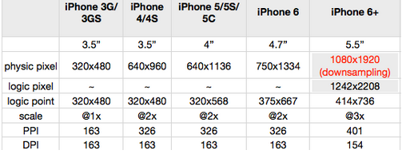
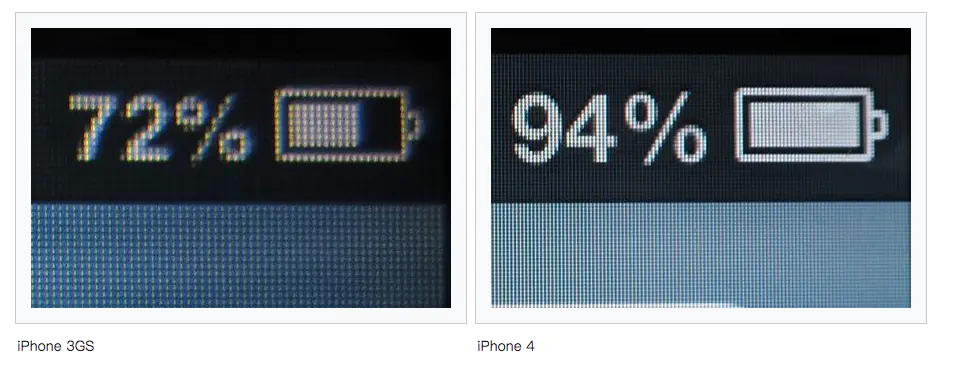

# 移动端项目准备工作

### meta标签的设置

```txt
H5页面窗口自动调整到设备宽度，并禁止用户缩放页面
<meta name="viewport" content="width=device-width,initial-scale=1.0,minimum-scale=1.0,maximum-scale=1.0,user-scalable=no" />


忽略将页面中的数字识别为电话号码
<meta name="format-detection" content="telephone=no" />


忽略Android平台中对邮箱地址的识别
<meta name="format-detection" content="email=no" />


当网站添加到主屏幕快速启动方式，可隐藏地址栏，仅针对ios的safari
<meta name="apple-mobile-web-app-capable" content="yes" />


<!-- ios7.0版本以后，safari上已看不到效果 -->
将网站添加到主屏幕快速启动方式，仅针对ios的safari顶端状态条的样式
<meta name="apple-mobile-web-app-status-bar-style" content="black" />
<!-- 可选default、black、black-translucent -->

```

### 重点设置

```html
<meta name="viewport" content="width=device-width, initial-scale=1.0, maximum-scale=1.0, user-scalable=no">
	width = device-width：宽度等于当前设备的宽度
	initial-scale： 初始的缩放比例（默认设置为1.0）
	minimum-scale：允许用户缩放到的最小比例（默认设置为1.0）
	maximum-scale：允许用户缩放到的最大比例（默认设置为1.0）
	user-scalable：用户是否可以手动缩放（默认设置为no，因为我们不希望用户放大缩小页面）
```


#### 分辨率，PPi,DPI,DPR,物理像素，逻辑像素区别

```txt
1、屏幕尺寸：指的是屏幕对角线的长度

2、分辨率：是指宽度上和高度上最多能显示的物理像素点个数

3、点距：像素与像素之间的距离，点距和屏幕尺寸决定了分辨率大小

4、PPI:屏幕像素密度，即每英寸(1英寸=2.54厘米)聚集的像素点个数，这里的一英寸还是对角线长度

5、DPI:每英寸像素点，印刷行业术语。对于电脑屏幕而言和PPI是一个意思

6、设备像素(又称为物理像素): 指设备能控制显示的最小物理单位，意指显示器上一个个的点。从屏幕在工厂生产出的那天起，它上面设备像素点就固定不变了，和屏幕尺寸大小有关，单位 pt。

7、设备独立像素(也叫密度无关像素或逻辑像素)：可以认为是计算机坐标系统中得一个点，这个点代表一个可以由程序使用的虚拟像素(比如: css像素)，这个点是没有固定大小的，越小越清晰，然后由相关系统转换为物理像素。

8、css像素(也叫虚拟像素)：指的是 CSS 样式代码中使用的逻辑像素，在 CSS 规范中，长度单位可以分为两类，绝对(absolute)单位以及相对(relative)单位。px 是一个相对单位，相对的是设备像素(device pixel)

9、DPR(设备像素比)：设备像素比 = 设备像素（物理像素） / 设备独立像素（逻辑像素）。(在Retina屏的iphone上，DPR为2，1个css像素相当于2个物理像素)
```



```txt
以iphone6为例：
设备宽高为375×667，可以理解为设备独立像素(或css像素)。
dpr为2，根据上面的计算公式，其物理像素就应该×2，为750×1334。


对于这样的css样式：
width: 2px;
height: 2px;

在不同的屏幕上(普通屏幕 vs retina屏幕)，css像素所呈现的大小(物理尺寸)是一致的，不同的是1个css像素所对应的物理像素个数是不一致的。

在普通屏幕下，1个css像素 对应 1个物理像素(1:1)。
在retina 屏幕下，1个css像素对应 4个物理像素(1:4)
```



#### 常见单位

1、px

```
px其实就是像素的意思，全称pixel，也就是图像的基本采样单位。对于不同的设备，它的图像基本单位是不同的，比如显示器和打印机。而我们通常所说的显示器分辨率是指桌面设定的分辨率，不是显示器的物理分辨率，但是现在我们的桌面分辨率和物理分辨率几乎是一致的，因为这样显示效果最佳。所以总的来说px就是对应我们显示器的分辨率。这样就会有个问题就是如果使用px的话我们就要根据不同电脑的分辨率来做自适应，有点麻烦。
```

2、em

```
em是相对长度单位。相对于当前对象内本文的字体尺寸（如果没有设置本文尺寸，那就是相对于浏览器默认的字体尺寸，也就是16px），这样计算的话。如果没有设置字体尺寸就是1em = 16px。如果使用em的话，有个好的建议，就是将body的font-size设置成62.5%，也就是16px * 62.5% = 10px。这样的话1em = 10px，方便我们计算。
```

3、rem

```
rem和em一样也是相对长度单位，但是不一样的是rem始终都是相对html根元素。这样有个很大的有点就是使用rem后不会受到对象内文本字体尺寸的影响，而且只需要改变根元素就能改变所有的字体大小。兼容性也是不错的，IE8以上版本和其他浏览器都已经支持，是个做响应式页面的好选择
```

4、vw  vh  

```
vw和vh是视口（viewport units）单位，何谓视口，就是根据你浏览器窗口的大小的单位，不受显示器分辨率的影响，是不是很神奇，这就代表了，我们不需要顾虑到现在那么多不同电脑有关分辨率的自适应问题。

vw是可视窗口的宽度单位，和百分比有点一样，1vw = 可视窗口的宽度的百分之一。比如窗口宽度大小是1800px，那么1vw = 18px。和百分比不一样的是，vw始终相对于可视窗口的宽度，而百分比和其父元素的宽度有关。

vh就是可视窗口的高度了。

这边顺便提一下vmin和vmax，vmin是指选择vw和vh中最小的那个，而vmax是选择最大的那个
```