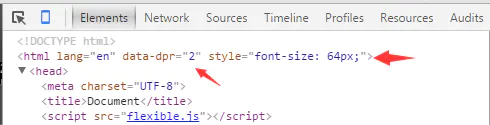

# 媒体查询 + rem

##### 计算方法

```txt
 计算rem方法：
        结合媒体查询   -》   随着设备的改变 更改html  font-size的值。

        媒体查询确定范围？？

        移动端设计图 ： 640px   750px   1080px;
        dpr              2       2         3
        范围            320px   375px     
```

```css
@media screen and (max-width:320px){
    html{
        font-size:12px;
    }
}
@media screen and (min-width:321px) and (max-width:375px){
    html{
        font-size:14px;
    }
}
@media screen and (min-width:376px){
    html{
        font-size:16px;
    }
}
```

##### 实现流程

```txt
ui设计图   640px

dpr    2

ps量出height   88px;

88px / 2 ==  44px;

设计图640px    dpr  2

640px  /  2 == 320px

44px / 12px == rem
```


# vw + rem

```txt
为了方便计算，可以把html的font-size值 设置成100px;        1rem == 100px;
100px是一个固定值，没办法随着设备的改变而改变。
能跟随设备发生改变 
vw 根据视口大小进行改变。
100px == ?vw   
```

##### 根据设计图分配情况

```
第一种情况：
        如果UI设计图为 640px 
        考虑的dpr    2
        适配的核心设备   320px;

        100vw == 320px
        1vw == 3.2px
        ?vw == 100px
        31.25vw == 100px
```

```
第二种情况
        如果设计图为750px
        考虑dpr    2
        适配的核心设备   375px
        100vw == 375px
        1vw == 3.75px
        ?vw == 100px
        26.67vw == 100px;
```

##### 设置方法

```
如果设计图为 640px    html设置{font-size:31.25vw}
如果设计图为 750px    html设置{font-size:26.67vw}
```

##### 计算流程

```
vw  结合 rem   计算流程
因为设计图 640px
所以html设置{font-size:31.25vw;}
ps中获取height 88px
dpr     2
88 / 2 == 44px
44 / 100 == 0.44rem;
```


# flxible.js  插件 

##### 计算流程

```
1：引入flxible.js插件
        <script src=""></script>
2:去掉html里面默认的meta标签
        <meta name="viewport" content="width=device-width, initial-scale=1.0">
```

##### flxible.js原理

```
在页面中引入flexible.js后，flexible会在<html>标签上增加一个data-dpr属性和font-size样式（如下图）。
为了方便计算可以设置成100px;
```



```js
//js首先会获取设备型号，然后根据不同设备添加不同的data-dpr值，比如说1、2或者3，从源码中我们可以看到。
if (!dpr && !scale) {
    var isAndroid = win.navigator.appVersion.match(/android/gi);
    var isIPhone = win.navigator.appVersion.match(/iphone/gi);
    var devicePixelRatio = win.devicePixelRatio;
    if (isIPhone) {
        // iOS下，对于2和3的屏，用2倍的方案，其余的用1倍方案
        if (devicePixelRatio >= 3 && (!dpr || dpr >= 3)) {
            dpr = 3;
        } else if (devicePixelRatio >= 2 && (!dpr || dpr >= 2)) {
            dpr = 2;
        } else {
            dpr = 1;
        }
    } else {
        // 其他设备下，仍旧使用1倍的方案
        dpr = 1;
    }
    scale = 1 / dpr;
}
```

```
页面中的元素用rem单位来设置，rem就是相对于根元素<html>的font-size来计算的，flexible.js能根据<html>的font-size计算出元素的盒模型大小。这样就意味着我们只需要在根元素确定一个px字号，因此来算出各元素的宽高，从而实现屏幕的适配效果
```

##### 把视觉稿中的px转换成rem

工作中我们常见的视觉稿大小大至可为640、750、1125三种。不过flexible.js并没有限制只能用这三种，所以你还可以根据自身情况来调整，具体如何转换，我们以视觉稿为640px的宽来举例子，把640px分为100份，每一份称为一个单位a，那么每个a就是6.4px，而1rem单位被认定为10a，此时，1rem=1(a)X10X6.4(px)即64px。

```
640px/100=6.4px                              1个单位a为6.4px
1rem = 10a                                   1rem单位被认定为10a
1rem = 1(a)*10*6.4(px) = 64px
```
