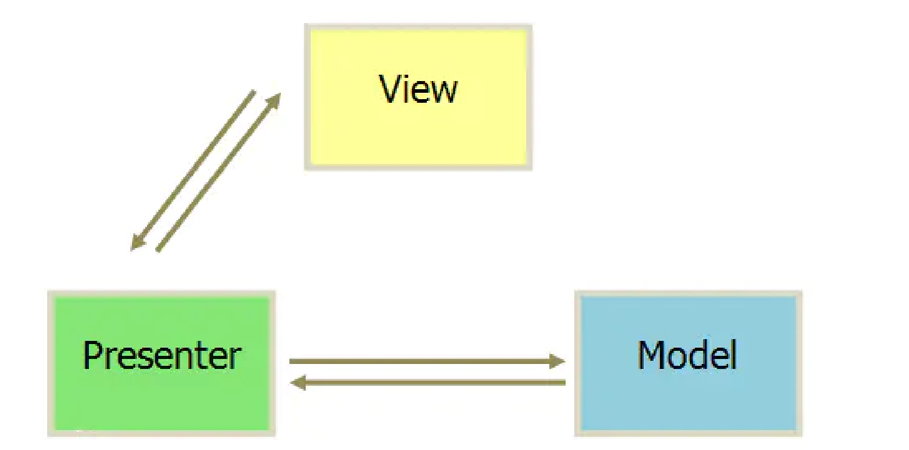
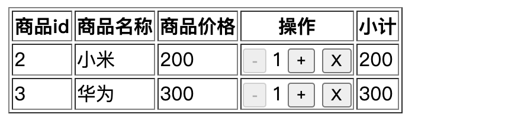
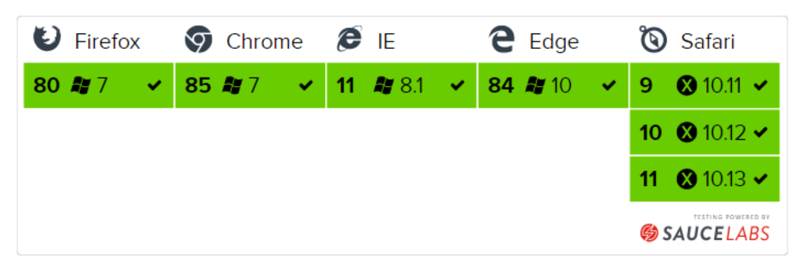
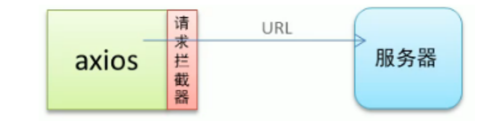
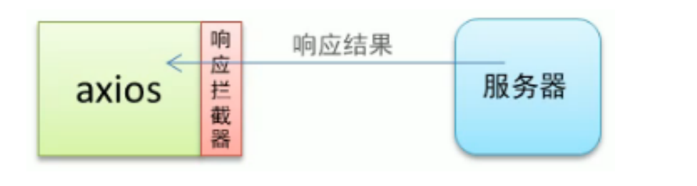
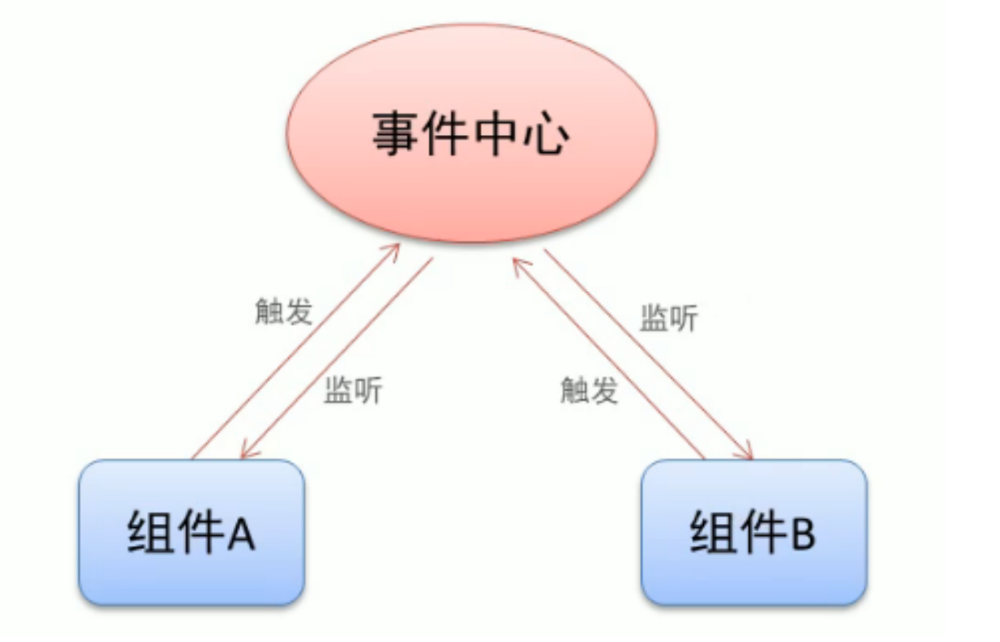
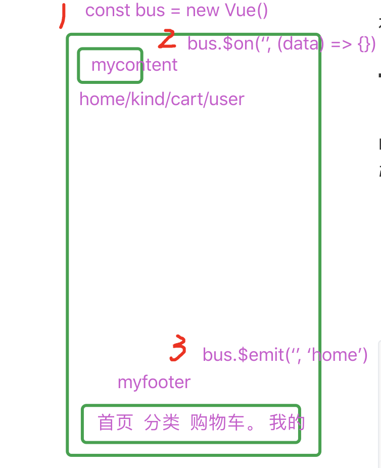
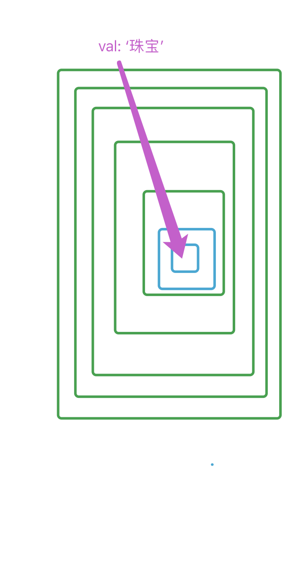
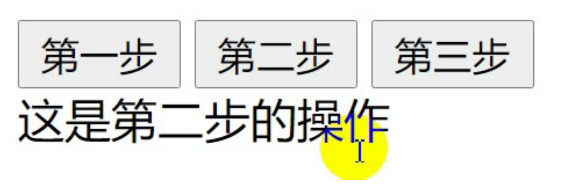
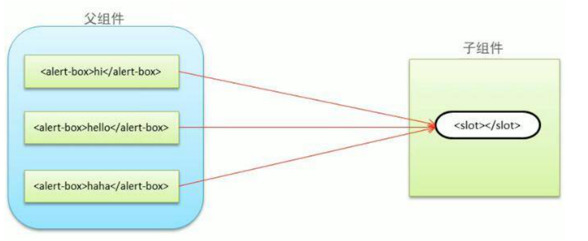

# 1.目标

> * 了解什么是VUE


# 2.vue基础

## 2.1 概述

官网：https://cn.vuejs.org/

Vue.js是一套构建用户界面的**渐进式**框架。

Vue 采用**自底向上**增量开发的设计。

Vue 的核心库只关注视图层，它不仅易于上手，还便于与第三方库或既有项目整合。

另一方面，当与单文件**组件**和 Vue 生态系统支持的库结合使用时，Vue 也完全能够为复杂的单页应用程序提供驱动。(SPA单页面应用，所有的显示都在一个页面当中)

> 渐进式：一步一步，不是说你必须一次把所有的东西都用上
>
> 自底向上设计：是一种设计程序的过程和方法，就是先编写出基础程序段，然后再逐步扩大规模、补充和升级某些功能，实际上是一种自底向上构造程序的过程


Vue从设计角度来讲，虽然能够涵盖这张图上所有的东西，但是你并不需要一上手就把所有东西全用上，都是可选的。

**声明式渲染和组件系统是**Vue的核心库所包含内容，而路由、状态管理、构建工具都有专门解决方案。这些解决方案相互独立，我们可以在核心的基础上任意选用其他的部件，不一定要全部整合在一起。

## 2.2 声明式渲染和组件化

可以使用`cnpm i vue` 下载vue的资源包，将dist/vue.js以及 v e.min.js 移动到lib目录下

### 2.2.1 **声明**式渲染

Vue.js的核心是一个允许采用简洁的模板语法来声明式的将数据渲染进DOM的系统，例如：

```vue
<div id="app"> 
  <!-- 渲染 --> 
  {{ message }} 
</div> 
<script src="lib/vue.js"></script>
<script type='text/javascript'>
  var app = new Vue({ 
    el: '#app', 
    data: { 
      // 声明一下变量 
      message: 'hello world' 
    } 
  })
</script>
```

### 2.2.2 **组件化**应用构建

组件系统是Vue的另一个重要概念（后续学习），因为它是一种抽象的允许我们使用**小型、独立**和通常**可复用**的“小积木”构建大型应用。几乎任意类型的应用界面都可以抽象为一个组件树。


## 2.3 开发模式

> 注意：开发模式≠设计模式

开发模式，就是一个开发项目的方式或者标准。

比较常见的三种开发模式：MVC、MVP、MVVM

* MVC

MVC全名是Model View Controller，是模型(model)－视图(view)－控制器(controller)的缩写，一种软件设计典范，**用一种业务逻辑（C**）、数据（M）、界面显示（V）分离的方法组织代码，将业务逻辑聚集到一个部件里面，在改进和个性化定制界面及用户交互的同时，不需要重新编写业务逻辑。


1. 用户可以向 View 发送指令（DOM 事件），再由 View 直接要求 Model 改变状态。

2. 用户也可以直接向 Controller 发送指令（改变 URL 触发 hashChange 事件），再由Controller 发送给 View。
3. Controller 非常薄，只起到路由的作用，而 View 非常厚，业务逻辑都部署在 View。

**优点** -----  高内聚 低耦合

耦合性低，重用性高，部署快，可维护性高，有利于软件工程化管理

**缺点**

由于模型model和视图view要严格的分离，给前端程序带来了很大的困难，每次操作需要彻底的测试

* MVP

MVP是Model-View-Presenter简称，MVP是从经典的模式MVC演变而来，它们的基本思想有相通的地方Controller/Presenter负责逻辑的处理，Model提供数据，View负责显示：



1. 各部分之间的通信，都是双向的。

2. View 与 Model 不发生联系，都通过 Presenter 传递。可以将一个Presenter用于多个视图，而不需要改变Presenter的逻辑。这个特性非常的有用，因为视图的变化总是比模型的变化频繁。

3. View 非常薄，不部署任何业务逻辑，称为"被动视图"（Passive View），即没有任何主动性，而 Presenter非常厚，所有逻辑都部署在那里。

> **缺点**
>
> 由于对视图的渲染放在了Presenter中，所以视图和Presenter的交互会过于频繁。一旦视图需要变更，那么Presenter也需要变了。

* MVVM
  * M：（model）普通的javascript数据对象
  * V：（view）前端展示页面
  * VM：（ViewModel）用于双向绑定数据与页面，对于我们的课程来说，就是vue的实例

MVVM 模式将 Presenter 改名为 ViewModel，基本上与 MVP 模式完全一致。唯一的区别是，它采用双向绑定（data-binding）：View的变动，自动反映在 ViewModel，反之亦然。**这种模式下，页面输**入改变数据，数据改变影响页面数据展示与渲染

> vue使用MVVM响应式编程模型，避免直接操作DOM , 降低DOM操作的复杂性。


> **优点**
>
> * 低耦合。视图（View）可以独立于Model变化和修改，一个ViewModel可以绑定到不同的View上，当View变化的时候Model可以不变，当Model变化的时候View也可以不变。
>
> * 可重用性。你可以把一些视图逻辑放在一个ViewModel里面，让很多view重用这段视图逻辑。
>
> * 可测试。界面素来是比较难于测试的，而现在测试可以针对ViewModel来写。

# 3.vue入门

## 3.1 传统DOM与vue实现对比

假设需要输出 “hello world”

传统开发模式的原生js，jQuery代码如下：

```html
<div id="test"></div>
<!--原生js-->
<script>
  var msg = 'hello world'
	var test = document.getElementById('test')
  test.innerHTML = msg
</script>
<!--jQuery-->
<script>
	var msg = 'hello world'
  $('#test').html(msg)
</script>
```

> **步骤**
>
> 1. 定义用于填充数据的标签
>
> 2. 引入vue.js库文件（ 学习测试使用开发版本，项目上线换成生产版本 ）
> 3. 使用vue语法实现需求
>
> 4. 将vue提供的数据填充到“第1步”中的标签里

代码如下

```html
<body>
<!-- 1. 定义用于填充数据的标签 --> 
  <div id="app">{{msg}}</div> 
</body> 
<!-- 2. 引入vue.js库文件 --> 
<script src="./js/vue.js"></script>
<script type="text/javascript"> 
  // 3. 使用vue语法实现需求 
  var vue = new Vue({ 
    // 4. 将vue提供的数据填充到“第1步”中的标签里 
    el: "#app", 
    data: { 
      msg: "hello world"
    }
  }); 
</script> 
```

Vue实例细节分析：

* Vue参数对象属性

  * el：元素挂载的位置，值可以是CSS选择器或DOM元素

  * data：模型数据，值是一个对象

* 插值表达式 {{msg}}
  * 将数据填充到HTML标签中

**了解**：前端渲染方式


前端渲染方式有：

* 原生JavaScript拼接字符串（维护困难） -  吃了符号的亏，上了大小写的当

* 使用前端模板引擎（维护较容易，但缺乏事件支持） - ejs / jade

* 使用Vue特有的模板语法
  * 插值表达式
  * 指令
  * 事件绑定
  * 属性绑定
  * 样式绑定
  * 分支循环结构
  * ...

## 3.2 vue devtools工具安装

通过chrome中的谷歌插件商店安装Vue Devtools工具，此工具帮助我们进行vue数据调试所用，一定要安装。

Vue工具在谷歌商店的地址是：https://chrome.google.com/webstore?utm_source=chrome-ntp-icon

> 请注意：打开chrome应用商店，**需要科学上网**才能访问到，至于怎么科学上网请各位自行解决。

安装好后打开Chrome的 开发者工具（F12或Ctrl+Shift+I） 即可使用

> **补充：如果自己解决不了科学上网问题，但是又需要用**Vue **开发工具那该怎么办？**
>
> 如果实在解决不了科学上网难题，Vue官方也提供了插件源码允许我们自己编译/构建GoogleChrom插件，步骤如下（构建插件流程稍微麻烦一些<**不要求掌握如何构建**>，此处已为同学们构建好，可以直接使用）。
>
> 官网-生态系统-devtools

* 克隆仓库

Git仓库地址：https://github.com/vuejs/vue-devtools

* 安装依赖包 cnpm i

* 构建 cnpm run build

* 打开Chrome扩展页面

* 开启开发者模式

* 加载已解压扩展，选择shells-chrome目录

* 将产生的 .crx 文件拖入谷歌浏览器 扩展程序 界面

* 在Windows策略管理器中添加Google策略模板文件，将插件对应的ID添加到 配置扩展程序白名 单 
  * .crx 和 .adm 文件已打包上传至公有云，可以点击访问2url.cc/l3M5x1进行下载

* 在谷歌浏览器 扩展程序 管理界面中给 Vue.js devtools 插件授权
  * 允许访问文件网址
  * 收集各项错误


## 3.3 vue数据双向绑定原理

> 核心：数据劫持 + 发布与订阅

当把一个普通的JavaScript对象传给Vue实例的data选项，Vue将遍历此对象所有的属性，使用Object.defineProperty把这些属性全部转为getter/setter(数据劫持/数据映射)。

在属性被访问和修改时通知变化。每个组件实例都有相应的 watcher 实例对象，它会在组件渲染的过程中把属性记录为依赖，之后当依赖项的 setter 被调用时，会通知 watcher 重新计算，从而致使它关联的组件得以更新。


数据的改变会引起视图的二次渲染

```js
var obj = { a: 1 }

// obj a.  setter getter

console.log(obj.a) // getter
obj.a = 2 // setter
```


`Object.defineProperty(obj, prop, descriptor) `

> **obj**
>
> 要定义属性的对象。
>
> **prop**
>
> 要定义或修改的属性的名称 。
>
> **descriptor**
>
> 要定义选项。

```html
<body>
  <!-- div#app>div#msg+input -->
  <div id="app">
    <div id="msg"></div>
    <input type="text" id="ipt" oninput="changeVal(this)">
  </div>
</body>
<script src="lib/vue.js"></script>
<script>
  // 参照值 - // 1. 定义对象 
  var userInfo = { username: '吴大勋' }
  // 需要劫持的对象 - 2. 数据劫持 
  var obj = {}
  // 劫持了 obj对象的 name属性，不管你有没有
  Object.defineProperty(obj, 'name', {
    get () {
      return userInfo.username
    },
    set (val) {
      userInfo.username = val
      document.getElementById('msg').innerHTML = obj.name
    }
  })
  // 3. 实时渲染  只作用了第一次，如果不数据劫持，显示的是 undefined
  document.getElementById('msg').innerHTML = obj.name
  // 4. 发布订阅 
  function changeVal (element) {
    // console.log(element.value)
    console.log(document.getElementById('ipt').value)
    obj.name = element.value
  }
</script>
```


## 3.4 vue模版语法

Vue.js 使用了基于 HTML 的模板语法，允许开发者声明式地将 DOM 绑定至底层 Vue 实例的数据。所有 Vue.js 的模板都是合法的 HTML，所以能被遵循规范的浏览器和 HTML 解析器解析。

在底层的实现上，Vue 将模板编译成虚拟 DOM 渲染函数。结合响应系统，Vue 能够智能地计算出最少需要重新渲染多少组件，并把 DOM 操作次数减到最少。

### 3.4.1 插值表达式

```html
<body>
  <div id="app">
    <!-- 文本 -->
    {{ msg }} - {{ test }}
    <!-- 原始HTML -->
    <div v-html="test"></div>
    <div v-text="test"></div>
    <!-- attribute -->
    <div v-bind:aaa="flag"></div>
    <div v-bind:bbb="msg"></div>
    <!-- js表达式 -->
    {{ num + 2 }}
    {{ msg.split('').reverse().join('') }}
  </div>
</body>
<script src="lib/vue.js"></script>
<script>
  // {{}} 语法会将 变量 进行 转义输出    <%= test %>
  // 如果需要解析输出 使用 指令 v-html   <%- test %>
  // 如果需要转义输出 使用 指令 v-text   <%= test %>

  // v-html 使用场景  --- 产品详情里面图文详情
  // <div style=""><p></p></div>
  const app = new Vue({
    el: '#app',
    data: {
      msg: 'hello vue',
      test: '<h1>hello world</h1>',
      flag: true,
      num: 100
    }
  })
</script>
```


### 3.4.2 指令

指令 (Directives) 是带有 `v-` 前缀的特殊 attribute。指令 attribute 的值预期是**单个 JavaScript 表达式**。指令的职责是，当表达式的值改变时，将其产生的连带影响，响应式地作用于 DOM。

# 4.常用指令

## 4.1 v-cloak

这个指令保持在元素上直到关联实例结束编译。

和 CSS 规则如 `[v-cloak] { display: none }` 一起用时，这个指令可以隐藏未编译的 Mustache 标签直到实例准备完毕。

如果网络不好的情况下，网页先显示 {{ message }}，如果vue加载完毕，显示 hello vue

闪烁

```html
<head>
  <meta charset="UTF-8">
  <meta name="viewport" content="width=device-width, initial-scale=1.0">
  <title>Document</title>
  <script src="https://cdn.jsdelivr.net/npm/vue/dist/vue.js"></script>
  <style>
    [v-cloak] { /* 如果未加载完vue，{{ message }} 不显示 */
      display: none;
    }
  </style>
</head>
<body>
  <!-- 如果多个元素都使用到了 {{}}, 可以在共同的父级元素上加 指令 v-cloak -->
  <div id="app"  v-cloak>
    {{ message }}
  </div>
</body>
<script>
  const app = new Vue({
    el: '#app',
    data: {
      message: 'hello vue'
    }
  })
</script>
```


## 4.2 双向数据绑定指令 v-model

你可以用 `v-model` 指令在表单 `<input>`、`<textarea>` 及 `<select>` 元素上创建双向数据绑定。

它会根据控件类型自动选取正确的方法来更新元素。

尽管有些神奇，但 `v-model` 本质上不过是语法糖。

它负责监听用户的输入事件以更新数据，并对一些极端场景进行一些特殊处理

>`v-model` 会忽略所有表单元素的 `value`、`checked`、`selected` attribute 的初始值而总是将 Vue 实例的数据作为数据来源。
>
>你应该通过 JavaScript 在组件的 `data` 选项中声明初始值。


`v-model` 在内部为不同的输入元素使用不同的 property 并抛出不同的事件：

- text 和 textarea 元素使用 `value` property 和 `input` 事件；
- checkbox 和 radio 使用 `checked` property 和 `change` 事件；
- select 字段将 `value` 作为 prop 并将 `change` 作为事件。

```html
<body>
  <div id="app">
    <div>
      用户名： 
      <input type="text" v-model="username"> {{ username }}
    </div>
    <div>
      密码： 
      <input type="password" v-model="password"> {{ password }}
    </div>
    <div>
      性别:
      <input type="radio" name="sex" value="1" v-model="sex"> 男
      <input type="radio" name="sex" value="0" v-model="sex"> 女 --- {{ sex }}
    </div>
    <div>
      爱好:
      <input type="checkbox" name="hobby" value="篮球" v-model="hobby"> 篮球
      <input type="checkbox" name="hobby" value="排球" v-model="hobby"> 排球 
      <input type="checkbox" name="hobby" value="网球" v-model="hobby"> 网球 --- {{ hobby }}
    </div>
    <div>
      阶段:
      <select v-model="lesson">
        <option value="1">1阶段</option>
        <option value="2">2阶段</option>
        <option value="3">3阶段</option>
      </select> - {{ lesson }}
    </div>
    <input type="checkbox" v-model="flag"> 已阅读****协议 --- {{ flag }}
    <div>
      <button v-on:click="register">注册</button>
    </div>
  </div>
</body>
<script src="lib/vue.js"></script>
<script>
  const app = new Vue({
    el: '#app',
    data: {
      username: '吴大勋',
      password: '123456',
      sex: "1",
      hobby: [],
      lesson: 3,
      flag: true
    },
    methods: { // 所有vue自定义的事件
      register () {
        console.log({
          username: this.username,
          password: this.password,
          sex: this.sex === '1' ? '男' : '女',
          hobby: this.hobby,
          lesson: this.lesson == '3' ? '三阶段' : this.lesson == '2' ? '二阶段' : '一阶段',
        })
      }
    }
  })
</script>
```

> 注意：
>
> * 1.checkbox，如果你的数据类型是数组类型，代表的就是 多选框（爱好，兴趣）；如果数据类型是boolean类型，true代表的是选中的状态，false代表的是未选中（注册时已阅读 ****协议，购物车的选中状态）
>
> * 2.select下拉选择框：如果 `v-model` 表达式的初始值未能匹配任何选项，`<select>` 元素将被渲染为“未选中”状态。
>
>   在 iOS 中，这会使用户无法选择第一个选项。
>
>   因为这样的情况下，iOS 不会触发 change 事件。因此，更推荐提供一个值为空的禁用选项。
>
>   ```html
>   <div>
>   阶段:
>     <select v-model="lesson">
>       <option disabled value="">请选择</option>
>       <option value="1">1阶段</option>
>       <option value="2">2阶段</option>
>       <option value="3">3阶段</option>
>   	</select> - {{ lesson }}
>   </div>
>   ```
>
>   

## 4.3 v-once

只渲染元素和组件**一次**。随后的重新渲染，元素/组件及其所有的子节点将被视为静态内容并跳过。

**这可以用于优化更新性能**。

```html
<body>
  <div id="app">
    <input type="text" v-model="username"> {{ username }}
    <div v-once>
      {{ username }}
    </div>
  </div>
</body>
<script src="lib/vue.js"></script>
<script>
  const app = new Vue({
    el: '#app',
    data: {
      username: '1111'
    }
  })
</script>
```


## 4.4 绑定属性 v-bind

动态地绑定一个或多个 attribute，或一个组件 prop 到表达式。

在绑定 `class` 或 `style` attribute 时，支持其它类型的值，如数组或对象。可以通过下面的教程链接查看详情。

在绑定 prop 时，prop 必须在子组件中声明。可以用修饰符指定不同的绑定类型。

没有参数时，可以绑定到一个包含键值对的对象。注意此时 `class` 和 `style` 绑定不支持数组和对象。

**vue中当遇到变量，boolean类型或者number类型时，需要使用绑定属性**

```html
<body>
  <div id="app">
    <!-- 变量 -->
     
    <!-- number类型 -->
    <div v-bind:num="10"></div>
    <!-- boolean类型 -->
    <div v-bind:flag="true"></div>  
    <!-- 缩写 -->
    <div :flag="true"></div>


  </div>
</body>
<script src="lib/vue.js"></script>
<script>
  const app = new Vue({
    el: '#app',
    data: {
      imgsrc: 'https://cn.vuejs.org/images/logo.png'
    }
  })
</script>
```


## 4.5 v-on

### 4.5.1 基本使用

**作用：**绑定事件监听器（事件绑定）

```js
<!-- 常规写法 --> 
<button v-on:click="num++"></button> 
<!-- 缩写 --> 
<button @click="num++"></button>
<!-- 事件处理函数调用：直接写函数名 --> 
<button @click="say"></button> 
<!-- 事件处理函数调用：常规调用,可以传递参数 --> 
<button @click="alert('123')"></button>
```

如果事件处理函数为自定义函数，则需要先进行定义，定义的方式如下：

```js
... 
data: { 
... 
},
methods: { 
  functionName: function(arg1,arg2,arg3,...) { 
    // something to do 
  },
  .... 
} 
```

> 注意：事件绑定 v-on 属性表达式中切记不能直接写业务逻辑，例如 @click="alert('123')"

**事件处理函数传参**

```html
<!-- 事件处理函数调用：直接写函数名 -->
<button @click="say"></button> 
<!-- 事件处理函数调用：常规调用 -->
<button @click="say('hi',$event)"></button>
```

在不传递自定义参数的时候，上述两种用法均可以使用；但是如果需要传递自定义参数的话，则需要使用第2种方式。

> 事件对象的传递与接收注意点
>
> 如果事件直接使用函数名并且不写小括号，那么默认会将事件对象作为唯一参数进行传递
>
> 如果使用常规的自定义函数调用（只要写了小括号），那么如果需要使用事件对象则必须作为最后一个参数进行传递，且事件对象的名称必须是“$event”

```html
<body>
  <div id="app">
    <button v-on:click="num++">+</button>{{ num }}
    <button @click="num--">-</button>
    <!-- 事件绑定 v-on 属性表达式中切记不能直接写业务逻辑，例如 @click="alert('123')" -->
    <button @click="alert('123')">vue</button>
    <button onclick="alert('456')">js</button>
    <!-- 事件处理函数传参 -->
    <!-- 事件处理函数调用：直接写函数名,如果不需要参数，可以不写（） -->
    <button @click="say1">没有参数</button> 
    <!-- 事件处理函数调用：常规调用, 如果需要使用时间对象，记得一定传的是 $event -->
    <button @click="say2('hi', $event)">有参数和事件对象</button>
    <!-- 如果想要使用默认的事件对象，不要加（），在定义函数时有默认的event参数 -->
    <button @click="say3">查看默认的事件对象</button>
  </div>
</body>
<script src="lib/vue.js"></script>
<script>
  const app = new Vue({
    el: '#app',
    data: {
      num: 100
    },
    methods: {
      say1 () {
        console.log('没有参数')
      },
      say2 (str, event) {
        console.log('有参数和事件对象, str-' + str + '，event-' + event)
        console.log(event)
      },
      say3 (event) {
        console.log(event)
      }
    },
  })
</script>
```


```html
<!--练习-->
<style> 
  #big {width: 300px; height: 300px; background-color: red; }
  #mid {width: 200px; height: 200px; background-color: green; }
  #sma {width: 100px; height: 100px; background-color: pink; } 
</style> 
<body>
  <div id="app">
    <div id="big" @click="say('大娃',$event)"> 
      <div id="mid" @click="say('二娃',$event)"> 
        <div id="sma" @click="say('三娃',$event)"></div> 
      </div> 
    </div> 
  </div> 
</body> 
<script src="lib/vue.js"></script> 
<script> 
  new Vue({ 
    el: '#app', 
    data: { },
    methods:{ 
      say: function(name,event){ 
        console.log('你点了' + name); 
      } 
    } 
  }) 
</script>
```


### 4.5.2 事件修饰符

含义：用来处理事件的特定行为

使用示例：

```html
<!-- 停止冒泡 --> 
<button @click.stop="doThis"></button> 
<!-- 阻止默认行为 --> 
<button @click.prevent="doThis"></button> 
<!-- 串联修饰符 --> 
<button @click.stop.prevent="doThis"></button>
```

更多事件修饰符请参考官方文档：https://cn.vuejs.org/v2/guide/events.html#%E4%BA%8B%E4%BB%B6%E4%BF%AE%E9%A5%B0%E7%AC%A6

- `.stop`
- `.prevent`
- `.capture`
- `.self`
- `.once`
- `.passive`

```html
<!-- 阻止单击事件继续传播 -->
<a v-on:click.stop="doThis"></a>

<!-- 提交事件不再重载页面 -->
<form v-on:submit.prevent="onSubmit"></form>

<!-- 修饰符可以串联 -->
<a v-on:click.stop.prevent="doThat"></a>

<!-- 只有修饰符 -->
<form v-on:submit.prevent></form>

<!-- 添加事件监听器时使用事件捕获模式 -->
<!-- 即内部元素触发的事件先在此处理，然后才交由内部元素进行处理 -->
<div v-on:click.capture="doThis">...</div>

<!-- 只当在 event.target 是当前元素自身时触发处理函数 -->
<!-- 即事件不是从内部元素触发的 -->
<div v-on:click.self="doThat">...</div>
```

```html
<body>
  <div id="app">
    <!-- 子元素 阻止冒泡 事件对象 -->
    <!-- <div @click="clickDiv" style="width: 200px;height: 200px;background-color: #f66;">
      <button @click="clickBtn">按钮</button>
    </div> -->
    <!-- vue 事件修饰符阻止冒泡 子元素添加 stop -->
    <!-- <div @click="clickDiv" style="width: 200px;height: 200px;background-color: #f66;">
      <button @click.stop="clickBtn">按钮</button>
    </div> -->
    <!-- vue 事件修饰符阻止冒泡 父元素添加 self -->
    <div @click.self="clickDiv" style="width: 200px;height: 200px;background-color: #f66;">
      <button @click="clickBtn">按钮</button>
    </div>
  </div>
</body>
<script src="lib/vue.js"></script>
<script>
  
  const app = new Vue({
    el: '#app',
    data: {},
    methods: {
      // 子元素 阻止冒泡 事件对象
      // clickDiv () {
      //   console.log('div')
      // },
      // clickBtn (event) {
      //   event.stopPropagation()
      //   console.log('button')
      // }
      // vue 事件修饰符阻止冒泡 子元素添加 stop
      // clickDiv () {
      //   console.log('div')
      // },
      // clickBtn () {
      //   console.log('button')
      // }
      // vue 事件修饰符阻止冒泡 父元素添加 self
      clickDiv () {
        console.log('div')
      },
      clickBtn () {
        console.log('button')

      }
    }
  })
</script>
```


### 4.5.3 按键修饰符

>  在监听键盘事件时，我们经常需要检查详细的按键。Vue 允许为 v-on 在监听键盘事件时添加按键修饰符。

```html
<!-- 只有在 `key` 是 `Enter` 回车键的时候调用 --> 
<input v-on:keyup.enter="submit"> 
<!-- 只有在 `key` 是 `Delete` 回车键的时候调用 --> 
<input v-on:keyup.delete="handle">
```

更多按键修饰符请参考官方文档：

https://cn.vuejs.org/v2/guide/events.html#%E6%8C%89%E9%94%AE%E4%BF%AE%E9%A5%B0%E7%AC%A6

```
.enter
.tab
.delete (捕获“删除”和“退格”键)
.esc
.space
.up
.down
.left
.right
```


```html
<body>
  <div id="app">
    <input type="text" onkeyup="changeJsVal(event)">
    <input type="text" @keyup="changeVueVal">
    <!-- 按键修饰符 -->
    <!-- <input type="text" @keyup.enter="changeVue2Val"> -->
    <input type="text" @keyup.13="changeVue2Val">
  </div>
</body>
<script src="lib/vue.js"></script>
<script>
  function changeJsVal (event) {
    // console.log(event)
    if (event.keyCode == 13) {
      console.log(111)
    }
  }
  const app = new Vue({
    el: '#app',
    data: {},
    methods: {
      changeVueVal (event) {
        if (event.keyCode == 13) {
          console.log(222)
        }
      },
      changeVue2Val () {
        console.log(333)
      }
    }
  })
</script>
```


### 4.5.4 自定义修饰符

需要配合 系统修饰键 完成

https://cn.vuejs.org/v2/guide/events.html#%E7%B3%BB%E7%BB%9F%E4%BF%AE%E9%A5%B0%E9%94%AE


按键修饰符还有一个额外的细节需要注意，Vue内置的按键修饰符是有限的，如果还需要用到其他键盘按键的修饰符，则此时我们可以通过全局对象config.keyCodes自行定义按键修饰符，例如：

```js
Vue.config.keyCodes.KEYNAME = 112
```

当然，在实际使用的时候也允许我们不去定义修饰符而直接去使用按键对应的数字（按键码），例如：

```html
<input v-on:keyup.13="submit">
```

但是这种方式直接记忆数字与按键的关系，不是很方便。已经被官方废弃了，并且可能在最新的浏览器中不被支持。参考地址：https://developer.mozilla.org/en-US/docs/Web/API/KeyboardEvent/keyCode

```html
<body>
  <div id="app">
    <!-- 按住 alt + c -->
    <input type="text" @keyup.alt.67="test">
  </div>
</body>
<script src="lib/vue.js"></script>
<script>
  
  const app = new Vue({
    el: '#app',
    data: {},
    methods: {
      test () {
        console.log('啦啦啦')
      }
    }
  })
</script>
```


## 4.6 循环分支（判断）指令

### 4.6.1 循环指令

**作用：**根据一组数组或对象的选项列表进行渲染。

**指令：**v-for

* 数组遍历使用示例：

```html
<!-- 模板部分 --> 
<ul>
  <!-- 直接取值 -->
  	<li v-for='item in fruits'>{{item}}</li> 
  	<!-- 带索引 --> 
  	<li v-for='(item,index) in fruits'>{{item}}{{index}}</li> 
</ul> 
<!-- JavaScript部分 --> 
...... 
data: { 
	fruits: ['apple','pear','banana','orange'] 
}
......
```

> 细节：key的作用，提高性能，不影响显示效果（ 如果没有id，可以考虑使用索引替代 ）

```html
<ul>
  <li :key='item.id' v-for='(item,index) in fruits'>{{item}}</li> 
</ul>
```

* 对象遍历使用示例：

```html
<!-- 模板部分 --> 
<ul>
  <li v-for='(value,key,index) in obj'>
    {{value + '-' + key + '-' + index}} 
  </li> 
</ul> 
<!-- JavaScript部分 --> 
...... 
data: { 
  obj: {
    username: 'zhangsan', 
    age: 28, 
    gender: 'male' 
  } 
}
...... 
```

**示例代码：**

```html
<body>
  <div id="app">
    <!-- 遍历时建议添加 属性 key，给每一个元素都添加了标识 (十把锁十把钥匙) -->
    <!-- 如果没有唯一值时，使用索引值代替 key -->
    <!-- 数组 （item, index） of arr -->
    <!-- 对象 (value, key, index) of arr -->
    <!-- 遍历fruits -->
    <ul>
      <li v-for="(item, index) of fruits" :key="index">{{ item }}</li>
    </ul>
    <!-- 遍历 obj-->
    <ul>
      <li v-for="(value, key) of obj" :key="index">
        {{ key }}: {{ value }}
      </li>
    </ul>
    <!-- 遍历arr -->
    <ul>
      <li v-for="item of arr" :key="item.id">{{ item.name }}</li>
    </ul>
  </div>
</body>
<script src="lib/vue.js"></script>
<script>
  const app = new Vue({
    el: '#app',
    data: {
      fruits: ['apple', 'pear', 'banana', 'orange'],
      obj: {
        username: 'zhangsan', 
        age: 28, 
        gender: 'male' 
      },
      arr: [
        { id: 1, name: '石越' },
        { id: 2, name: '张鸣涛' }
      ]
    }
  })
</script>
```


```html
<!--练习-->
<body>
  <div id="app"> 
    <div>
      <ul>
        <li :key="index" v-for="(item,index) in cars">{{item}}</li> 
      </ul> 
    </div> 
    <div>
      <ul>
        <li :key="index" v-for="(item,key,index) in user">{{key}}： {{item}}</li>
      </ul> 
    </div> 
  </div> 
</body> 
<script src="lib/vue.js"></script>
<script> 
  new Vue({ 
    el: '#app',
    data: { 
      cars: ['bmw','aodi','benchi','haima'], 
      user: { 
        username: 'zhangsan', 
        gender: 'mele',//性别，sex 
        age: 22 
      } 
    } 
  })
</script>
```


### 4.6.2 分支指令 - 判断条件

**作用：**根据表达式的布尔值(true/false)进行判断是否渲染该元素

* v-if

* v-else

* v-else-if

> 上述三个指令是分支中最常见的。根据需求，v-if可以单独使用，也可以配合v-else一起使用，也可以配合v-else-if和v-else一起使用。

* v-show

> v-show是根据表达式之真假值，切换元素的 display CSS属性。

使用示例：

```html
<div v-if="score >= 90"> 优秀 </div> 
<div v-else-if="score >= 80 && score < 90"> 良好 </div> 
<div v-else-if="score >= 70 && score < 80"> 一般 </div> 
<div v-else> 不及格 </div> 
<!-- v-show --> 
<div v-show='flag'>测试v-show</div> 
<!-- JavaScript部分 --> 
...... data: { 
	score: 88, 
	flag:false 
}
......
```

> 思考：v-if系列与v-show的区别是什么？
>
> v-if：控制元素是否渲染
>
> v-show：控制元素是否显示（已经渲染，display:none;）
>
> v-if系列指令、v-show指令可以与v-for指令结合起来使用（循环+分支）。例如：

```html
<body>
  <div id="app">
    <!-- v-if v-else-if v-else -->
    <!-- v-show -->
    <input type="text" v-model="grade">
    <div v-if="grade >= 90">优</div>
    <div v-else-if="grade >= 80">良</div>
    <div v-else-if="grade >= 70">中</div>
    <div v-else-if="grade >= 60">差</div>
    <div v-else>不及格</div>
    <hr>
    <div v-show="grade >= 90">优</div>
    <div v-show="grade >= 80 && grade < 90">良</div>
    <div v-show="grade >= 70 && grade < 80">中</div>
    <div v-show="grade >= 60 && grade < 70">差</div>
    <div v-show="grade < 60">不及格</div>
  </div>
</body>
<script src="lib/vue.js"></script>
<script>
  const app = new Vue({
    el: '#app',
    data: {
      grade: 98
    }
  })
</script>

```

> 通过审查元素观察 v-if 以及 v-show的区别

## 4.7 综合案例：简易购物车



> 细节：
>
> ​	展示基本的商品信息
>
> ​	计算每个商品的小计
>
> ​	商品数量的加、减操作
>
> ​		+：增加商品数量，同时更新小计
>
> ​		-：减少商品数量，同时更新小计，如果本身为“1”，-不可以再次点击
>
> ​	如果需要在Vue实例中访问自身data属性中的数据，可以使用以下方式：
>
> ​		this.xxxxx
>
> ​		this.$data.xxxxx
>
> ​		this._data.xxxxx

**参考数据源**

```js
var cartData = [ { 
  id: 1, 
  name: '小米', 
  price: 100, 
  num: 1
}, { 
  id: 2, 
  name: '华为', 
  price: 200, 
  num: 1 
},{ 
  id: 3, 
  name: '联想',
  price: 300, 
  num: 1 
} ]
```

**参考核心代码**

```html
<body>
  <div id="app">
    <table border="1">
      <tr>
        <th>商品id</th>
        <th>商品名称</th>
        <th>商品价格</th>
        <th>操作</th>
        <th>小计</th>
      </tr>
      <tr v-for="(item, index) of cartData" :key="item.id">
        <td>{{ item.id }}</td>
        <td>{{ item.name }}</td>
        <td>{{ item.price }}</td>
        <td>
          <button :disabled="item.num<=1" @click="item.num-=1">-</button>
          {{ item.num }}
          <button @click="item.num+=1">+</button>
          <button @click="deleteItem(index)">X</button>
        </td>
        <td>
          {{ item.num * item.price }}
        </td>
      </tr>
    </table>
  </div>
</body>
<script src="lib/vue.js"></script>
<script>
  const cartData = [
    {id:1,name:'苹果',num:1,price:100}, 
    {id:2,name:'小米',num:1,price:200}, 
    {id:3,name:'华为',num:1,price:300}
  ]
  const app = new Vue({
    el: '#app',
    data: {
      cartData
    },
    methods: {
      deleteItem (index) {
        confirm('确认删除吗') && this.cartData.splice(index, 1)
      }
    }
  })
</script>
```

>  `&emsp; `表示tab，一个顶四个`nbsp; `

## 4.8 样式绑定

### 4.8.1 class样式绑定

* 对象语法（ 用于控制开关切换 ） 

  ```html
  <style> 
    /* CSS片段 */ 
    .active { color: red; }
  </style>
  <!-- HTML片段 --> 
  <div v-bind:class="{active: isActive}">class样式</div>
  <script type='text/javascript'> 
    // JavaScript片段 
    data: { 
      isActive: true
    }
  </script>
  
  
  ```

* 数组写法

  ```html
  <style>
    /* CSS片段 */ 
    .active { 
      color: red; 
    }
  </style> 
  <!-- HTML片段 --> 
  <div v-bind:class="[activeClass]">数组写法</div>
  <script type='text/javascript'> 
    // JavaScript片段 
    data: { 
      activeClass: 'active' 
    }
  </script>
  ```


案例：

```html
<head>
  <style>
    .active {
      color: #fff;
      background-color: #f66;
    }
    .ft {
      font-size: 30px
    }
  </style>
</head>
<body>
  <div id="app">
    <div class="active">class的使用</div>
    <!-- class的对象语法 -->
    <div :class="{active: isActive}">class的对象语法</div>
    <!-- class的数组语法 -->
    <div :class="[test, fn1]">class的数组语法</div>
    <!-- 三目运算符 解决问题 -->
    <div :class="isActive ? 'active' : ''">class的对象语法 ---- 三目运算符</div>
  </div>
</body>
<script src="lib/vue.js"></script>
<script>
  const app = new Vue({
    el: '#app',
    data: {
      isActive: true,
      test: 'active',
      fn1: 'ft'
    }
  })
</script>
```


### 4.8.2 style样式处理

* 对象语法

```html
<!-- HTML片段 --> 
<div:style="{color: redColor, fontSize: '20px'}">对象写法</div> 
<script type='text/javascript'> 
  // JavaScript片段 
  data: { 
    redColor: 'red' 
  }
</script>
```

* 数组语法

```html
<!-- HTML片段 --> 
<div v-bind:style="[color, fontSize]">数组写法</div> 
<script type='text/javascript'>
  // JavaScript片段 
  data: { 
		color: {
      color: 'red' 
    },
    fontSize: { 
      'font-size': '20px' 
    } 
  }
</script>
```


## 4.9 v-model

修饰符

.lazy：默认情况下Vue的数据同步采用 input 事件，使用 .lazy 将其修改为失去焦点时触发(change)

.number：自动将用户的输入值转为数值类型（如果能转的话）

.trim：自动过滤用户输入的首尾空白字符

```html
<body>
  <div id="app">
    <input type="text" v-model.lazy="username"> {{ username }}
    <input type="text" v-model.number="num"> {{ num }}
    <!-- 在用户未输入 和 输入后 点击按钮测试 -->
    <button @click="getType">获取num的数据类型</button>
    <!-- <input type="text" v-model.trim="note"> -->
    <input type="text" v-model="note">
    <button @click="getVal">获取note的值</button>
  </div>
</body>
<script src="lib/vue.js"></script>
<script>
  new Vue({
    el: '#app',
    data: {
      username: '',
      num: '100',
      note: ''
    },
    methods: {
      getType () {
        console.log(typeof this.num)
      },
      getVal () {
        // console.log(this.note)
        console.log(this.note.trim())
      }
    }
  })
</script>
```


## 4.10 综合案例： 购物车全选/全不选

* 分析给 全选 按钮绑定什么样的事件

  * click

  * change

* 全选 复选框与商品列表前面的复选框不是一回事

  * 两者v-mode的值肯定是不一样的

  * 全选 按钮的v-mode值应该是一个bool值

  * 商品列表前面的复选框v-model值应该是一个数组

**参考代码**

```html
<body>
  <div id="app">
    <input type="checkbox" value="a" v-model="arr">a
    <input type="checkbox" value="b" v-model="arr">b
    <input type="checkbox" value="c" v-model="arr">c
    <input type="checkbox" value="d" v-model="arr">d
    <div>
      {{ arr }}
    </div>
  </div>
</body>
<script src="lib/vue.js"></script>
<script>
  new Vue({
    el: '#app',
    data: {
      arr: ['c']
    }

  })
</script>
```


```html
<body>
  <div id="app">
    {{ checkarr }}
    <table border="1">
      <tr>
        <th>
          <input type="checkbox" v-model="checked" @change="checkAll">
        </th>
        <th>商品id</th>
        <th>商品名称</th>
        <th>商品价格</th>
        <th>操作</th>
        <th>小计</th>
      </tr>
      <tr v-for="(item, index) of cartData" :key="item.id">
        <td>
          <input type="checkbox" :value="item.id" v-model="checkarr">
        </td>
        <td>{{ item.id }}</td>
        <td>{{ item.name }}</td>
        <td>{{ item.price }}</td>
        <td>
          <button :disabled="item.num<=1" @click="item.num-=1">-</button>
          {{ item.num }}
          <button @click="item.num+=1">+</button>
          <button @click="deleteItem(index)">X</button>
        </td>
        <td>
          {{ item.num * item.price }}
        </td>
      </tr>
    </table>
  </div>
</body>
<script src="lib/vue.js"></script>
<script>
  const cartData = [
    {id:1,name:'苹果',num:1,price:100}, 
    {id:2,name:'小米',num:1,price:200}, 
    {id:3,name:'华为',num:1,price:300}
  ]
  const app = new Vue({
    el: '#app',
    data: {
      cartData,
      checked: false,
      checkarr: []
    },
    methods: {
      deleteItem (index) {
        confirm('确认删除吗') && this.cartData.splice(index, 1)
      },
      checkAll () {
        if (this.checked) {
          this.cartData.forEach((item, index) => {
            this.checkarr.push(item.id)
          })
        } else {
          this.checkarr = []
        }
      }
    }
  })
</script>
</html>
```

# 5.vue常用特性

## 5.1 自定义指令

除了核心功能默认内置的指令，Vue也允许注册自定义指令。有的情况下，对普通 DOM 元素进行底层操作，这时候就会用到自定义指令绑定到元素上执行相关操作。

**自定义指令分为：** 全局 **指令和** 局部 **指令**，当全局指令和局部指令同名时以局部指令为准。

自定义指令**常用**钩子函数有：

* bind：在**指令**第一次绑定到元素时调用

* inserted：被绑定**元素**插入父节点时调用 (仅保证父节点存在，但不一定已被插入文档中)

* update：数据更新时调用

> 请注意：不管在定义全局还是局部自定义指令时，所提及的指令名均是不带 v- 前缀的名称

**全局自定义指令定义**

```js
// 无参(v-once/v-cloak)
Vue.directive('指令名',{ 
  钩子函数名: function(el[,....]){ 
  // 业务逻辑 
  // el参数是挂载到元素的DOM对象 
	} 
}
// 传参(v-text/v-html/v-model) v-model="username"
Vue.directive('指令名',{ 
  钩子函数名: function(el,binding[,....]){ 
  	let param = binding.value  // param 其实就时 username 的值
    // 业务逻辑
    },
    .... 
} 
```

> 全局自定义指令（后续的知识点也是的）不能写在Vue实例中（或者某个组件中）

**自动获取焦点的指令**

```html
<body>
  <div id="app">
    <input type="text" v-focus>
  </div>
</body>
<script src="lib/vue.js"></script>
<script>
  // 全局自定义指令 -- new Vue之前
  // Vue.directive('focus', {
  //   inserted (element) {
  //     element.focus()
  //   }
  // });
  new Vue({
    el: '#app',
    data: {},
    directives: { // 局部自定义指令
      'focus': {
        inserted (element) {
          element.focus()
        }
      }
    }
  })
</script>
```


**局部自定义指令定义**

可以在 new Vue 的时候添加 directives 以注册局部自定义指令，局部自定义指令只能在当前组件中使用：

```js
directives: { 
  指令名: { 
    // 指令的定义 
    钩子函数名: function (el,binding) { 
      // 业务逻辑 
    } 
  } 
}
```

**函数简写（重点）**

> 在很多时候，我们可能想在 bind **和** update 时触发相同行为（如果只是其一，则还是单独分开声明），而不关心其它的钩子。那么这样写：

```js
// 全局 
Vue.directive('指令名', function (el,binding) { 
  // 业务逻辑 
})
// 局部 
directives: { 
  指令名: function (el,binding) { 
    // 业务逻辑 
  } 
}
```

> 在自定义指令的方法中，不能像以前的 methods 中的方法一样使用关键词 this ，此时 this关键词指向的是 Window 对象。

案例：使用自定义指令实现以下效果

* 使用全局指令定义自定义的 v-red（不传参） 和 v-color（传参）

* 使用局部自定义指令实现 v-mobile（不传参） 验证用户输入的是否是合法的手机号

```html
<body>
  <div id="app">
    <div v-red>哈哈哈哈</div>
    <div v-color="'green'">嘻嘻</div>
    <input type="text" v-mobile v-model="phone">
  </div>
</body>
<script src="lib/vue.js"></script>
<script>
  // 使用全局指令定义自定义的 v-red（不传参） 和 v-color（传参）
  Vue.directive('red', {
    inserted (el) {
      el.style.color = 'red'
    }
  })
  Vue.directive('color', {
    inserted (el, binding) {
      el.style.color = binding.value // binding.value 传递过来的值
    }
  })
  new Vue({
    el: '#app',
    data: {
      phone: ''
    },
    // 使用局部自定义指令实现 v-mobile（不传参） 验证用户输入的是否是合法的手机号
    directives: {
      mobile: {
        update (el) {
          console.log(el.value)
          if (!(/^1[3-9]\d{9}$/).test(el.value)) {
            el.style.color = "red"
          } else {
            el.style.color = "green"
          }
        }
      }
    }
  })
</script>
```


## 5.2 计算属性 - computed

模板中放入太多的逻辑会让模板过重且难以维护，使用计算属性可以让模板变得简洁易于维护。计算属性是基于它们的响应式依赖进行**缓存**的，计算属性比较适合对多个变量或者对象进行处理后返回一个结果值，也就是数多个变量中的某一个值发生了变化则我们监控的这个值也就会发生变化。

计算属性定义在Vue对象中，通过关键词 computed 属性对象中定义一个个函数，并返回一个值，使用计算属性时和 data 中的数据使用方式一致。

**任何复杂的业务逻辑，我们都应当使用计算属性** -  计算属性具有依赖性，只有依赖的值发生改变，才会重新计算

**示例**

```html
<body>
  <div id="app">
    <h1>事件</h1>
    {{ addNum() }}
    {{ addNum() }}
    <h1>计算属性</h1>
    {{ numcom }}
    {{ numcom }}
    {{ numcom }}
  </div>
</body>
<script src="lib/vue.js"></script>
<script>
  new Vue({
    el: '#app',
    data: {
      num: 0
    },
    computed: {
      numcom () {
        console.log('计算属性')
        return this.num + 100
      }
    },
    methods: {
      addNum () {
        console.log('加1')
      }
    }
  })
</script>
```


```html
<div id="app">
  <!-- 当多次调用 cfn计算属性时只要里面的 num值不改变,它会把第一次计算的结果直接返回直 到data中的num值改变 计算属性才会重新发生计算 --> 
  <div>{{ cfn }}</div> 
  <div>{{ cfn }}</div> 
  <!-- 调用methods中的方法的时候 他每次会重新调用 --> 
  <div>{{ fn() }}</div> 
  <div>{{ fn() }}</div> 
</div> 
<script src="lib/vue.js"></script> 
<script type="text/javascript"> 
  const vm = new Vue({ 
    el: "#app", 
    data: { 
      num: 10
    },
    // 方法 
    methods: { 
      fn() {
        console.log("methods"); 
        return this.num; 
      }
    },
    // 计算属性 
    computed: { 
      cfn() { 
        console.log("computed"); 
        return this.num; 
      }
    }
  })
</script>
```

> **注意：**只要依赖的数据源不发生改变，计算属性里的对应方法就只被调用1次，其它时候被调用时则使用缓存。


## 5.3 监听器 - watch

使用watch来侦听data中数据的变化，watch中的属性一定是data 中已经存在的数据。

**使用场景：**数据变化时执行异步或开销比较大的操作。

**典型应用：**http://www.pinyinzi.cn/


**参考代码：**

```html
<body>
  <div id="app">
    <input type="text" v-model="firstName"> + 
    <input type="text" v-model="lastName"> =
    {{ fullName }}
  </div>
</body>
<script src="lib/vue.js"></script>
<script>
  new Vue({
    el: '#app',
    data: {
      firstName: '',
      lastName: '',
      fullName: ''
    },
    watch: {
      firstName (newVal, oldVal) {
        this.fullName = newVal + this.lastName
      },
      lastName (newVal, oldVal) {
        this.fullName = this.firstName + newVal
      }
    }
  })
</script>
```

```html
<body>
  <div id="app">
    <input type="text" v-model="firstName"> + 
    <input type="text" v-model="lastName"> =
    {{ fullName }}
  </div>
</body>
<script src="lib/vue.js"></script>
<script>
  new Vue({
    el: '#app',
    data: {
      firstName: '',
      lastName: ''
    },
    computed: { // 计算属性优于侦听属性
      fullName () {
        return this.firstName + this.lastName
      }
    }
  })
</script>
```


> 注意点：
>
> * 声明监听器，使用的关键词是 watch
>
> * 每个监听器的方法，可以接受2个参数，第一个参数是新的值，第二个参数是之前的值

**注意：**当需要监听一个对象的改变时，普通的watch方法无法监听到对象内部属性的改变，此时就需要deep属性对对象进行深度监听。

**使用对象的数据形式改写上述案例参考代码：**

```html
<body>
  <div id="app">
    <input type="text" v-model="userInfo.firstName"> + 
    <input type="text" v-model="userInfo.lastName"> =
    {{ userInfo.fullName }}
  </div>
</body>
<script src="lib/vue.js"></script>
<script>
  new Vue({
    el: '#app',
    data: {
      userInfo: {
        firstName: '',
        lastName: '',
        fullName: ''
      }
    },
    watch: {
      // 为什么要 oldVal，路由 /home -> /detail/1,监听路由变化
      // 通过对象属性侦听
      // 'userInfo.firstName': function (newVal, oldVal) {
      //   this.userInfo.fullName = newVal + this.userInfo.lastName
      // },
      // 'userInfo.lastName': function (newVal, oldVal) {
      //   this.userInfo.fullName = this.userInfo.firstName + newVal
      // }
      userInfo: {
        handler (val) {
          this.userInfo.fullName = val.firstName + val.lastName 
        },
        deep: true
      }
    }
  })
</script>
```


## 5.4 综合案例：继续完善购物车

**进一步需求：**

* 增加自动计算总价功能，只计算被选中的商品【计算属性】

  * 循序渐进

  * 可以先计算全部的，再剔除未选中的商品
* 增加反选功能
* 当手动选中全部商品， 全选 复选框自动选中，但凡有一个商品的复选框没有被选中，则 全选复选框不选中【监听】

```html
<body>
  <div id="app">
    {{ checkarr }}
    <table border="1">
      <tr>
        <th>
          <input type="checkbox" v-model="checked" @change="checkAll">全选
        </th>
        <th>商品id</th>
        <th>商品名称</th>
        <th>商品价格</th>
        <th>操作</th>
        <th>小计</th>
      </tr>
      <tr v-for="(item, index) of cartData" :key="item.id">
        <td>
          <input type="checkbox" :value="item.id" v-model="checkarr">
        </td>
        <td>{{ item.id }}</td>
        <td>{{ item.name }}</td>
        <td>{{ item.price }}</td>
        <td>
          <button :disabled="item.num<=1" @click="item.num-=1">-</button>
          {{ item.num }}
          <button @click="item.num+=1">+</button>
          <button @click="deleteItem(index)">X</button>
        </td>
        <td>
          {{ item.num * item.price }}
        </td>
      </tr>
      <!-- 3.添加总记 -->
      <tr>
        <td>
          <!-- 5.反选 -->
          <button @click="antiselect">反选</button>
        </td>
        <td colspan="3"></td>
        <td >
          {{ totalNum }}
        </td>
        <td >
          {{ totalPrice }}
        </td>
      </tr>
    </table>
  </div>
</body>
<script src="lib/vue.js"></script>
<script>
  const cartData = [
    {id:1,name:'苹果',num:1,price:100}, 
    {id:2,name:'小米',num:1,price:200}, 
    {id:3,name:'华为',num:1,price:300}
  ]
  const app = new Vue({
    el: '#app',
    data: {
      cartData,
      checked: false,
      checkarr: []
    },
    // 4. 计算属性计算总价总数量
    computed: {
      totalPrice () {
        return this.cartData.reduce((sum, item) => {
          const index = this.checkarr.indexOf(item.id)
          if (index !== -1) {
            sum += item.num * item.price
          }
          return sum
        }, 0)
      },
      totalNum () {
        // return this.cartData.reduce((sum, item) => {
        //   // 检测哪些数据是被选中的
        //   const index = this.checkarr.indexOf(item.id)
        //   if (index !== -1) {
        //     sum += item.num
        //   }
        //   return sum
        // }, 0)
        let sum = 0
        this.cartData.forEach((item) => {
          const index = this.checkarr.indexOf(item.id)
          if (index !== -1) {
            sum += item.num
          }
        })
        return sum
      }
    },
    methods: {
      // 6.实现反选，找到索引值的 删除，没找到的push
      antiselect () {
        this.cartData.forEach((item) => {
          const index = this.checkarr.indexOf(item.id)
          if (index > -1) { // 代表有数据
            this.checkarr.splice(index, 1)
          } else {
            this.checkarr.push(item.id)
          }
        })
      },
      deleteItem (index) {
        // 7.如果删除完当前的元素，其余的都被选中，全选一定被选中
        confirm('确认删除吗') && this.cartData.splice(index, 1)
        if (this.checkarr.length === this.cartData.length) {
          this.checked = true
        } else {
          this.checked = false
        }
      },
      checkAll () {
        if (this.checked) {
          this.checkarr = [] // 2.这一步必不可少，先清空，然后push全部的数据
          this.cartData.forEach((item, index) => {
            this.checkarr.push(item.id)
          })
        } else {
          this.checkarr = []
        }
      }
    },
    // 1.监听 checkarr 的数据变化 - 
    // 列表全部选中，全选就被选中，只要列表有一个没有被选中，全选就不被选中
    watch: {
      checkarr (newVal, oldVal) {
        console.log(newVal, oldVal)
        if (newVal.length === this.cartData.length) {
          this.checked = true
        } else {
          this.checked = false
        }
      }
    }
  })
</script>
```

参考代码

```html
<body>
  <div id="app"> 
    <div>
      <!-- 实现相关功能 -->
      <input type="checkbox" v-model="checked" @change="checkAll">全 选 
      <button @click="antiselect">反选</button> 
    </div> 
    <ul>
      <li v-for="(item,index) in cartData" style="list-style: none;"> 
        <input type="checkbox" :value="item.id" v-model="checkArr">
        商品ID：{{item.id}}&emsp;&emsp; 
        商品名称：{{item.name}}&emsp;&emsp; 
        商品价格：{{item.price}}&emsp;&emsp; 
        商品数量：<button @click="dec(item,index)">-</button> {{item.num}}<button @click="inc(item)">+</button>&emsp;&emsp; 
        商品小计：{{item.price * item.num}} 
      </li>
    </ul>
    <div>
      总价：{{total}}
    </div> 
  </div> 
</body> 
<script src="lib/vue.js"></script> 
<script> 
  var cartData = [ 
    {id:1,name:'苹果',num:1,price:100}, 
    {id:2,name:'小米',num:1,price:200}, 
    {id:3,name:'华为',num:1,price:300}]
  new Vue({ 
    el: '#app', 
    data: { 
      cartData, 
      checked: false, // 默认不全选 
      checkArr: []
    },
    methods: { 
      dec: function (item,index) { 
        // 判断是否是1件 
        if(item.num == 1){ 
          confirm('机不可失，确定不要买一件吗？') && this.cartData.splice(index,1) 
        }else{
          item.num-- 
        } 
      },
      inc: function (item) { 
        item.num++ 
      },
      checkAll: function(){ 
        // console.log(this.checked); 
        // 判断全选按钮是否被选中 
        if(this.checked){ 
          // 全选 
          this.cartData.forEach(element => { 
            // 判断当前列表中没有被选中的数据
            let pos = this.checkArr.indexOf(element.id) 
            if(pos == -1){  // 没有被选中的数据才插入
              this.checkArr.push(element.id) 
            } 
          })
        }else{
          // 全不选 
          this.checkArr = [] 
        } 
      },
      // 反选 
      antiselect: function(){
        this.cartData.forEach(element => { 
          let pos = this.checkArr.indexOf(element.id) 
          if(pos > -1){ 
            // 要删除该商品 
            this.checkArr.splice(pos,1) 
          }else{
            // 添加该商品 
            this.checkArr.push(element.id) 
          } 
        }) 
      } 
    },
    computed: { 
      // 计算总价 
      total: function(){ 
        let sum = 0 
        this.cartData.forEach(element => { 
          // 确定当前循环到的商品是否被选中 
          let pos = this.checkArr.indexOf(element.id) 
          if(pos > -1){ 
            sum += element.num * element.price 
          } 
        })
        return sum 
      } 
    },
    // 检查是否需要全选
    watch: { 
      checkArr: function(){ 
        if(this.checkArr.length == this.cartData.length){ 
          // 全选 
          this.checked = true 
        }else{
          // 不全选 
          this.checked = false 
        } 
      } 
    } 
  }) 
</script>
```


## 5.5 过滤器 - filters

**作用：**格式化数据，比如将字符串格式化为首字母大写、将日期格式化为指定的格式等。

* 过滤器可以定义成全局过滤器和局部过滤器。

* 过滤器的本质就是一个方法，使用过滤器实际上就相当于方法调用，仅是书写形式上的差异(使用的时候需要用“|”，其也可以被称之为 管道 或 变量/数据修饰符 ）


**声明语法：**

```js
// 全局过滤器 
Vue.filter('过滤器名称',function(value[,arg1,arg2...]){ 
  //过滤器业务逻辑 
  return .... 
})
// 局部过滤器 
el: '#app', 
data: {}, 
filters: { 
  过滤器名称: function(value[,arg1,arg2...]){ 
    return something 
  },
 .... 
}
```

**使用语法：**

```html
<!-- 过滤器使用 -->
<div>{{msg | upper}}</div>
<!-- 过滤器允许连续使用，“前 → 后”按顺序执行 --> 
<div>{{msg | upper | lower}}</div> 
<!-- 过滤器支持在v-bind中使用 --> 
<div v-bind:id='id | formatId'></div> 
<!-- 过滤器支持传参 --> 
<div>{{msg | mysub(1,2)}}</div>
```


**案例：声明转字母为大写的全局过滤器和转字母为小写的局部过滤器并使用**

```html
<body>
  <div id="app">
    <div>{{ msg | toUpper }}</div>
    <div>{{ msg | toLower }}</div>
    <div>{{ sex | sexFilter }}</div>
  </div>
</body>
<script src="lib/vue.js"></script>
<script>
  // 全局大写过滤器
  Vue.filter('toUpper', (val) => {
    return val.toUpperCase()
  })
  Vue.filter('sexFilter', (val) => {
    return val === 1 ? '男' : '女'
  })
  new Vue({
    el: '#app',
    data: {
      msg: 'Hello World',
      sex: 1
    },
    // 局部小写过滤器
    filters: {
      'toLower': (val) => {
        return val.toLowerCase()
      }
    }
  })
</script>
```


## 5.6 混入 - mixins

混入（mixins）是一种分发Vue组件中**可复用**功能的非常灵活的方式。**混入对象可以包含任意组件选项**。当组件使用混入对象时，所有混入对象（加的水）的选项将被混入该组件本身的选项（锅底）。

混入分为全局混入和局部混入。


**示例：**

* 局部混入（按需混入）

```html
<script src="lib/vue.js"></script> 
<script type="text/javascript"> 
  // 定义一个混入对象（局部混入） 
  var myMixin = { 
    created: function () { 
      this.hello()
    },
    methods: { 
      hello: function () { 
        console.log("hello from mixin!")
      }
    },
    };
  // Vue实例 
  const vm = new Vue({ 
    mixins: [myMixin]
  }); 
</script>
```

* 全局混入（强制混入）

```html
<script src="lib/vue.js"></script> 
<script type="text/javascript"> 
  // 全局混入 
  Vue.mixin({ 
    created: function () { 
      var myOption = this.myOption; 
      if (myOption) { 
        console.log(myOption)
      } 
    }
  }); 
  new Vue({ 
    data: { 
      myOption: "hello!"
    } 
  })
</script>
```

```html
<body>
  <div id="app">
    <button @click="test">测试</button>{{ reverseMsg }}
  </div>
</body>
<script src="lib/vue.js"></script>
<script>
  // 全局混入 --- 强制加载
  Vue.mixin({
    methods: {
      test () {
        console.log(this.msg)
      }
    }
  });

  var myMixins = {
    data: {
      msg: '456'
    },
    computed: {
      reverseMsg () {
        return this.msg.split('').reverse().join('')
      }
    },
    mounted () {//  --- 生命周期的钩子函数
      console.log('mixin')
    }
  }
  new Vue({
    el: '#app',
    data: {
      msg: '123'
    },
    mounted () {
      console.log('com')
    },
    // 局部混入 - 按需加载
    mixins: [myMixins]
  })
</script>
```


**注意事项**

* 当组件和混入对象含有同名选项时，这些选项将以恰当的方式进行“合并”，合并策略：

  * data 数据对象发生冲突时以组件数据优先

  * 同名钩子函数将合并为一个数组，都将被调用，并且混入对象的钩子将在组件自身钩子**之前**调用

  * 值为对象的选项，例如 methods 、 components 和 directives ，将被合并为同一个对象。两个对象键名冲突时，取组件对象的键值对

* 全局注册使用时需要格外小心！一旦使用全局混入，它将影响**每一个**之后创建的 Vue 实例

## 5.7 生命周期

每个 Vue 实例在被创建之前都要经过一系列的初始化过程。例如需要设置数据监听、编译模板、挂载实例到 DOM，在数据变化时更新 DOM 等。同时在这个过程中也会运行一些叫做**生命周期钩子**的函数，目的是给予用户在一些特定的场景下添加他们自己代码的机会。

Vue生命周期的主要阶段：4个before， 4个ed，创建，装载，更新，销毁

* 挂载（初始化相关属性）

  * beforeCreate ---- 备孕

    **注意点**：在此时不能获取data中的数据，也就是说 this.msg 得到的是

  * created ---- 怀上了

  * beforeMount ---- 怀胎十月

  * mounted【页面加载完毕的时候就是此时】 ---- 生下来了

    **注意点**：默认情况下，在组件的生命周期中只会触发一次

* 更新（元素或组件的变更操作）

  * beforeUpdate

  * updated

    **注意点**：可以重复触发的

* 销毁（销毁相关属性）

  * beforeDestroy --- game over前

  * destroyed --- game over

> 销毁（手动）使用 this.$destroy()

关于8个生命周期涉及到的方法，可以参考Vue官网API：

https://cn.vuejs.org/v2/api/#%E9%80%89%E9%A1%B9-%E7%94%9F%E5%91%BD%E5%91%A8%E6%9C%9F%E9%92%A9%E5%AD%90


## 5.8 虚拟DOM与diff算法

**什么是虚拟DOM？**


**什么是diff（different）算法？**

差异比较算法的一种，把树形结构按照层级分解，只**比较同级**元素。不同层级的节点只有创建和删除操作


虚拟DOM+diff算法 **的方式与** 传统DOM操作 **相比，有什么好处？**

**传统DOM**操作：在一次操作中，往往会伴随多个DOM节点更新，浏览器收到第一个DOM请求后并不知道还有若干次更新操作，因此会马上执行流程，最终执行若干次。在后续找DOM坐标的时候，可能因为前期更新DOM导致了后续需要寻找的DOM坐标发生了变化。而操作DOM频繁还会出现页面卡顿，影响用户体验。

**虚拟**DOM+diff算法**：若一次操作中有若干次更新DOM的动作，虚拟DOM不会立即操作DOM，而是将这若干次更新的diff内容保存到本地一个JS对象中，最终将这个JS对象**一次性放到DOM树上，再进行后续操作，避免大量无谓的计算量。


# 6.网络请求

## 6.1 XMLHttpRequest

​	浏览器对XMLHttpRequest对象的支持度不足, 创建 XMLHttpRequest 对象时需要对IE浏览器做的兼

容解决。 -  ActiveXObject

​	回顾：XHR

* readyState
  
* 0-4，0表示未初始化，4表示请求已完成
  
* status（HTTP响应状态码）

  * 200：**OK**，成功

  * 3XX【重定向系列的状态码】

    * 301：永久重定向

    * 302：临时重定向

    * 307：内部浏览器（缓存）重定向
  
  * 4XX【错误系列】
  
    * 400：bad request，错误请求
  
    * 401：鉴权失败
    * 403：禁止访问 
    * 404：找不到对应的资源 
    * 405：方法不被允许
  
  * 5XX【服务器错误，环境问题】
  
    * 500：服务器内部错误（代码、环境问题）
  
    * 502：bad Getway，错误网关
  
  **使用XHR请求全国高校数据接口**
  
  接口地址
  
  * https://api.i-lynn.cn/college
  
  * 只循环展示 list 信息即可
  
  * 接口可以直接被跨域请求
  
  案例效果


**参考代码：**

```html
<body>
  <div id="app">
    <ul>
      <li v-for="item of list" :key="item.area">
        {{ item.area}}: {{ item.counts }}
      </li>
    </ul>
  </div>
</body>
<script src="lib/vue.js"></script>
<script>
new Vue({
  el:'#app',
  data: {
    list: []
  },
  mounted () {
    // 1.生成XHR对象
    const xhr = new XMLHttpRequest()
    const api = 'https://api.i-lynn.cn/college'

    // 2.绑定回调函数 
    xhr.onreadystatechange = () => {
       // 3. 判断是否成功 
      if (xhr.readyState === 4 && xhr.status === 200) {
        console.log(xhr.responseText)
        const data = JSON.parse(xhr.responseText).list
        this.list = data
        console.log(this.list)
      }
    }
    // 4. 打开请求 
    xhr.open('GET',api) 
    // 5.发送请求
    xhr.send()
  }
})
</script>
```


## 6.2 jQuery

jQuery类的引入解决自己写兼容的烦恼，但现在只是使用了jQuery库中的网络请求功能，而jQuery中大量的dom的方法都是无效引入了，有点大材小用的意思。

```js
$.ajax({ 
  url, 
  type:get/post, 
  data, 
  dataType:json/text/xml/html/jsonp 
  success:function(res){}, 
  error:function(){} 
})
$.get(url,data,callback,dataType) 
$.post(url,data,callback,dataType)
```

```html
<body>
  <div id="app"> 
    <ul>
      <li :key="index" v-for="(el,index) in list"> 
        {{el.area}}：{{el.counts}}所 
      </li> 
    </ul> 
  </div> 
</body>
<script src="lib/vue.js"></script> 
<script src="lib/jquery.js"></script>
<script type="text/javascript"> 
  const vm = new Vue({ 
    el: "#app", 
    data: { 
      list: []
    },
    async mounted() { 
      const api = "https://api.i-lynn.cn/college"; 
      let data = await $.get(api,"json"); 
      this.list = data.list; 
    }
  })
</script>
```

> async：关键词，用于函数声明关键词 function 之前，标记当前的函数为异步函数
>
> await：关键词，让当前关键词的行代码执行之后等到到结果之后再去执行后续代码


## 6.3 fetch

**由HTML5提供的内置API**

更加简单的数据获取方式，功能更强大、灵活，可以看作是xhr的升级版

基于Promise实现

fetch支持很多请求方式，但默认为 GET 请求，如果需要使用其他方式可以通过第二个自选参数的 method 选项去指定

```
fetch(url[,some settings]).then(fn2) .then(fn3) ... .catch(fn)
```

```js
// 通过url表达式来传递数据 
fetch("http://xxx/?id=123") 
  .then(res => res.json()) 
  .then(data => console.log(data)); 

// post标准提交 
fetch("http://xxxx/post", { 
  method: "post", 
  body: "uname=lisi&pwd=123", 
  headers: { "Content-Type": "application/x-www-form-urlencoded"
           }
})
  .then(res => res.json()) 
  .then(data => console.log(data));

// post提交json数据 
fetch("http://localhost:3000/books", { 
  method: "post", 
  body: JSON.stringify({ uname: "lisi", pwd: "123", }), 
  headers: { "Content-Type": "application/json", }
})
  .then(res => res.json()) 
  .then(data => console.log(data));
```

> 注意：fetch 不会发送 cookies。除非你使用了credentials 的初始化选项 credentials: "include"

在上述代码示例中我们会看到有个 json() 方法，它是fetch的响应结果处理方法，fetch的常用响应

结果处理方法有：

* text()：将返回体处理成字符串类型

* json()：返回结果和JSON.parse(responseText)一样

**使用fetch方式改写 XHR 部分案例**

```html
<body>
  <div id="app">
    <ul>
      <li v-for="item of list" :key="item.area">
        {{ item.area}}: {{ item.counts }}
      </li>
    </ul>
  </div>
</body>
<script src="lib/vue.js"></script>
<script>
new Vue({
  el:'#app',
  data: {
    list: []
  },
  // mounted () {
  //   fetch('https://api.i-lynn.cn/college')
  //     .then(res => res.json()) // 把promise对象转换为 json 对象
  //     .then(result => { // 输出json数据的结果
  //       console.log(result)
  //       this.list = result.list
  //     })
  // }
  async mounted () {// async 代表该函数内部含有异步操作
    // await 后的代码不执行完毕，后续代码不会继续往下执行
    const res = await fetch('https://api.i-lynn.cn/college')
    // const data = await res.json()
    // this.list = data.list
    const { list } = await res.json()
    this.list = list 
  }
})
</script>
```


## 6.4 axios

### 6.4.1 基本使用

文档：https://www.kancloud.cn/yunye/axios/234845

axios 是一个基于 promise 的 HTTP 库，可以用在浏览器和node.js中。**axios是vue作者推荐使用**

**的网络请求库**，它具有以下特性：

* 支持浏览器和node.js

* 支持promise

* 能够拦截 请求和响应

* 自动转换json数据

**axios**的浏览器支持



**在使用**axios**之前需要在对应的模板文件中引入**axios**的**js库文件，随后按照以下用法使用axios：

```js
// GET请求方式 
axios.get('/get_data?id=10010')
  .then(ret => console.log(ret.data))

axios.get('/get_data',{ 
  params: { 
    id: 10010, 
    name: 'zhangsan', 
    age: 26 } })
  .then(ret => console.log(ret.data)) 

//POST请求方式 
axios.post('/set_data', { 
  firstName: 'zhang', lastName: 'san' 
}).then(ret => { }) 

axios({ 
  method: 'post', 
  url: 'set_data', 
  timeout: 1000, 
  headers: {'X-Custom-Header': 'foobar'}, 
  data: { firstName: 'zhang', lastName: 'san' } 
}).then(ret => { })
```

当然axios**除了**支持传统的 GET 和 POST 方式**以外**，常见的请求方式还支持：

* put：修改数据

* delete：删除数据

以上方的axios请求示例为例，axios响应结果（ ret ）的主要属性有：

* data：实际响应回来的数据（最常用）**

* headers：响应头信息

* status：响应状态码

* statusText：响应状态信息

另外需要注意的是，在使用axios发送请求之前它允许我们通过**全局配置**做一些设置，这样可以方便后续的请求操作，例如：

* axios.defaults.timeout = 3000【设置超时时间】

* axios.defaults.baseURL = 'http://localhost/app'【设置默认地址】

* axios.defaults.headers['_token'] = '123123123'【设置请求头信息，通用头信息】_

  * axios.defaults.headers.get['_token'] = '123123'

  * axios.defaults.headers.post['_token'] = '123123'

  * axios.defaults.headers.common['_token'] = '123123'【通用头信息，common可以不写】

> 注意：
>
> axios发送post请求的时候，默认发送json格式数据
>
> 如果需要发送post表单类型请求，则需要指定请求头

```js
axios.post('college',{ 
  username: 'zhangsan', age: 22 
},{ 
  headers: { "Content-Type": "application/x-www-form-urlencoded" } 
}).then(ret => this.list = ret.data.list)
```

**使用axios方式改写 XHR 部分案例**

```html
<!-- 以GET形式为例 --> 
<body>
  <div id="app">
    <ul>
      <li v-for="item of list" :key="item.area">
        {{ item.area}}: {{ item.counts }}
      </li>
    </ul>
  </div>
</body>
<script src="lib/vue.js"></script>
<script src="lib/axios.js"></script>
<script>
new Vue({
  el:'#app',
  data: {
    list: []
  },
  // mounted() {
  //   axios.get('https://api.i-lynn.cn/college')
  //     // .then(res => console.log(res))
  //     .then(res => {
  //       this.list = res.data.list
  //     })
  // },
  async mounted() {
    const res = await axios.get('https://api.i-lynn.cn/college')
    this.list = res.data.list
  },
})
// axios.get('url?id=1').then(res => console.log(res))
// axios.get('url', { params: { id: 1 } }).then(res => console.log(res))
// axios.post('url', { id: 1}).then(res => console.log(res))
// axios({ url, .....})
</script>
```


### 6.4.2 拦截器

**目的：**在请求 发出去之前 / 收到响应之后 做一些操作

**请求拦截器**



```js
axios.interceptors.request.use(function(config){ 
  // 在请求发出去之前进行一些信息设置 
  return config; 
},function(err){ 
  // 处理响应的错误信息 
});
```

**响应拦截器**



```js
axios.interceptors.response.use(function(res){ 
  // res为axios对象 
  return res; 
},function(err){ 
  // 处理响应的错误信息 
});
```


# 7.vue组件


## 7.1 什么是组件

组件 （Component）是 Vue.js 最强大的功能之一，组件是一个自定义元素或称为一个模块，包括所需的模板（HTML）、逻辑（JavaScript）和样式（CSS）。

**组件化开发的特点：**

* 标准

* 分治

* 重用

* 组合

组件也是有 全局（component） 与 局部（components） 之分。

## 7.2 组件的注册及其使用

在使用组件时需要注意以下几点：

* 构造 Vue 实例时传入的各种选项大多数都可以在组件里使用，只有一个例外：**data**必须是函数，同时这个函数要求返回一个对象

```js
data: function(){ 
  return { 
    msg: '你好世界' 
  } 
}
```

* 组件模板 template

  * 必须是单个根元素

  ```html
  <!-- 单个根元素 -->
  <div>
    <ul>
      <li></li> 
    </ul> 
    <ul>
      <li></li> 
    </ul> 
  </div> 
  <!-- 不符合单个根元素的情况 --> 
  <p></p> 
  <p></p>
  ```

  * 支持模板字符串形式

* 组件名称命名方式
  * 短横线方式（推荐）
    * my-component
  * 大驼峰方式（只能在其他组件模板字符串中使用，不能在HTML模板中**直接**使用）
    * MyComponent

> 大驼峰式组件名不能在HTML模板中直接使用，如果需要在HTML模板中使用，需要将其进行特定规则转化：
>
> * 首字母从大写转为小写
>
> * 后续每遇到大写字母都要转化成小写并且在转化后的小写字母前加 -
>
> 例如， WoDeZuJian 这个大驼峰组件名在HTML中使用的时候需要写成 wo-de-zu-jian

### 7.2.1 全局组件

全局组件注册形式如下：

```js
// 声明全局组件 
Vue.component(componentName,{ 
  data: '组件数据', 
  template: '组件模版内容' 
})
```

上述示例中， component() 的第一个参数是 组件名 （**实则可以看作是**HTML标签名称），第二个参数是一个对象形式的选项，里面存放组件的声明信息。全局组件注册后，任何Vue实例都可以使用。

例如，有以下代码：

```js
// 声明一个全局的HelloWorld组件 
Vue.component('HelloWorld', { 
  data: function(){ 
    return { 
      msg: 'HelloWorld' 
    } 
  },
  template: '<div>{{msg}}</div>' 
});
```

```html
<body>
  <div id="app">
    <component-demo></component-demo>
  </div>
</body>
<script src="lib/vue.js"></script>
<script>
  Vue.component('ComponentDemo', {
    template: '<h1>全局注册组件{{ num }}</h1>',
    data () {
      return {
        num: 100
      }
    }
  });
  new Vue({
    el: '#app'
  })
</script>
```


### 7.2.2 局部组件

局部组件定义后只能在当前注册它的Vue实例中使用，其是通过某个 Vue 实例/组件的实例选项components 注册。

例如，有以下代码：

```js
var Child = { 
  template: '<div>A custom component!</div>' 
}
new Vue({ 
  components: { 
    // <my-component> 将只在父组件模板中可用 
    'my-component': Child 
  } 
})
```

```html
<body>
  <div id="app">
    <component-demo></component-demo>
  </div>
</body>
<script src="lib/vue.js"></script>
<script>
  new Vue({
    el: '#app',
    components: {
      'component-demo': {
        template: '<h1>局部注册组件{{ num }}</h1>',
        data () {
          return {
            num: 500
          }
        },
        computed: {},
        watch: {},
        mounted () {}
      }
    }
  })
</script>

```


### 7.2.3 组件的使用

在HTML模板中，组件以**一个自定义标签的形式存在**，起到占位符的功能。通过Vue.js的声明式渲染后，占位符将会被替换为实际的内容，下面是一个最简单的模块示例：

```html
<div id="app"> 
  <my-component></my-component>
</div>
```

也可以在一个组件的组件模板中去使用**其他已经注册**的组件，例如：

```html
<body>
  <div id="app"> 
    <!-- 使用局部组件component_two --> 
    <component_two></component_two> 
  </div> 
</body> 
<script src="lib/vue.js"></script>
<script type="text/javascript"> 
  // 注册全局组件component_one 
  Vue.component('component_one',{ 
    template: '<div>我是组件component_one</div>' 
  })
  var component_two = { 
    template: `<div> <div>我是组件component_two</div> <component-one></component-one> </div>` 
  }
  new Vue({ 
    el: '#app', 
    components: { 
      // 注册局部组件component_two 
      component_two 
    } 
  }) 
</script>
```

```html
<body>
  <div id="app">
    <!-- 使用组件 -->
    <component-demo></component-demo>
  </div>
</body>
<!-- 确定组件的模版 -->
<template id="test">
  <h1>局部注册组件{{ num }}</h1>
</template>
<script src="lib/vue.js"></script>
<script>
  // 定义组件
  const ComponentDemo = {
        template: '#test',
        data () {
          return {
            num: 500
          }
        },
        computed: {},
        watch: {},
        mounted () {}
      }
  // const ComponentDemo = {
  //       template: '<h1>局部注册组件{{ num }}</h1>',
  //       data () {
  //         return {
  //           num: 500
  //         }
  //       },
  //       computed: {},
  //       watch: {},
  //       mounted () {}
  //     }
  new Vue({
    el: '#app',
    components: {
      // 注册组件
      'component-demo': ComponentDemo
    }
  })
</script>
```

```html
<head>
  <meta charset="UTF-8">
  <meta name="viewport" content="width=device-width, initial-scale=1.0">
  <title>Document</title>
  <link rel="stylesheet" href="https://www.swiper.com.cn/package/swiper-bundle.min.css">
  <style>
    .swiper-container {
      height: 300px;
      border: 1px solid #f66;
    }
  </style>
</head>
<body>
  <div id="app">
    <!-- 4.使用组件 -->
    <banner ></banner>
  </div>
</body>
<!-- 1.确定组件的模版 -->
<template id="banner">
  <div class="swiper-container">
    <div class="swiper-wrapper">
      <div class="swiper-slide" v-for="(item, index) of bannerlist">
        {{ item }}
      </div>
    </div>
  </div>

</template>
<script src="https://www.swiper.com.cn/package/swiper-bundle.min.js"></script>
<script src="lib/vue.js"></script>
<script>
  // 2.定义组件
  const Banner = {
    template: '#banner',
    data () {
      return {
        bannerlist: [
          'aaa', 'bbb', 'ccc', 'ddd'
        ]
      }
    },
    mounted () {
      var swiper = new Swiper('.swiper-container', {
        autoplay:true,//等同于以下设置
      });
    }
  }
  // 3.全局组件注册
  // Vue.component('banner', Banner)
  new Vue({
    el: '#app',
    components: { // 3. 局部组件注册
      banner: Banner
    }
  })
</script>
```


## 7.3 组件间传值

如前面介绍组件时所说，组件有 分治 的特点，每个组件之间具有一定的独立性，但是在实际工作中使用组件的时候有互相之间传递数据的需求，此时就得考虑如何进行 组件间传值 的问题了。

### 7.3.1 父->子传值

父子组件

```html
<body>
  <div id="app">
    <parent ></parent>
  </div>
</body>
<template id="parent">
  <div>
    <h1>这里是父组件</h1>
    <child ></child>
  </div>
</template>
<template id="child">
  <div>
    <h3>这里是子组件</h3>
  </div>
</template>
<script src="lib/vue.js"></script>
<script>
  const Child = {
    template: '#child'
  }
  const Parent = {
    template: '#parent',
    components: { // 谁用谁注册
      child: Child
    }
  }
  new Vue({
    el: '#app',
    components: {
      parent: Parent
    }
  })
</script>
```


* 父组件以属性的形式绑定值到子组件身上

* 子组件通过使用属性props接收

  * props是单向绑定的（只读属性）：当父组件的属性变化时，将传导给子组件，但是反过来不会

  * props属性支持两种常见的写法形式

    * 数组

      * 优点：书写简单

      * 缺点：不能设置默认值、数据类型

    * 对象

      * 优点：可以设置数据默认值与数据类型

      * 缺点：写法复杂

```html
<body>
  <div id="app">
    <parent ></parent>
  </div>
</body>
<template id="parent">
  <div>
    <h1>这里是父组件</h1>
    <!-- 在父组件调用子组件的地方，添加一个自定义的属性，属性的值就是父组件需要传递给子组件的值 -->
    <!-- 如果需要传递的值是一个变量，boolean类型或者是number类型，需要使用绑定属性 -->
    <child :msg="msg"></child>
    <child></child>
  </div>
</template>
<template id="child">
  <div>
    <h3>这里是子组件-{{ msg }}</h3>
  </div>
</template>
<script src="lib/vue.js"></script>
<script>
  const Child = {
    // 在子组件定义的地方，添加props选项
    // props选项有2种写法，一种是数组，一种是对象
    // 如果是数组，数组的元素就是父组件中当时自定义的属性名，
    //   在子组件模版中通过自定义属性名即可访问到父组件的数据
    // 如果是对象，又有2种写法
    //  第一种： key值为自定义属性名，value值为数据类型
    //      在子组件模版中通过自定义属性名即可访问到父组件的数据
    //  第二种： key值为自定义属性名，value值为对象，在该对象下
            // type 设置数据类型
            // require 设置属性是不是必填项
            // default 用户设置属性的默认值，如果默认值是数组或者对象，需要使用函数，并且返回值

    // props: ['msg'],
    // props: {
    //   msg: String
    // },
    props: {
      msg: {
        type: String,
        // required: true, // 这个自定义的属性是必须传递的
        default: '123213423564'
      }
    },
    template: '#child'
  }
  const Parent = {
    template: '#parent',
    data () {
      return {
        msg: 'hello parent'
      }
    },
    components: { // 谁用谁注册
      child: Child
    }
  }
  new Vue({
    el: '#app',
    components: {
      parent: Parent
    }
  })
</script>
```

> 自己整理话术：

### 7.3.2 子->父传值

* 子组件模版内容中用 $emit() 定义 自定义事件 ， $emit() 方法有2个参数

  * 第一个参数为自定义的事件名称

  * 第二个参数为需要传递的数据（可选）

* 父组件模板内容中的子组件占位标签上用v-on（或@）绑定子组件定义的自定义事件名，监听子组件的事件，实现通信

```html
<body>
  <div id="app">
    <parent ></parent>
  </div>
</body>
<template id="parent">
  <div>
    <h1>这里是父组件</h1>
    <!-- 父组件调用子组件的地方，绑定定义的自定义事件名,函数不写（），
    -->
    <child @my-event-test="getData"></child>
  </div>
</template>
<template id="child">
  <div>
    <h3>这里是子组件</h3>
    <button @click="sendData(10000)">传值给父组件 10000</button>
  </div>
</template>
<script src="lib/vue.js"></script>
<script>
  const Child = {
    template: '#child',
    methods: {
      sendData () {
        // 在子组件的某一个事件中，通过 this.$emit('自定义的事件名'[, 参数])
        this.$emit('my-event-test', 10000)
      }
    },
  }
  const Parent = {
    template: '#parent',
    components: { // 谁用谁注册
      child: Child
    },
    methods: {
      // 函数由父组件实现,内涵默认参数,默认参数即为子组件传递给父组件的值
      getData (data) {
        console.log(data)
      }
    },
  }
  new Vue({
    el: '#app',
    components: {
      parent: Parent
    }
  })
</script>
```


### 7.3.3 EventBus

> EventBus又被称之为中央事件总线

在Vue中通过单独的 事件中心 来管理非 父子关系 组件（兄弟）间的通信：

公众号千千万，都得先关注公众号,一旦发送消息，就可以收到消息 - 专注交流一百年



**核心步骤**

* 建立事件中心

```
const eventBus = new Vue()
```

* 传递数据

```
eventBus.$emit('自定义事件名',传递的数据)
```

* 接收数据

```
eventBus.$on('自定义事件名'[,callback])
```

* 销毁事件中心

```
eventBus.$off('自定义事件名')
```

先建立事件中心 `const bus = new Vue()`

在需要接受数据的地方先监听自定义事件以及接受数据的回调函数`bus.$on('my-event', (data) => {})`

在需要传递数据的地方提交 自定义事件以及参数 `bus.$emit('my-event', params)`



```html
<body>
  <div id="app">
    <mycontent></mycontent>
    <myfooter></myfooter>
  </div>
</body>
<template id="content">
  <div>
    {{ content }}
  </div>
</template>
<template id="footer">
  <ul>
    <li @click="goPage('home')">首页</li>
    <li @click="goPage('kind')">分类</li>
    <li @click="goPage('cart')">购物车</li>
    <li @click="goPage('user')">我的</li>
  </ul>
</template>

<script src="lib/vue.js"></script>
<script>
  // 微信公众号服务器 - 中央事件总线
  const bus = new Vue()
  const Content = {
    template: '#content',
    data () {
      return {
        content: ''
      }
    },
    mounted () {
      // 关注公众号
      bus.$on('my-event', (data) => { // home / kind/ cart / user
        this.content = data
      })
    }
  }
  const Footer = { 
    template: '#footer',
    methods: {
      goPage (type) { // home / kind/ cart / user
        // 发送消息
        bus.$emit('my-event', type)
      }
    },
  }

  new Vue({
    el: '#app',
    components: {
      mycontent: Content,
      myfooter: Footer
    }
  })
</script>
```


### 7.3.4 ref

ref 属性被用来给元素或子组件注册引用信息，引用信息将会注册在父组件的 $refs 对象上。

如果在普通的 DOM 元素上使用 ref 属性，则引用指向的就是 DOM 元素；

如果 ref 属性用在子组件上，引用就指向子组件**实例**。

* ref 放在标签上，拿到的是原生节点。 
* ref 放在组件上 拿到的是组件实例

* 原理：在父组件中通过 ref 属性（会被注册到父组件的 $refs 对象上）拿到组件/DOM对象，从而得到组件/DOM中的**所有的信息**，也包括值

```html
<body>
  <div id="app">
    <div ref="oDiv">ref作用在标签上</div>
    <com ref="test"></com>
  </div>
</body>
<template id="com">
  <div>
    <h1>ref的使用</h1>
  </div>
</template>
<script src="lib/vue.js"></script>
<script>
  const Com = {
    template: '#com',
    data () {
      return {
        msg: 'hello msg'
      }
    },
    methods: {
      fn () {
        console.log('dsajhkdggdshjg')
      }
    }
  }
  new Vue({
    el: '#app',
    components: {
      com: Com
    },
    mounted () {
      console.log(this)
      // this.$refs.oDiv dom元素
      this.$refs.oDiv.style.color="red"
      // this.$refs.test 组件的实例
      console.log(this.$refs.test.msg)
      this.$refs.test.fn()
    }
  })
</script>
```

> 注意：
>
> ref 属性这种获取子元素/组件的方式虽然写法简单，容易上手，但是其由于权限过于开放，不推荐使用，有安全问题。（不仅可以获取值，还可以获取其他所有的元素/组件的数据，甚至可以修改这些数据。）

### 7.3.5 parent

可以通过$parent直接获取到父组件的实例

```html
<body>
  <div id="app">
    <com></com>
  </div>
</body>
<template id="com">
  <div>
    <h1>parent的使用</h1>
    {{ $parent.msg }}
  </div>
</template>
<script src="lib/vue.js"></script>
<script>
  const Com = {
    template: '#com',
    mounted () {
      console.log(this.$parent)
    }
  }
  new Vue({
    el: '#app',
    components: {
      com: Com
    },
    data () {
      return {
        msg: 'hello msg'
      }
    },
    methods: {
      fn () {
        console.log('dsajhkdggdshjg')
      }
    }
  })
</script>
```

> 如果需要在组件的结构中访问父组件的属性和方法，不需要添加this,但是也可以添加

### 7.3.6 祖先组件传递后代组件



通过 provide + inject 完成传值

```html
<body>
  <div id="app">
    <com></com>
  </div>
</body>
<template id="com">
  <div>
    <h1>provide + inject的使用</h1>
    {{ aaa }}
  </div>
</template>
<script src="lib/vue.js"></script>
<script>
  const Com = {
    template: '#com',
    inject: ['aaa']
  }
  new Vue({
    el: '#app',
    components: {
      com: Com
    },
    data: {
      msg: 'hello msg'
    },
    // provide: {
    //   aaa: '啦啦啦' // 不能直接访问 this.msg
    // }
    provide () { // 可以访问this.msg
      console.log(this)
      return {
        aaa: this.msg
      }
    }
  })
</script>
```


> `provide` 和 `inject` 主要在开发高阶插件/组件库时使用。并不推荐用于普通应用程序代码中。

## 7.4 动态组件

**通过分支条件判断实现选项卡切换**

```html
<body>
  <div id="app">
    <home v-if="type==='home'"></home>
    <kind v-else-if="type==='kind'"></kind>
    <cart v-else-if="type==='cart'"></cart>
    <user v-else></user>
    <ul>
      <li @click="goPage('home')">首页</li>
      <li @click="goPage('kind')">分类</li>
      <li @click="goPage('cart')">购物车</li>
      <li @click="goPage('user')">我的</li>
    </ul>
  </div>
</body>
<script src="lib/vue.js"></script>
<script>
  const Home = { template: '<div>首页</div>' }
  const Kind = { template: '<div>分类</div>' }
  const Cart = { template: '<div>购物车</div>' }
  const User = { template: '<div>我的</div>' }
  new Vue({
    el: '#app',
    data: {
      type: 'home'
    },
    components: {
      home: Home,
      kind: Kind,
      cart: Cart,
      user: User,
    },
    methods: {
      goPage (type) {
        this.type = type
      }
    }
  })
</script>
```

通过使用保留的 <component> 元素，动态地绑定到它的 is 特性，我们让多个组件可以使用同一个挂载点，并动态切换。

```html
<body>
  <div id="app">
    <component :is="type"></component>
    <!-- type 对应的是 组件的名称 -->
    <ul>
      <li @click="type='home'">首页</li>
      <li @click="type='kind'">分类</li>
      <li @click="type='cart'">购物车</li>
      <li @click="type='user'">我的</li>
    </ul>
  </div>
</body>
<script src="lib/vue.js"></script>
<script>
  const Home = { template: '<div>首页</div>' }
  const Kind = { template: '<div>分类</div>' }
  const Cart = { template: '<div>购物车</div>' }
  const User = { template: '<div>我的</div>' }
  new Vue({
    el: '#app',
    data: {
      type: 'home'
    },
    components: {
      home: Home,
      kind: Kind,
      cart: Cart,
      user: User,
    }
  })
</script>
```

> 思考：如果每个组件中都有一个输入框，点击切换时输入不同的内容，然后再切换，查看效果


> **keep-alive**的作用：
>
> keep-alive 可以将已经切换出去的非活跃组件保留在内存中。如果把切换出去的组件保留在内存中，可以保留它的状态，避免重新渲染。

```html
<body>
  <div id="app">
    <!-- keep-alive 可以将已经切换出去的非活跃组件保留在内存中。
      如果把切换出去的组件保留在内存中，可以保留它的状态，避免重新渲染。
      保留组件的状态，避免组件的重新渲染
    -->
    <keep-alive>
      <component :is="type"></component>
    </keep-alive>
    <!-- type 对应的是 组件的名称 -->
    <ul>
      <li @click="type='home'">首页</li>
      <li @click="type='kind'">分类</li>
      <li @click="type='cart'">购物车</li>
      <li @click="type='user'">我的</li>
    </ul>
  </div>
</body>
<script src="lib/vue.js"></script>
<script>
  const Home = { template: '<div>首页<input type="text" placeholder="首页"/></div>' }
  const Kind = { template: '<div>分类<input type="text" placeholder="分类"/></div>' }
  const Cart = { template: '<div>购物车<input type="text" placeholder="购物车"/></div>' }
  const User = { template: '<div>我的<input type="text" placeholder="我的"/></div>' }
  new Vue({
    el: '#app',
    data: {
      type: 'home'
    },
    components: {
      home: Home,
      kind: Kind,
      cart: Cart,
      user: User,
    }
  })
</script>
```


> 思考：使用keep-alive 看似保留了所有的状态，但是如果某一个组件不要保留状态呢

```html
<body>
  <div id="app">
    <!-- 
      https://cn.vuejs.org/v2/api/#keep-alive
      keep-alive 如何保证 不是全部的 状态保存
      include - 字符串或正则表达式。只有名称匹配的组件会被缓存。
      exclude - 字符串或正则表达式。任何名称匹配的组件都不会被缓存。
      max - 数字。最多可以缓存多少组件实例。
    -->
    <!-- include默认就是组件的名称, 逗号后不要添加空格 -->
    <!-- <keep-alive include="home,kind,user"> -->
      <!-- 在定义组件时，可以添加name属性，include可以写name属性 -->
      <!-- <keep-alive include="homeCom,kindCom,userCom"> -->
      <!-- <keep-alive :include="['homeCom','kindCom','userCom']"> -->
        <keep-alive :include="/homeCom|kindCom|userCom/">

      <component :is="type"></component>
    </keep-alive>
    <!-- type 对应的是 组件的名称 -->
    <ul>
      <li @click="type='home'">首页</li>
      <li @click="type='kind'">分类</li>
      <li @click="type='cart'">购物车</li>
      <li @click="type='user'">我的</li>
    </ul>
  </div>
</body>
<script src="lib/vue.js"></script>
<script>
  const Home = { name: 'homeCom', template: '<div>首页<input type="text" placeholder="首页"/></div>' }
  const Kind = { name: 'kindCom', template: '<div>分类<input type="text" placeholder="分类"/></div>' }
  const Cart = { name: 'cartCom', template: '<div>购物车<input type="text" placeholder="购物车"/></div>' }
  const User = { name: 'userCom', template: '<div>我的<input type="text" placeholder="我的"/></div>' }
  new Vue({
    el: '#app',
    data: {
      type: 'home'
    },
    components: {
      home: Home,
      kind: Kind,
      cart: Cart,
      user: User,
    }
  })
</script>
```

> 使用keep-alive之后会触发什么钩子函数(手机应用程序)

```html
<body>
  <div id="app">
    <!-- 缓存的组件会自动触发两个生命周期钩子函数
      activated     缓存的组件 被切换显示的时候 ---- 数据的请求
      deactivated   缓存的组件 被切换消失的时候
    -->
    <keep-alive :include="/homeCom|kindCom|userCom/">
      <component :is="type"></component>
    </keep-alive>
    <!-- type 对应的是 组件的名称 -->
    <ul>
      <li @click="type='home'">首页</li>
      <li @click="type='kind'">分类</li>
      <li @click="type='cart'">购物车</li>
      <li @click="type='user'">我的</li>
    </ul>
  </div>
</body>
<script src="lib/vue.js"></script>
<script>
  const Home = { activated(){
    // 数据的请求等
  },deactivated() {
    
  }, name: 'homeCom', template: '<div>首页<input type="text" placeholder="首页"/></div>' }
  const Kind = { activated(){
    // 数据的请求等
  },deactivated() {
    
  }, name: 'kindCom', template: '<div>分类<input type="text" placeholder="分类"/></div>' }
  const Cart = { name: 'cartCom', template: '<div>购物车<input type="text" placeholder="购物车"/></div>' }
  const User = { activated(){
    // 数据的请求等
  },deactivated() {
    
  }, name: 'userCom', template: '<div>我的<input type="text" placeholder="我的"/></div>' }
  new Vue({
    el: '#app',
    data: {
      type: 'home'
    },
    components: {
      home: Home,
      kind: Kind,
      cart: Cart,
      user: User,
    }
  })
</script>
```


**案例：使用动态组件实现简易的步骤向导效果**



```html
<body>
  <div id="app"> 
    <button @click='change("step1")'>第一步</button> 
    <button @click='change("step2")'>第二步</button>
    <button @click='change("step3")'>第三步</button> 
    <keep-alive> 
      <component :is="name"></component> 
    </keep-alive> 
  </div> 
</body> 
<script src="lib/vue.js"></script> 
<script>
  var step1 = {
    template: '<div>这是第一步的操作</div>'
  }
  var step2 = {
    template: '<div>这是第二步的操作</div>'
  } 
  var step3 = {
    template: '<div>这是第三步的操作</div>'
  }
  var vm = new Vue({ 
    el: "#app", 
    data: { 
      name: "step2",
    },
    components: { 
      step1, 
      step2, 
      step3 
    },
    methods: { 
      change:function(name){ 
        this.name = name 
      } 
    } 
  }) 
</script>
```

## 7.5 组件插槽

组件的最大特性就是 重用 ，而用好插槽能大大提高组件的可重用能力。

**插槽的作用：**父组件向子组件传递内容。



通俗的来讲，**插槽无非就是在** 子组件 **中挖个坑，坑里面放什么东西由** 父组件 **决定。**

插槽类型有：

* 单个（匿名）插槽

* 具名插槽

* 作用域插槽

### 7.5.1 匿名插槽

> 匿名插槽一般就是使用单个插槽

```html
<body>
  <div id="app">
    <!-- 单个插槽，匿名插槽
      子组件模版中挖个坑 <slot></slot>
      坑在哪，内容就在哪
    -->
    <com>111</com>
    <com>222</com>
    <com>333</com>
    <com></com>
  </div>
</body>
<template id="com">
  <div>
    <slot>啦啦啦</slot>
    <h1>com</h1>
  </div>
</template>
<script src="lib/vue.js"></script>
<script>
  const Com = {
    template: '#com'
  }
  new Vue({
    el: '#app',
    components: {
      com: Com
    }
  })
</script>
```

> 注意：子组件的 slot 标签中允许书写内容，当父组件不往子组件传递内容时， slot 中的内容才会被展示出来。

### 7.5.2 具名插槽

slot 元素可以用一个特殊的特性 name 来进一步配置如何分发内容。多个插槽可以有不同的名字，具名插槽将匹配内容片段中有对应 slot 特性的元素。

上中下 形式网页布局示例代码

```html
<body>
  <div id="app">
    <!-- 
      具名插槽
      子组件的模版中 添加多个 slot 标签。每个slot都可以起一个名字
      复用时，通过 slot 属性 赋值为 之前定义的名字，就可以对号入座
     -->
    <app-layout>
      <header slot="header">首页头部</header>
      <p>首页内容</p>
      <p>首页内容</p>
      <p>首页内容</p>
      <p>首页内容</p>
      <footer slot="footer">首页底部</footer>
    </app-layout>
  </div>
</body>
<template id="layout">
  <div>
    <header style="background-color: #f66;">
      <slot name="header"></slot>
    </header>
    <div  style="background-color: #00f;">
      <slot></slot>
    </div>
    <footer  style="background-color: #0f0;">
      <slot name="footer"></slot>
    </footer>
  </div>
</template>
<script src="lib/vue.js"></script>
<script>
  const Com = {
    template: '#layout'
  }
  new Vue({
    el: '#app',
    components: {
      AppLayout: Com
    }
  })
</script>
```

> 具名插槽存在的意义就是为了解决在单个页面中同时使用多个插槽。

### 7.5.3 作用域插槽

**应用场景：**父组件对子组件的内容进行加工处理

作用域插槽是一种**特殊类型**的插槽，**作用域插槽会绑定了一套数据，父组件可以拿这些数据来用**，于是，情况就变成了这样：样式父组件说了算，但父组件中内容可以显示子组件插槽绑定的数据。

> 自 2.6.0 起有所更新。已废弃的使用 `slot-scope` attribute 的语法在[这里](https://cn.vuejs.org/v2/guide/components-slots.html#废弃了的语法)。

```html
<body>
  <div id="app">
    <app-layout>
      <div slot-scope="props">
        <h1>父组件</h1>
        {{ props.text }}
      </div>
    </app-layout>
  </div>
</body>
<template id="layout">
  <div>
    <slot text="我是子组件中的内容"></slot>
  </div>
</template>
<script src="lib/vue.js"></script>
<script>
  const Com = {
    template: '#layout'
  }
  new Vue({
    el: '#app',
    components: {
      AppLayout: Com
    }
  })
</script>
```

### 7.5.4 v-slot指令

https://cn.vuejs.org/v2/api/#v-slot

> 定义组件
>
> 挖个坑 `<slot></slot>`,如果要使用具名插槽`<slot name="test"></slot>`
>
> 调用组件时<template v-slot></template>或者 <template v-slot="test"></template>

```html
<body>
  <div id="app">
    <com>
      <template v-slot="test">
        <div>
          123142435654
        </div>
      </template>
    </com>
    <com></com>
  </div>
</body>
<template id="com">
  <div>
    <slot name="test">啦啦</slot>
    <h1>com</h1>
  </div>
</template>
<script src="lib/vue.js"></script>
<script>
  const Com = {
    template: '#com'
  }
  new Vue({
    el: '#app',
    components: {
      com: Com
    }
  })
</script>
```


# 作业


## 1.num1

* 掌握数据双向绑定的案例
* 联系当天的代码
* 参照目录 预习 后续内容

## 2.num2

* 1.v-if 以及 v-show的区别
* 2.v-for是否可以遍历字符串
* 3.练习 style 语法的绑定

## 3.num3

* 复习ajax
* 熟练使用 fetch以及axios
* 独立完成购物车业务逻辑

## num4

* 1.熟练使用动态组件
* 2.熟练使用插槽