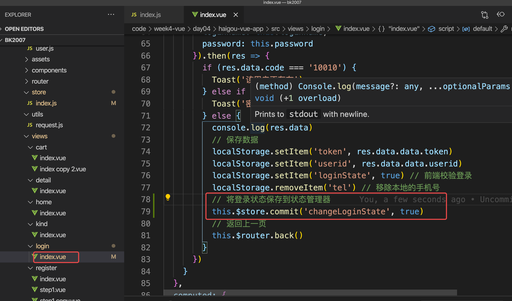

# 1.**Vue-cli** 

Vue-CLI ≠ Vue，Vue-CLI就是一个Vue工具。

## 1.1单文件组件

在很多 Vue 项目中，我们使用 Vue.component 来定义全局组件，紧接着用 new Vue({ el:'#container '}) 在每个页面内指定一个容器元素。这种方式在很多中小规模的项目中运作的很好，在这些项目里 JS 只被用来加强特定的视图。但当在更复杂的项目中，或者你的前端完全由JS驱动的时候，下面这些缺点将变得非常明显：

* 所有的组件都放同一个html文件中

* 没有构建步骤,不能使用npm来管理项目

* 缺乏语法高亮和提示

* 没有针对单个组件的css样式支持

针对于上述的问题，vue框架发布了 vue-cli 项目 生成 工具，Vue-cli是一个基于 Vue.js 进行快速开发的完整系统， 致力于将 Vue 生态中的工具基础标准化。它确保了各种构建工具能够基于智能的默认配置即可平稳衔接，这样你可以专注在撰写应用上，而不必花好几天去纠结配置的问题。


## 1.2 快速原型开发

https://cli.vuejs.org/zh/guide/prototyping.html

你可以使用 `vue serve` 和 `vue build` 命令对单个 `*.vue` 文件进行快速原型开发，不过这需要先额外安装一个全局的扩展

```bash
cnpm install -g @vue/cli-service-global
```

> 可以使用快速原型开发快速测试一些demo

```js
// demo/App.vue
<template>
  <div>
    <input type="text" v-model="username" />
    <button @click="addItem">添加</button>
    <ul>
      <li v-for="(item, index) of list" :key="index">
        {{ item }} <button @click="deleteItem(index)">删除</button>
      </li>
    </ul>
  </div>
</template>
<script>
export default {
  data () {
    return {
      username: '',
      list: []
    }
  },
  methods: {
    addItem () {
      this.list.push(this.username)
    },
    deleteItem (index) {
      this.list.splice(index, 1)
    }
  },
}
</script>
<style>
  
</style>
```

案例拆分组件

```js
// demo/App.vue
<template>
  <div>
    <input type="text" v-model="username" />
    <button @click="addItem">添加</button>
    <Child :list="list"></Child>
  </div>
</template>
<script>
import Child from './Child' // const Child = require('./Child')
export default { // module.exports = {}
  data () {
    return {
      username: '',
      list: []
    }
  },
  components: {
    Child
  },
  methods: {
    addItem () {
      this.list.push(this.username)
    }
  },
}
</script>
<style>
  
</style>
```

```vue
// demo/Child.vue
<template>
  <ul>
    <li v-for="(item, index) of list" :key="index">
      {{ item }} <button @click="deleteItem(index)">删除</button>
    </li>
  </ul>
</template>
<script>
export default {
  props: ['list'],
  methods: {
    deleteItem(index){
      this.list.splice(index, 1)
    }
  }
}
</script>
```


## 1.3 工具安装

Vue-cli3.x以上版本需要 Node.js 8.9 或更高版本(推荐 v10 以上)。

网址：http://npmjs.com

```bash
## 安装 
cnpm install -g @vue/cli 
## 安装成功后，检查  4.5.11 / 4.5.12
vue --version 
vue -V 
# Vue和VueCLI是两回事 
## 卸载 
cnpm uninstall -g @vue/cli 
```

> 如果需要安装其他版本，可以使用 npm install -g @vue/cli@版本号 的方式进行指定版本。

如果最新版安装不成功，可以尝试以下4种方式去解决：

* 断网，使用热点共享流量去执行安装命令

* 安装其他版本`cnpm i @vue/cli@4.5.11 -g`

* 切换一下npm镜像源，切换成taobao / cpm
* 找一个可以安装成功的小伙伴，等他创建完毕，删除掉node_modules然后传给你，保存起来(`cnpm i / yarn`)

# 2.创建项目

## 2.1 使用yarn来安装依赖

创建项目默认选择的包管理器顺序是 yarn，cnpm， npm

```
cnpm i yarn -g

# 安装模块 以下是语法，不需要安装
yarn add module -S
yarn add module -D
yarn add module
```

```bash
# 首先需要进入到对应的目录中(英文目录不要有空格及中文),执行如下命令 
# 如果当前你的终端工作路径带有中文或者空格，你可以使用`cd 路径`形式进行路径切换，切换到符合 要求的路径中 
vue create 项目名称(创建时会自己以对应的项目名称生成目录) 
## 例 
vue create haigou-vue-app 
# 上述命令中，可以允许变的就是`haigou-vue-app`部分
```

**以下步骤以** Vue CLI v4.5.11 **为例，仅供参考，在实际使用时，请以自身需求为准进行配置**

* 预设选择


* 选择预设功能（根据自身项目需要选择）


* 选择版本


* 选择路由的history模式


* 选择css预处理器


* 选择代码验证规则


* 选择额外的 eslint 功能


* 是否独立配置


* 是否保存本次预设


* 等待一会....
* 项目创建成功

```
cd haigou-vue-app
npm run serve  / yarn serve
```

> 自己暂时也可以不用创建项目，可以直接 拷贝 model.zip,解压，`cnpm i ` 或者 `yarn`安装依赖，使用`cnpm run serve`或者`yarn serve `运行项目

# 3.目录结构分析

```bash
haigou-vue-app # 项目名称
	|-node_modules # 项目依赖
	|-public	# 资源文件，静态资源目录，如图片、字体等。
		｜-img # 图片文件
		favicon.ico # 图标
		index.html # 首页入口文件，你可以添加一些 meta 信息或统计代码啥的。
		robots.txt
	|-src # 这里是我们要开发的目录，基本上要做的事情都在这个目录里
		|-assets 	# 放置一些图片，如logo等
		|-components #  目录里面放了一个组件文件，可以不用
		|-router # 路由
		|-store # 状态管理器
		|-views # 页面
		App.vue # 项目入口文件，我们也可以直接将组件写这里，而不使用 components 目录。
		main.js # 项目的核心文件。
		regsterServiceWorker.js
	.browserslistrc # 浏览器支持的规范配置
	.editorconfig # 编辑器的配置
	.eslintrc.js # 代码格式的校验规则
	.gitignore # git的忽略文件
	.babel.config.js # babel的配置，js高级的配置
	package.json # 项目配置文件
	README.md # 项目的说明文档，markdown 格式
	yarn.lock
```


# 4.vue路由 + 项目

## 4.1 路由的概念

路由的本质就是一种 对应关系 ，根据不同的URL请求，返回对应不同的资源。那么url地址和真实的资源之间就有一种对应的关系，就是路由。

路由分为： 后端路由 和 前端路由

* 后端路由：由服务器端进行实现并实现资源映射分发

  * 概念：根据不同的用户URL请求，返回不同的内容（**地址与资源**产生对应关系）

  * 本质：URL请求地址与服务器资源之间的对应关系

  > Node _ ejs
  >
  > 用户地址栏输入 /user，匹配到服务器 user的路由，服务做相关的业务逻辑，通过 res.render()渲染了一个新的页面

  

* 前端路由：根据不同的事件来显示不同的页面内容，是事件与事件处理函数之间的对应关系

  * 概念：根据不同的用户事件，显示不同的页面内容（**地址与事件**产生对应关系）

  * 本质：用户事件与事件处理函数之间的对应关系

    

**SPA**(Single Page Application)单页面应用程序，基于前端路由而起：**整个网站只有一个页面，通过监听地址栏中的变化事件，来通过Ajax局部更新内容信息显示、同时支持浏览器地址栏的前进和后退操作。**


## 4.2 前端路由实现

前端路由有2种模式：

* hash模式

hash路由模式是这样的：http://xxx.abc.com/#/xx。 有带#号，后面就是hash值的变化。改变后面的hash值，它不会向服务器发出请求，因此也就不会刷新页面。并且每次hash值发生改变的时候，会触发hashchange事件。因此我们可以通过监听该事件，来知道hash值发生了哪些变化。

```js
window.addEventListener('hashchange', ()=>{ 
  // 通过 location.hash 获取到最新的 hash 值 
  console.log(location.hash); 
});
```

* history模式 （我们在创建创建项目的时候选择的就是这个）

> HTML5的History API为浏览器的全局history对象增加了该扩展方法。它是一个浏览器（bom）的一个接口，在window对象中提供了onpopstate事件来监听历史栈的改变，只要历史栈有信息发生改变的话，就会触发该事件。

```js
history.pushState({},title,url); // 向历史记录中追加一条记录 
history.replaceState({},title,url); // 替换当前页在历史记录中的信息。 
window.addEventListener('popstate', function(event) { console.log(event) })
```

> 注：浏览器地址没有#， 比如(http://localhost:3001/a); 它也一样不会刷新页面的。但是url地址会改变。但它在服务器没有配置的情况下，不能手动刷新，否则返回404页面

**hash 纯前端 操作，history需要后端的配合**

**hash**路由体验

```html
<body>
  <a href="#/a">去a页面</a> <hr> 
  <a href="#/b">去b页面</a><hr> 
  <a href="#/c">去c页面</a><hr> 
  <a href="#/d">去d页面</a><hr> 
  <div id="route-view"></div> 
</body> 
<script type="text/javascript"> 
  // 获取元内容素 
  var ctn = document.getElementById('route-view') 
  // 默认渲染 
  render('/a') 
  // 监听hashchange事件 
  window.addEventListener('hashchange',function(){ 
    render(location.hash.slice(1)) 
  })
  // 分支
  function render(router){ 
    switch (router) { 
      case '/a': 
        ctn.innerHTML = '这是a页面' 
        break; 
      case '/b': 
        ctn.innerHTML = '这是b页面' 
        break; 
      case '/c': 
        ctn.innerHTML = '这是c页面' 
        break; 
      case '/d': 
        ctn.innerHTML = '这是d页面' 
        break; 
      default: 
        ctn.innerHTML = '404页面' 
        break; 
    } 
  } 
</script>
```

##  4.3 Vue Router

网址：https://router.vuejs.org/zh/

### 4.3.1 介绍

**Vue Router** **是** **Vue.js** **官方的路由管理器**。它和 Vue.js 的核心深度集成，让构建单页面应用变得易如反掌。包含的功能有：

* 嵌套的路由/视图表

* 模块化的、基于组件的路由配置
* 路由参数、查询、通配符
* 基于 Vue.js 过渡系统的视图过渡效果
* 细粒度的导航控制
* 带有自动激活的 CSS class 的链接
* HTML5 历史模式或 hash 模式，在 IE9 中自动降级
* 自定义的滚动条行为

### 4.3.2 **安装**

如果在vue-cli创建项目时没有勾选上 vue-router 选项，此时就需要手动的来安装它（**切记，要进入项目中再去运行这个指令**），不过我们之前创建项目时已经安装上了，所以下面的命令时不需要的。

```
cnpm i vue-router -S
```

查看是否安装成功，查看文件 package.json的依赖文件中是否包含 vue-router选项

### 4.3.3 Vue Router基本使用

Vue Router的基本使用步骤：

* 引入相关库文件 （咱们使用脚手架创建，本身已经自带引入）

* VueRouter引入到Vue类中 （咱们使用脚手架创建，本身已经自带引入， src/router/index.js）


* 定义路由组件规则（查看项目文件下的src/router文件夹，里面有index.js）


* 创建路由实例（查看项目文件下的src/router文件夹，里面有index.js）


* 把路由挂载到Vue根实例中（查看项目文件下的src/main.js）


* 添加路由组件渲染容器到对应组件中（占坑）（查看项目文件下的src/App.vue）


### 4.3.4 导航方式

在页面中，导航实现有2种方式：

* 声明式导航：通过点击链接实现的导航方式，例如HTML中的“a”标签，Vue中的“router-link”所实现的。
  * 它就是先在页面中定义好跳转的路由规则，vueRouter中通过 router-link组件来完成

```vue
<router-link to="path">xxx</router-link>
<!--
to 要跳转到的路由规则 string|object
to="users" 
:to="{path:'path'}" 
-->
```


* 编程式导航：通过调用JavaScript形式API实现的导航方式，例如location.href实现的跳转效果

  * 简单来说，编程式导航就是通过 JavaScript 来实现路由跳转

  

```js
this.$router.push("/login"); 
this.$router.push({ path:"/login" }); 
this.$router.push({ path:"/login",query:{username:"jack"} }); // http://localhost:8080/login?username=jack
this.$router.push({ name:'user' , params: {id:123} }); // http://localhost:8080/user/123
this.$router.go( n );//n为数字 负数为回退
this.$router.back();// 返回
```

> **注意点：**编程式导航在跳转到与当前地址一致的URL时会报错，但这个报错不影响功能：
>
> 
>
> 如果患有强迫症，可以在路由入口文件 index.js 中添加如下代码解决该问题：

```js
const originalPush = VueRouter.prototype.push; 
VueRouter.prototype.push = function push(location) { 
  return originalPush.call(this, location).catch((err) => err); 
};
```


# 5.构建项目

## 5.1 构建项目的基本结构


调整 src/App.vue  ---- 主界面

```vue
<template>
  <div></div>
</template>
<script>
export default {
}
</script>
<style lang="stylus">
</style>
```

按照上图布局

```vue
<template>
  <div class="container">
    <div class="box">
      <header class="header"></header>
      <div class="content"></div>
    </div>
    <footer class="footer"></footer>
  </div>
</template>
<script>
export default {
}
</script>
<style lang="stylus">
</style>

```

构建css - 预处理器 - stylus。---- 不要忘记审查元素

> 弹性盒布局：主流 - 默认 水平方向，可以调整为垂直方向
>
> 媒体查询：确定 横屏 还是 竖屏
>
> rem布局：自适应
>
> vw布局

```vue
<template>
  <div class="container">
    <div class="box">
      <header class="header"></header>
      <div class="content"></div>
    </div>
    <footer class="footer"></footer>
  </div>
</template>
<script>
export default {
}
</script>
<style lang="stylus">
*
  padding 0
  margin 0
  list-style none

html, body, .container
  width 100%
  height 100%

.container
  display flex
  flex-direction column
  .box
    width 100%
    flex 1
    display flex
    flex-direction column
    .header
      width 100%
      height 44px
      background-color #f66
    .content
      width 100%
      flex 1
      overflow auto
  .footer
    height 50px
    width 100%
    background-color #efefef
</style>

```


如何保证这个应用在横屏状态下无法正常预览

```vue
<template>
  <div class="container">
    <div class="box">
      <header class="header"></header>
      <div class="content"></div>
    </div>
    <footer class="footer"></footer>
    <div class="tip">请将屏幕竖向浏览</div>
  </div>
</template>
<script>
export default {
}
</script>
<style lang="stylus">
*
  padding 0
  margin 0
  list-style none

// 默认的展示
.tip
  position fixed
  top 0
  left 0
  right 0
  bottom 0
  height 100%
  background-color rgba(0, 0, 0, 0.5)
  color #ffffff
  font-weight bold
  font-size 24px
  display none

// 通过媒体查询判断横竖屏
// 横屏 landscape   竖屏 portrait
@media all and (orientation: landscape)
  .tip
    display flex
    align-items center
    justify-content center

html, body, .container
  width 100%
  height 100%
  background-color #f6f6f6
.container
  display flex
  flex-direction column
  max-width 1080px
  margin 0 auto
  .box
    width 100%
    flex 1
    display flex
    flex-direction column
    .header
      width 100%
      height 44px
      background-color #f66
    .content
      width 100%
      flex 1
      overflow auto
  .footer
    height 50px
    width 100%
    background-color #ffffff
    box-shadow 0 0 5px #000
</style>

```

如何通过rem快速的实现布局

```vue
<template>
  <div class="container">
    <div class="box">
      <header class="header"></header>
      <div class="content"></div>
    </div>
    <footer class="footer"></footer>
    <div class="tip">请将屏幕竖向浏览</div>
  </div>
</template>
<script>
export default {
}
</script>
<style lang="stylus">
*
  padding 0
  margin 0
  list-style none

// 默认的展示
.tip
  position fixed
  top 0
  left 0
  right 0
  bottom 0
  height 100%
  background-color rgba(0, 0, 0, 0.5)
  color #ffffff
  font-weight bold
  font-size 24px
  display none

// 通过媒体查询判断横竖屏
// 横屏 landscape   竖屏 portrait
@media all and (orientation: landscape)
  .tip
    display flex
    align-items center
    justify-content center

html, body, .container
  width 100%
  height 100%
  background-color #f6f6f6

// rem布局依靠根节点字体大小，将html节点的字体大小调整即可
// 以后使用rem作为单位
html
  font-size 100px
// 字体大小可以继承
body
  font-size 12px

.container
  display flex
  flex-direction column
  max-width 1080px
  margin 0 auto
  .box
    width 100%
    flex 1
    display flex
    flex-direction column
    .header
      width 100%
      height 0.44rem // 44px
      background-color #f66
    .content
      width 100%
      flex 1
      overflow auto
  .footer
    height 0.5rem // 50px
    width 100%
    background-color #ffffff
    box-shadow 0 0 5px #000
</style>

```

如果需要根据屏幕的宽度的变化而改变根节点的字体大小呢. ---- vw

```vue
<template>
  <div class="container">
    <div class="box">
      <header class="header"></header>
      <div class="content"></div>
    </div>
    <footer class="footer"></footer>
    <div class="tip">请将屏幕竖向浏览</div>
  </div>
</template>
<script>
export default {
}
</script>
<style lang="stylus">
*
  padding 0
  margin 0
  list-style none

// 默认的展示
.tip
  position fixed
  top 0
  left 0
  right 0
  bottom 0
  height 100%
  background-color rgba(0, 0, 0, 0.5)
  color #ffffff
  font-weight bold
  font-size 24px
  display none

// 通过媒体查询判断横竖屏
// 横屏 landscape   竖屏 portrait
@media all and (orientation: landscape)
  .tip
    display flex
    align-items center
    justify-content center

html, body, .container
  width 100%
  height 100%
  background-color #f6f6f6

// rem布局依靠根节点字体大小，将html节点的字体大小调整即可
// 以后使用rem作为单位
html
  // font-size 100px // 不管宽度多高  固定值
  // --------------------------------------------------
  // 找好参照物 iphone 6 将屏幕 100 等分 100 / 375 ，然后再乘以 100px
  // iphone 6 750 * 1334 --- 375 * 667   100 / 375 * 100  =
  font-size 26.6666666vw
// 字体大小可以继承
body
  font-size 12px

.container
  display flex
  flex-direction column
  max-width 1080px
  margin 0 auto
  .box
    width 100%
    flex 1
    display flex
    flex-direction column
    .header
      width 100%
      height 0.44rem // 44px
      background-color #f66
    .content
      width 100%
      flex 1
      overflow auto
  .footer
    height 0.5rem // 50px
    width 100%
    background-color #ffffff
    box-shadow 0 0 5px #000
</style>

```

如果屏幕的宽度大于750 固定字体大小 --- 固定。html 根节点的字体大小

```vue
<template>
  <div class="container">
    <div class="box">
      <header class="header"></header>
      <div class="content"></div>
    </div>
    <footer class="footer"></footer>
    <div class="tip">请将屏幕竖向浏览</div>
  </div>
</template>
<script>
export default {
}
</script>
<style lang="stylus">
*
  padding 0
  margin 0
  list-style none

// 默认的展示
.tip
  position fixed
  top 0
  left 0
  right 0
  bottom 0
  height 100%
  background-color rgba(0, 0, 0, 0.5)
  color #ffffff
  font-weight bold
  font-size 24px
  display none

// 通过媒体查询判断横竖屏
// 横屏 landscape   竖屏 portrait
@media all and (orientation: landscape)
  .tip
    display flex
    align-items center
    justify-content center

html, body, .container
  width 100%
  height 100%
  background-color #f6f6f6

// rem布局依靠根节点字体大小，将html节点的字体大小调整即可
// 以后使用rem作为单位
html
  // font-size 100px // 不管宽度多高  固定值
  // --------------------------------------------------
  // 找好参照物 iphone 6 将屏幕 100 等分 100 / 375 ，然后再乘以 100px
  // iphone 6 750 * 1334 --- 375 * 667   100 / 375 * 100  =
  font-size 26.6666666vw

// 屏幕宽度大于750 时，html根节点设置为固定值
@media all and (min-width: 750px )
  html
    font-size 100px

// 字体大小可以继承
body
  font-size 12px

.container
  display flex
  flex-direction column
  max-width 1080px
  margin 0 auto
  .box
    width 100%
    flex 1
    display flex
    flex-direction column
    .header
      width 100%
      height 0.44rem // 44px
      background-color #f66
    .content
      width 100%
      flex 1
      overflow auto
  .footer
    height 0.5rem // 50px
    width 100%
    background-color #ffffff
    box-shadow 0 0 5px #ccc
</style>

```

## 5.2 构建项目的基本页面

**创建首页，分类，购物车，我的 四个基本页面 --- 文件最后一行要添加空行**


## 5.3 配置 基本路由

> 如果多次使用的组件，推荐 先引入后调用
>
> 如果只使用一次，推荐使用懒加载
>
> 如果需要分割代码，/* webpackChunkName: "about" */

```js
// src/router/index.js
import Home from '../views/Home.vue'
// path name component 。。。。。
const routes = [
  {
    path: '/',
    name: 'Home',
    component: Home // 先引入，然后再调用
  },
  {
    path: '/about',
    name: 'About',
    // route level code-splitting
    // this generates a separate chunk (about.[hash].js) for this route
    // which is lazy-loaded when the route is visited.
    // 路由的懒加载 --- 需要的时候再加载 /* webpackChunkName: "about" */
    // /* webpackChunkName: "about" */ 可以通过  运行 yarn build 之后 dist/js 观察变化
    component: () => import(/* webpackChunkName: "about" */'../views/About.vue')
  }
]
```

转换为如下代码

```js
// src/router/index.js

import Vue from 'vue'
import VueRouter from 'vue-router'

const originalPush = VueRouter.prototype.push
VueRouter.prototype.push = function push (location) {
  return originalPush.call(this, location).catch((err) => err)
}
Vue.use(VueRouter)

// path name component 。。。。。
const routes = [
  {
    path: '/home',
    name: 'home',
    component: () => import('../views/home/index.vue')
  },
  {
    path: '/kind',
    name: 'kind',
    component: () => import('../views/kind/index.vue')
  },
  {
    path: '/cart',
    name: 'cart',
    component: () => import('../views/cart/index.vue')
  },
  {
    path: '/user',
    name: 'user',
    component: () => import('../views/user/index.vue')
  }
]

const router = new VueRouter({
  mode: 'history',
  base: process.env.BASE_URL,
  routes
})

export default router

```

## 5.4 添加路由组件渲染容器到对应组件中

```vue
// src/App.vue
<template>
  <div class="container">
    <!-- <div class="box">
      <header class="header"></header>
      <div class="content"></div>
    </div> -->
    <!-- 这个坑 用来显示 路由映射的 页面 -->
    <router-view></router-view>
    <footer class="footer"></footer>
    <div class="tip">请将屏幕竖向浏览</div>
  </div>
</template>
```

> 浏览器访问。/home  /kind  /cart  /user 分别查看效果


> 发现当用户什么也不输入的时候，显示不正常  ----- 什么都不输入，来一个默认的跳转地址

## 5.5 路由的重定向 以及 404页面

> 路由的匹配时从上到下匹配

```js
// src/router/index.js
const routes = [
  { // ********重定向*************
    path: '/',
    redirect: '/home'
  },
  {
    path: '/home',
    name: 'home',
    component: () => import('../views/home/index.vue')
  },
  {
    path: '/kind',
    name: 'kind',
    component: () => import('../views/kind/index.vue')
  },
  {
    path: '/cart',
    name: 'cart',
    component: () => import('../views/cart/index.vue')
  },
  {
    path: '/user',
    name: 'user',
    component: () => import('../views/user/index.vue')
  },
  { // **********404页面，可以创建一个单独的文件***********
    path: '**',
    component: () => import('../views/home/index.vue')
  }
]
```

## 5.6 设计页面底部的导航

打开 图标库 -> 选择图标-> 加入购物车->点击购物车-> 添加至项目-> font-class 


打开public/index.html

```html
<head>
    <meta charset="utf-8">
    <meta http-equiv="X-UA-Compatible" content="IE=edge">
    <meta name="viewport" content="width=device-width,initial-scale=1.0">
    <link rel="icon" href="<%= BASE_URL %>favicon.ico">
    <title><%= htmlWebpackPlugin.options.title %></title>
    <link rel="stylesheet" href="//at.alicdn.com/t/font_2429662_bceg4eosgvh.css">
  </head>
```

App.vue

```vue
<template>
  <div class="container">
    <router-view></router-view>
    <footer class="footer">
      <ul>
        <li>
          <span class="iconfont icon-shouye"></span>
          <p>首页</p>
        </li>
        <li>
          <span class="iconfont icon-fenlei"></span>
          <p>分类</p>
        </li>
        <li>
          <span class="iconfont icon-gouwuche"></span>
          <p>购物车</p>
        </li>
        <li>
          <span class="iconfont icon-wode"></span>
          <p>我的</p>
        </li>
      </ul>
    </footer>
    <div class="tip">请将屏幕竖向浏览</div>
  </div>
</template>
<script>
export default {
}
</script>
<style lang="stylus">
*
  padding 0
  margin 0
  list-style none

// 默认的展示
.tip
  position fixed
  top 0
  left 0
  right 0
  bottom 0
  height 100%
  background-color rgba(0, 0, 0, 0.5)
  color #ffffff
  font-weight bold
  font-size 24px
  display none

// 通过媒体查询判断横竖屏
// 横屏 landscape   竖屏 portrait
@media all and (orientation: landscape)
  .tip
    display flex
    align-items center
    justify-content center

html, body, .container
  width 100%
  height 100%
  background-color #f6f6f6

// rem布局依靠根节点字体大小，将html节点的字体大小调整即可
// 以后使用rem作为单位
html
  // font-size 100px // 不管宽度多高  固定值
  // --------------------------------------------------
  // 找好参照物 iphone 6 将屏幕 100 等分 100 / 375 ，然后再乘以 100px
  // iphone 6 750 * 1334 --- 375 * 667   100 / 375 * 100  =
  font-size 26.6666666vw

// 屏幕宽度大于750 时，html根节点设置为固定值
@media all and (min-width: 750px )
  html
    font-size 100px

// 字体大小可以继承
body
  font-size 12px

.container
  display flex
  flex-direction column
  max-width 1080px
  margin 0 auto
  .box
    width 100%
    flex 1
    display flex
    flex-direction column
    header
      width 100%
      height 0.44rem // 44px
      background-color #f66
    .content
      width 100%
      flex 1
      overflow auto
  .footer
    height 0.5rem // 50px
    width 100%
    background-color #ffffff
    box-shadow 0 0 5px #ccc
    ul
      width 100%
      height 100%
      display flex
      li
        flex 1
        height 100%
        display flex
        flex-direction column
        justify-content center
        align-items center
        span
          font-size 0.2rem
        p
          margin-top 5px

</style>

```

## 5.7 点击底部实现切换路由

使用 声明式导航 切换路由

```vue
<template>
  <div class="container">
    <!-- <div class="box">
      <header class="header"></header>
      <div class="content"></div>
    </div> -->
    <!-- 这个坑 用来显示 路由映射的 页面 -->
    <router-view></router-view>
    <footer class="footer">
      <ul>
      	<!-- router-link 默认会渲染为 a 标签
        使用tag属性设置 转换的标签 -->
        <router-link to="/home" tag="li">
          <span class="iconfont icon-shouye"></span>
          <p>首页</p>
        </router-link>
        <router-link to="/kind" tag="li">
          <span class="iconfont icon-fenlei"></span>
          <p>分类</p>
        </router-link>
        <router-link to="/cart" tag="li">
          <span class="iconfont icon-gouwuche"></span>
          <p>购物车</p>
        </router-link>
        <router-link to="/user" tag="li">
          <span class="iconfont icon-wode"></span>
          <p>我的</p>
        </router-link>
      </ul>
    </footer>
    <div class="tip">请将屏幕竖向浏览</div>
  </div>
</template>
<script>
export default {
}
</script>
<style lang="stylus">
*
  padding 0
  margin 0
  list-style none

// 默认的展示
.tip
  position fixed
  top 0
  left 0
  right 0
  bottom 0
  height 100%
  background-color rgba(0, 0, 0, 0.5)
  color #ffffff
  font-weight bold
  font-size 24px
  display none

// 通过媒体查询判断横竖屏
// 横屏 landscape   竖屏 portrait
@media all and (orientation: landscape)
  .tip
    display flex
    align-items center
    justify-content center

html, body, .container
  width 100%
  height 100%
  background-color #f6f6f6

// rem布局依靠根节点字体大小，将html节点的字体大小调整即可
// 以后使用rem作为单位
html
  // font-size 100px // 不管宽度多高  固定值
  // --------------------------------------------------
  // 找好参照物 iphone 6 将屏幕 100 等分 100 / 375 ，然后再乘以 100px
  // iphone 6 750 * 1334 --- 375 * 667   100 / 375 * 100  =
  font-size 26.6666666vw

// 屏幕宽度大于750 时，html根节点设置为固定值
@media all and (min-width: 750px )
  html
    font-size 100px

// 字体大小可以继承
body
  font-size 12px

.container
  display flex
  flex-direction column
  max-width 1080px
  margin 0 auto
  .box
    width 100%
    flex 1
    display flex
    flex-direction column
    .header
      width 100%
      height 0.44rem // 44px
      background-color #f66
    .content
      width 100%
      flex 1
      overflow auto
  .footer
    height 0.5rem // 50px
    width 100%
    background-color #ffffff
    box-shadow 0 0 5px #ccc
    ul
      width 100%
      height 100%
      display flex
      li
        flex 1
        height 100%
        display flex
        flex-direction column
        justify-content center
        align-items center
        // & 代表的就是当前li的class样式
        &.router-link-active
          color #f66
        span
          font-size 0.2rem
        p
          margin-top 5px

</style>

```

# 6.介绍vue 移动端的组件库

* mint-ui 被淘汰
* vant https://vant-contrib.gitee.io/vant/#/zh-CN/

## 6.1 安装vantui库

```
npm i vant@latest-v2 // v2项目使用这个指令安装
npm i vant -S  // v3 项目用这个指令安装

```

## 6.2 [配置UI库](https://vant-contrib.gitee.io/vant/#/zh-CN/quickstart)

自动按需引入组件 (推荐)

[babel-plugin-import](https://github.com/ant-design/babel-plugin-import) 是一款 babel 插件，它会在编译过程中将 import 的写法自动转换为按需引入的方式。

```
cnpm i babel-plugin-import -D   /  yarn add babel-plugin-import -D
```

## 6.3 修改 babel.config.js 中配置


babel.config.js 配置 

```javascript
module.exports = {
  presets: [
    '@vue/cli-plugin-babel/preset'
  ],
  plugins:[
    [
      "import" , {
        libraryName : "vant",
        libraryDirectory : "es",
        style : true 
      },
      "vant"
    ]
  ]
}

```

## 6.4 给首页添加轮播图

Src/views/home/index.vue

```vue
<template>
  <div class="box">
    <header class="header">首页头部</header>
    <div class="content">
      <van-swipe class="my-swipe" :autoplay="3000" indicator-color="white">
        <van-swipe-item>1</van-swipe-item>
        <van-swipe-item>2</van-swipe-item>
        <van-swipe-item>3</van-swipe-item>
        <van-swipe-item>4</van-swipe-item>
      </van-swipe>
    </div>
  </div>
</template>

<script>
import Vue from 'vue'
import { Swipe, SwipeItem } from 'vant'

Vue.use(Swipe)
Vue.use(SwipeItem)
export default {

}
</script>

<style lang="stylus">
.my-swipe .van-swipe-item
    color #fff
    font-size 20px
    line-height 150px
    text-align center
    background-color #39a9ed
</style>

```

# 7.首页展示

## 7.1 展示nav导航

```vue
<template>
  <div class="box">
    <header class="header">首页头部</header>
    <div class="content">
      <!-- 轮播图 -->
      <van-swipe class="my-swipe" :autoplay="3000" indicator-color="white">
        <van-swipe-item>1</van-swipe-item>
        <van-swipe-item>2</van-swipe-item>
        <van-swipe-item>3</van-swipe-item>
        <van-swipe-item>4</van-swipe-item>
      </van-swipe>
      <!-- nav导航 -->
      <van-grid :column-num="5" :border="false">
        <van-grid-item v-for="item in navlist" :key="item.navid" :icon="item.imgurl" :text="item.title" />
      </van-grid>
    </div>
  </div>
</template>

<script>
import Vue from 'vue'
import { Swipe, SwipeItem, Grid, GridItem } from 'vant'

Vue.use(Swipe)
Vue.use(SwipeItem)
Vue.use(Grid)
Vue.use(GridItem)
export default {
  data () {
    return {
      navlist: [
        { navid: 1, title: '嗨购超市', imgurl: 'https://m.360buyimg.com/mobilecms/s120x120_jfs/t1/125678/35/5947/4868/5efbf28cEbf04a25a/e2bcc411170524f0.png' },
        { navid: 2, title: '数码电器', imgurl: 'https://m.360buyimg.com/mobilecms/s120x120_jfs/t1/125678/35/5947/4868/5efbf28cEbf04a25a/e2bcc411170524f0.png' },
        { navid: 3, title: '嗨购服饰', imgurl: 'https://m.360buyimg.com/mobilecms/s120x120_jfs/t1/125678/35/5947/4868/5efbf28cEbf04a25a/e2bcc411170524f0.png' },
        { navid: 4, title: '嗨购生鲜', imgurl: 'https://m.360buyimg.com/mobilecms/s120x120_jfs/t1/125678/35/5947/4868/5efbf28cEbf04a25a/e2bcc411170524f0.png' },
        { navid: 5, title: '嗨购到家', imgurl: 'https://m.360buyimg.com/mobilecms/s120x120_jfs/t1/125678/35/5947/4868/5efbf28cEbf04a25a/e2bcc411170524f0.png' },
        { navid: 6, title: '充值缴费', imgurl: 'https://m.360buyimg.com/mobilecms/s120x120_jfs/t1/125678/35/5947/4868/5efbf28cEbf04a25a/e2bcc411170524f0.png' },
        { navid: 7, title: '9.9元拼', imgurl: 'https://m.360buyimg.com/mobilecms/s120x120_jfs/t1/125678/35/5947/4868/5efbf28cEbf04a25a/e2bcc411170524f0.png' },
        { navid: 8, title: '领券', imgurl: 'https://m.360buyimg.com/mobilecms/s120x120_jfs/t1/125678/35/5947/4868/5efbf28cEbf04a25a/e2bcc411170524f0.png' },
        { navid: 9, title: '领金贴', imgurl: 'https://m.360buyimg.com/mobilecms/s120x120_jfs/t1/125678/35/5947/4868/5efbf28cEbf04a25a/e2bcc411170524f0.png' },
        { navid: 10, title: 'plus会员', imgurl: 'https://m.360buyimg.com/mobilecms/s120x120_jfs/t1/125678/35/5947/4868/5efbf28cEbf04a25a/e2bcc411170524f0.png' }
      ]
    }
  }
}
</script>

<style lang="stylus">
.my-swipe .van-swipe-item
  color #fff
  font-size 20px
  line-height 150px
  text-align center
  background-color #39a9ed

.van-grid-item__content
  background-color #f6f6f6
</style>

```

## 7.2做好接口的准备工作

接口的代码在：my-admin-app

如果没有node_modules ， npm i

打开数据库的连接池

> npm run dev

http://localhost:3001/apidoc 查看接口文档


如果点击测试产品的接口，没有返回数据，说明数据库中没有商品的信息

打开 myapp

如果没有node_modules ， `cnpm i`

>  打开数据库的连接池
>
> 浏览器访问 http://localhost:3000/pro/uploadPro 就可以看到如下场景
>
> 

# 7.3 vue项目中进行数据的请求 - 演示 - 基础

```sh
yarn add axios -S    /   cnpm i axios -S
```

如果项目的开发过程中遇到了如下错误


> 上图说明 发生了跨域的问题。No 'Access-Control-Allow-Origin' header is present on the requested resource.

> 跨域问题 ----  同源策略 --- 协议+域名+端口


* 1.es6 的模块化开发 https://es6.ruanyifeng.com/#docs/module

```js
// commonjs规范
module.exports = {}    ====>   const module = require(path)

// es6 模块化
export default {}     =====>   import module from 'path'

export const str = '1'   
export const str1 = '2'  
export const str2 = '3'    =====>   import { str, str1, str2 } from 'path'

export function fn1 () {}
export function fn2 () {}
export function fn3 () {}  =====> import { fn1, fn2, fn3 } from 'path'
```

* 2.axios的get请求和post请求

```js
axios.get('url?id=1').then(res=> console.log(res)) // 1
axios.get('url', { params: { id: 1} }).then(res => console.log(res)) // 2

axios.post('url', { id: 1 }).then(res => console.log(res)) // 3

axios({}) // 4 
```

* 3.自定义axios

```js
// 比如 接口的地址为 http://localhost:3001/api/pro/list

// 如果不使用 自定义axios 请求时  axios.get('http://localhost:3001/api/pro/list').then(res => console.log(res))

// 如果自定义规则如下
const request = axios.create({
  baseURL: 'http://localhost:3001/api'
})
// 那么以后请求数据时，就可以 request.get('/pro/list').then(res => console.log(res))

// axios 请求完的数据是基于 promise 的，可以直接返回，在引入的模块下使用then函数继续操作
```

* 4.跨域问题
  * 前端解决 ----- 代理
  * 后端解决 ----- 设置接口无跨域  ----- react

```js
// haigou-vue-app/vue.config.js
// vue项目的配置
module.exports = {
  devServer: { // 配置vue项目的开发服务器
    // http://localhost:3001/api/pro/list     ===》   /pro/list
    proxy: 'http://localhost:3001/api'
  }
}


// 如果 以上代码如此处理，自定义axios 即可修改如下
const request = axios.create({
  baseURL: ''
})
```

## 7.4 数据请求的流程

* 1.如果项目的接口有跨域的问题，项目的根目录下创建 vue.config.js文件,记住端口号

```js
// haigou-vue-app/vue.config.js
module.exports = {
	devServer: {
		proxy: 'http://localhost:3001/api'
	}
}
```

> 配置完成重新运行项目
>
> vue.config.js 其实可以看作是 webpack.config.js 配置的重写
>
> Webpack 是 前端模块化开发，组件化开发的利器 

* 2 在src/utils/request.js 中 封装axios

```js
// 引入axios
import axios from 'axios'

// 创建 axios 的实例，---- 自定义axios
const request = axios.create({
  // 后续请求接口时  会自动添加如下的前缀
  // 有代理的话，先走代理的服务器，再拼接 axios的baseURL，最后再拼接接口的地址
  // baseURL: 'http://localhost:3001/api' // 如果未配置过跨域
  baseURL: '' // 如果配置过跨域，什么也不写
})

// axios 拦截器

// 请求拦截器 ---- 所有 的接口在请求之前都需要做的事   ------  显示加载的动画

// 响应拦截器 ---- 所有 的接口在返回数据之前都需要做的事 -----  隐藏加载的动画
export default request

```

* 3.src/api文件夹下封装 各个模块的数据请求

产品模块相关的接口 src/api/pro.js

```js
// 引入自定义封装的axios
import request from './../utils/request'

// 封装 查询秒杀列表的数据接口
export function getSeckillList () {
  return request.get('/pro/seckilllist')
}

```

* 4.首页请求 秒杀的列表数据 src/views/home/index.vue

```vue
<template>
  ...
</template>

<script>
import Vue from 'vue'
import { Swipe, SwipeItem, Grid, GridItem } from 'vant'
// *******
import { getSeckillList } from './../../api/pro'

Vue.use(Swipe)
...
export default {
  data () {
    return {
      navlist: [],
      seckilllist: [] // 秒杀列表数据
    }
  },
  mounted () {
    // *******
    getSeckillList().then(res => {
      console.log(res)
      this.seckilllist = res.data.data
    })
  }
}
</script>

<style lang="stylus" scoped>
// scoped 表示当前设置的样式只在 当前组件生效
.my-swipe .van-swipe-item
  color #fff
  font-size 20px
  line-height 150px
  text-align center
  background-color #39a9ed
.van-grid-item__content
  background-color #f6f6f6
</style>

```

* 5.渲染数据

显然发现 jd 的秒杀和 快捷导航基本保持一致，但是价格那块有点不太一样

快捷导航底下 一行

秒杀2行

> 插槽。---- 看ui 库的属性表是不是支持 插槽


> 分析修改一处的样式，另一边也跟着改变

```vue
<template>
  <div class="box">
    <header class="header">首页头部</header>
    <div class="content">
      <!-- 轮播图 -->
      <van-swipe class="my-swipe" :autoplay="3000" indicator-color="white">
        <van-swipe-item>1</van-swipe-item>
        <van-swipe-item>2</van-swipe-item>
        <van-swipe-item>3</van-swipe-item>
        <van-swipe-item>4</van-swipe-item>
      </van-swipe>
      <!-- nav导航 -->
      <van-grid :column-num="5" :border="false">
        <van-grid-item v-for="item in navlist" :key="item.navid" :icon="item.imgurl" :text="item.title" />
      </van-grid>
      <!-- 秒杀列表 -->
      <!-- <van-grid :column-num="6">
        <van-grid-item v-for="item in seckilllist" :key="item.proid" :icon="item.img1" >
          <div slot="text">
            <p>¥ {{ item.originprice * item.discount / 10 }}</p>
            <p>¥ {{ item.originprice }}</p>
          </div>
        </van-grid-item>
      </van-grid> -->
      <ul class="seckilllist">
        <li v-for="item in seckilllist" :key="item.proid">
          
          <p class="price">¥{{ item.originprice * item.discount / 10 }} </p>
          <p class="originprice">¥<del>{{ item.originprice }}</del></p>
        </li>
      </ul>
    </div>
  </div>
</template>

<script>
  ...
export default {
  ....
}
</script>

<style lang="stylus">
.my-swipe .van-swipe-item
  color #fff
  font-size 20px
  line-height 150px
  text-align center
  background-color #39a9ed
.van-grid-item__content
  background-color #f6f6f6

.seckilllist
  display flex
  height 1rem
  background-color #fff
  li
    width 16.6666%
    height 1rem
    .img
      width 0.5rem
      height 0.5rem
    .price
      color #f66
      width 0.45rem
      overflow hidden
      text-align center
    .originprice
      color #666
      width 0.45rem
      overflow hidden
      text-align center
</style>

```

## 7.5 请求首页推荐列表的数据

* 1.封装请求推荐列表的接口

```js
// src/api/pro.js
// 引入自定义封装的axios
import request from './../utils/request'

...

// 封装 查询推荐列表的数据接口
export function getRecommendlList () {
  return request.get('/pro/recommendlist')
}

```

* 2.首页引入数据请求方法以及请求数据 src/views/home/index.vue

```vue
<template>
  .... 
</template>

<script>
import Vue from 'vue'
import { Swipe, SwipeItem, Grid, GridItem } from 'vant'
// ************
import { getSeckillList, getRecommendlList } from './../../api/pro'

Vue.use(Swipe)
Vue.use(SwipeItem)
Vue.use(Grid)
Vue.use(GridItem)
export default {
  data () {
    return {
      navlist: [],
      seckilllist: [],
      recommendlist: [] // ************
    }
  },
  mounted () {
    getSeckillList().then(res => {
      console.log(res)
      this.seckilllist = res.data.data
    })
    // ************
    getRecommendlList().then(res => {
      console.log(res)
      this.recommendlist = res.data.data
    })
  }
}
</script>

<style lang="stylus">
...
</style>

```

* 3.使用UI的Card 卡片视图渲染数据

https://vant-contrib.gitee.io/vant/#/zh-CN/card

```vue
<template>
  <div class="box">
    <header class="header">首页头部</header>
    <div class="content">
      ....
      <!-- 推荐列表 -->
      <van-card
        v-for="item of recommendlist"
        :key="item.proid"
        :title="item.proname"
        :desc="item.desc"
        :price="item.originprice"
        :thumb="item.img1"/>
    </div>
  </div>
</template>

<script>
import Vue from 'vue'
import { Swipe, SwipeItem, Grid, GridItem, Card } from 'vant'

....
Vue.use(Card)
....
</script>

<style lang="stylus">
...
</style>

```

> 此时发现要不没有头，要不没有底部
>
> ？分析：到底是谁产生了滚动条


# 8.首页效果展示

## 8.1 上拉加载数据

```js
// src/api/pro.js
// 引入自定义封装的axios
import request from './../utils/request'

// 封装 查询推荐列表的数据接口
export function getRecommendlList (params) {
  return request.get('/pro/recommendlist', { params: params })
}

```


实际上就是移动的端的分页的展示 https://vant-contrib.gitee.io/vant/#/zh-CN/list

> List 组件通过 `loading` 和 `finished` 两个变量控制加载状态，当组件滚动到底部时，会触发 `load` 事件并将 `loading` 设置成 `true`。此时可以发起异步操作并更新数据，数据更新完毕后，将 `loading` 设置成 `false` 即可。若数据已全部加载完毕，则直接将 `finished` 设置成 `true` 即可。

```vue
<template>
  <div class="box">
    <header class="header">首页头部</header>
    <div class="content">
      <!-- 轮播图 -->
      <!-- nav导航 -->
      <!-- 秒杀列表 -->
      ...
      <!-- 推荐列表 -->
      <!-- 上拉加载 -->
      <van-list
        v-model="loading"
        :finished="finished"
        finished-text="我也是有底线的"
        @load="onLoad"
      >
        <van-card
          v-for="item of recommendlist"
          :key="item.proid"
          :title="item.proname"
          :desc="item.desc"
          :price="item.originprice"
          :thumb="item.img1"/>
      </van-list>
    </div>
  </div>
</template>

<script>
import Vue from 'vue'
import { Swipe, SwipeItem, Grid, GridItem, Card, List } from 'vant'
import { getSeckillList, getRecommendlList } from './../../api/pro'

Vue.use(Swipe)
Vue.use(SwipeItem)
Vue.use(Grid)
Vue.use(GridItem)
Vue.use(Card)
Vue.use(List) // *******
export default {
  data () {
    return {
      navlist: [],
      seckilllist: [],
      recommendlist: [],
      // *******
      loading: false,
      finished: false,
      count: 2 // 因为mounted 默认已经请求了第1页，下一次从第2页开始
    }
  },
  methods: {
    onLoad () {
      // loading 设置为true，请求成功时设置为 false
      this.loading = true
      // console.log('load data')
      getRecommendlList({
        count: this.count, // 每页的页数
        limitNum: 12
      }).then(res => {
        // console.log('load data', res)
        // 页码加1
        this.count++ // 请求完成 页码 要加1
        this.loading = false // 请求完成，loading设置为false
        if (res.data.data.length === 0) { // 没有更多的数据
          // 表示没有更多的数据了
          this.finished = true
        } else {
          // 拼接数据 - 拼接数组 -- 数组的合并  arr.concat(arr1)
          this.recommendlist = [...this.recommendlist, ...res.data.data]
        }
      })
    }
  },
  mounted () {
   ...
  }
}
</script>

<style lang="stylus">
</style>

```

## 8.2 下拉刷新

> 下拉刷新时会触发 `refresh` 事件，在事件的回调函数中可以进行同步或异步操作，操作完成后将 `v-model` 设置为 `false`，表示加载完成。

> **重置状态**
>
> 实际项目中，下拉刷新请求的就是第一页的数据，但是接口返回的数据和上一次的下拉刷新的数据不一样
>
> 本项目中，是一样 的

```vue
<template>
  <div class="box">
    <header class="header">首页头部</header>
    <div class="content">
      <!-- 轮播图 -->
      <van-swipe class="my-swipe" :autoplay="3000" indicator-color="white">
        <van-swipe-item>1</van-swipe-item>
        <van-swipe-item>2</van-swipe-item>
        <van-swipe-item>3</van-swipe-item>
        <van-swipe-item>4</van-swipe-item>
      </van-swipe>
      <!-- nav导航 -->
      <van-grid :column-num="5" :border="false">
        <van-grid-item v-for="item in navlist" :key="item.navid" :icon="item.imgurl" :text="item.title" />
      </van-grid>
      <!-- 秒杀列表 -->
      <!-- <van-grid :column-num="6">
        <van-grid-item v-for="item in seckilllist" :key="item.proid" :icon="item.img1" >
          <div slot="text">
            <p>¥ {{ item.originprice * item.discount / 10 }}</p>
            <p>¥ {{ item.originprice }}</p>
          </div>
        </van-grid-item>
      </van-grid> -->
      <ul class="seckilllist">
        <li v-for="item in seckilllist" :key="item.proid">
          
          <p class="price">¥{{ item.originprice * item.discount / 10 }} </p>
          <p class="originprice">¥<del>{{ item.originprice }}</del></p>
        </li>
      </ul>
      <!-- 推荐列表 -->
      <!-- 下拉刷新 -->
      <van-pull-refresh v-model="isLoading" @refresh="onRefresh">
        <!-- 上拉加载 -->
        <van-list
          v-model="loading"
          :finished="finished"
          finished-text="我也是有底线的"
          @load="onLoad"
        >
          <van-card
            v-for="item of recommendlist"
            :key="item.proid"
            :title="item.proname"
            :desc="item.desc"
            :price="item.originprice"
            :thumb="item.img1"/>
        </van-list>
      </van-pull-refresh>
    </div>
  </div>
</template>

<script>
import Vue from 'vue'
import { Swipe, SwipeItem, Grid, GridItem, Card, List, PullRefresh } from 'vant'
import { getSeckillList, getRecommendlList } from './../../api/pro'

Vue.use(Swipe)
Vue.use(SwipeItem)
Vue.use(Grid)
Vue.use(GridItem)
Vue.use(Card)
Vue.use(List)
Vue.use(PullRefresh) // ****************
export default {
  data () {
    return {
      navlist: [],
      seckilllist: [],
      recommendlist: [],
      loading: false,
      finished: false,
      isLoading: false, // 是不是在下拉刷新请求数据时 **********
      count: 1 // 因为mounted 默认已经请求了第1页，下一次从第2页开始
    }
  },
  methods: {
    onRefresh () { // 下拉刷新的函数 --- 实际上就是请求的第1页的数据
      this.isLoading = true
      getRecommendlList().then(res => { // 请求的就是第一页的数据
        this.isLoading = false
        this.recommendlist = res.data.data
        this.finished = false // 表示可以上拉
        this.count = 2 // 页码重置
      })
    },
    onLoad () {
     ...
    }
  },
  mounted () {
    ...
  }
}
</script>

<style lang="stylus">
...
</style>

```

## 8.3 返回顶部

> `body.scrollTop = 0`

> 是谁产生了滚动条

```vue
<template>
  <div class="box">
    <header class="header">首页头部</header>
    <div class="content" ref="content" @scroll="scrollFn">
      ...
      <div class="backtop" @click="backtop" v-if="flag">
        <van-icon name="back-top" size="30"/>
      </div>
    </div>
  </div>
</template>

<script>
...
export default {
  data () {
    return {
      ...,
      flag: false
    }
  },
  methods: {
    scrollFn (event) {
      console.log(event)
      if (event.target.scrollTop > 200) {
        this.flag = true
      } else {
        this.flag = false
      }
    },
    backtop () {
      this.$refs.content.scrollTop = 0
    },
    ...
  },
  mounted () {
    ...
    // 监听滚动条滚动的事件
    // this.$refs.content.addEventListener('scroll', () => {
    // })
  }
}
</script>

<style lang="stylus">
...
.backtop
  position fixed
  right 10px
  bottom  0.6rem
  width 30px
  height 30px
  border 1px solid #ccc
  border-radius 50%
  background-color #fff
</style>

```


# 9.点击列表进入详情

## 9.1 构建详情页面

Src/views/detail/index.vue

```vue
<template>
  <div class="box">
    <header class="header">
      详情头部
    </header>
    <div class="content">产品的详情</div>
  </div>
</template>

<script>
export default {

}
</script>

```

9.2 构建跳转到详情的路由

> /detail/123 ===> 路由  ===> /detail/:proid

> /detail?proid=123 ===> 路由===》 /detail

src/router/index.js

```js
import Vue from 'vue'
import VueRouter from 'vue-router'

const originalPush = VueRouter.prototype.push
VueRouter.prototype.push = function push (location) {
  return originalPush.call(this, location).catch((err) => err)
}
Vue.use(VueRouter)

// path name component 。。。。。
const routes = [
  。。。，
  {
    path: '/detail/:proid',
    name: 'detail',
    component: () => import('../views/detail/index.vue'),
    meta: { // 路由的元信息，可以随意制定任何的属性
      hidden: true
    }
  },
  {
    path: '**',
    component: () => import('../views/home/index.vue')
  }
]

const router = new VueRouter({
  mode: 'history',
  base: process.env.BASE_URL,
  routes
})

export default router

```

修改App.vue

```vue
<template>
  <div class="container">
    <router-view></router-view>
    <footer class="footer" v-if="!$route.meta.hidden">
      ...
    </footer>
    <div class="tip">请将屏幕竖向浏览</div>
  </div>
</template>
<script>
export default {
}
</script>
<style lang="stylus">
</style>

```


## 9.2 点击秒杀列表进入产品详情

* 声明式跳转

> 如果需要传递动态参数
>
> <router-link :to="{ name: 'detail', params: { proid: item.proid }}"></router-link>

>  <router-link :to="'/detail/' + item.proid"></router-link>

* 命名路由

定义路由规则时的 name 的属性名

```vue
<template>
  <div class="box">
    <header class="header">首页头部</header>
    <div class="content" ref="content" @scroll="scrollFn">
      <!-- 轮播图 -->
      <van-swipe class="my-swipe" :autoplay="3000" indicator-color="white">
        <van-swipe-item>1</van-swipe-item>
        <van-swipe-item>2</van-swipe-item>
        <van-swipe-item>3</van-swipe-item>
        <van-swipe-item>4</van-swipe-item>
      </van-swipe>
      <!-- nav导航 -->
      <van-grid :column-num="5" :border="false">
        <van-grid-item v-for="item in navlist" :key="item.navid" :icon="item.imgurl" :text="item.title" />
      </van-grid>
      <!-- 秒杀列表 -->
      <!-- <van-grid :column-num="6">
        <van-grid-item v-for="item in seckilllist" :key="item.proid" :icon="item.img1" >
          <div slot="text">
            <p>¥ {{ item.originprice * item.discount / 10 }}</p>
            <p>¥ {{ item.originprice }}</p>
          </div>
        </van-grid-item>
      </van-grid> -->
      <ul class="seckilllist">
        <!--通过使用命名路由形式传递参数-->
        <router-link :to="{ name: 'detail', params: {
          proid: item.proid
        }}" v-for="item in seckilllist" :key="item.proid" tag="li">
          
          <p class="price">¥{{ item.originprice * item.discount / 10 }} </p>
          <p class="originprice">¥<del>{{ item.originprice }}</del></p>
        </router-link>
      </ul>
      <!-- 推荐列表 -->
      <!-- 下拉刷新 -->
      <van-pull-refresh v-model="isLoading" @refresh="onRefresh">
        ...
      </van-pull-refresh>
      <div class="backtop" @click="backtop" v-if="flag">
        <van-icon name="back-top" size="30"/>
      </div>
    </div>
  </div>
</template>

<script>
import Vue from 'vue'
import { Swipe, SwipeItem, Grid, GridItem, Card, List, PullRefresh, Icon } from 'vant'
import { getSeckillList, getRecommendlList } from './../../api/pro'

export default {
  data () {
    return {
      
  },
  methods: {
    ...
  },
  mounted () {...
  }
}
</script>

<style lang="stylus">
...
</style>

```

* 编程式跳转
* a页面到b页面，b页面到c页面

> This.$router.push().   a到b用push，b到c用push====》c返回了b，b返回了a
>
> This.$router.replace()   a到b用push，b到c用replace =》 c返回了a
>
> This.$router.go(-1)
>
> This.$router.back()

```vue
<template>
  <div class="box">
    <header class="header">首页头部</header>
    <div class="content" ref="content" @scroll="scrollFn">
      ...
      <van-pull-refresh v-model="isLoading" @refresh="onRefresh">
        <!-- 上拉加载 -->
        <van-list
          v-model="loading"
          :finished="finished"
          finished-text="我也是有底线的"
          @load="onLoad"
        >
          <van-card
            v-for="item of recommendlist"
            :key="item.proid"
            :title="item.proname"
            :desc="item.desc"
            :price="item.originprice"
            :thumb="item.img1"
            @click="toDetail(item.proid)"
            />
        </van-list>
      </van-pull-refresh>
      <div class="backtop" @click="backtop" v-if="flag">
        <van-icon name="back-top" size="30"/>
      </div>
    </div>
  </div>
</template>

<script>
  ...
export default {
  data () {
    return {
      ...
    }
  },
  methods: {
    toDetail (proid) {
      // this.$router.push('/detail/' + proid)
      // this.$router.push({
      //   path: '/detail/' + proid
      // })
      this.$router.push({ name: 'detail', params: { proid } })
    },
    ...
  },
  ...
}
</script>

<style lang="stylus">
</style>

```

## 9.3 渲染详情的页面

* 封装请求数据的接口

s r c/api/pro.js

```js
// 引入自定义封装的axios
import request from './../utils/request'
...
// 封装 查询产品详情的数据接口
export function getProDetail (params) {
  return request.get('/pro/detail/' + params)
}

```

Src/views/detail/index.vue

```vue
<template>
  <div class="box">
    <header class="header">
      详情头部
    </header>
    <div class="content">产品的详情</div>
  </div>
</template>

<script>
import { getProDetail } from '../../api/pro'
export default {
  data () {
    return {
      proid: '',
      banners: [],
      proname: '',
      category: '',
      brand: '',
      originprice: 0,
      discount: 0,
      desc: ''
    }
  },
  mounted () {
    this.proid = this.$route.params.proid
    getProDetail(this.proid).then(res => {
      if (res.data.code === '10001') {
        // 没有找到该商品
      } else {
        console.log(res.data.data)
        // 需要处理数据再赋值
        this.banners = res.data.data.banners[0].split(',')
        this.proname = res.data.data.proname
        this.category = res.data.data.category
        this.brand = res.data.data.brand
        this.originprice = res.data.data.originprice
        this.discount = res.data.data.discount
        this.desc = res.data.data.desc
      }
    })
  }
}
</script>

```

* 渲染数据

```vue
<template>
  <div class="box">
    <header class="header">
      详情头部
    </header>
    <div class="content">
      <van-swipe class="my-swipe" @change="onChange">
        <!-- <van-swipe-item>
          视频
        </van-swipe-item> -->
        <van-swipe-item v-for="(item, index) of banners" :key="index">
          <van-image
            width="100%"
            height="375"
            :src="item"
          />
        </van-swipe-item>
        <template #indicator>
          <div class="custom-indicator">{{ current + 1 }}/{{ len }}</div>
        </template>
      </van-swipe>
    </div>
  </div>
</template>

<script>
import Vue from 'vue'
import { Swipe, SwipeItem, Image as VanImage } from 'vant'
import { getProDetail } from '../../api/pro'

Vue.use(Swipe)
Vue.use(SwipeItem)
Vue.use(VanImage)
export default {
  data () {
    return {
      proid: '',
      banners: [],
      proname: '',
      category: '',
      brand: '',
      originprice: 0,
      discount: 0,
      desc: '',
      current: 0,
      len: 0  // *********
    }
  },
  methods: {
    onChange (index) {
      this.current = index
    }
  },
  mounted () {
    this.proid = this.$route.params.proid
    getProDetail(this.proid).then(res => {
      if (res.data.code === '10001') {
        // 没有找到该商品
      } else {
        // console.log(res.data.data)
        this.banners = res.data.data.banners[0].split(',')
        // *********
        this.len = this.banners.length
        this.proname = res.data.data.proname
        this.category = res.data.data.category
        this.brand = res.data.data.brand
        this.originprice = res.data.data.originprice
        this.discount = res.data.data.discount
        this.desc = res.data.data.desc
      }
    })
  }
}
</script>

<style lang="stylus" scoped>
.custom-indicator {
  position: absolute
  right: 5px;
  bottom: 5px;
  padding: 2px 5px;
  font-size: 22px;
  color: #fff;
  background: rgba(0, 0, 0, 0.5);
}
</style>

```

## 9.4 预览

```vue
<template>
  <div class="box">
    <header class="header">
      详情头部
    </header>
    <div class="content">
      <van-swipe class="my-swipe" @change="onChange">
        <!-- <van-swipe-item>
          视频
        </van-swipe-item> -->
        <van-swipe-item v-for="(item, index) of banners" :key="index" @click="previewImg(index)">
          <van-image
            width="100%"
            height="375"
            :src="item"
          />
        </van-swipe-item>
        <template #indicator>
          <div class="custom-indicator">{{ current + 1 }}/{{ len }}</div>
        </template>
      </van-swipe>
      <h1>{{proname}}</h1>

      <van-goods-action>
        <van-goods-action-icon icon="chat-o" text="客服" color="#ee0a24" />
        <van-goods-action-icon icon="cart-o" text="购物车" />
        <van-goods-action-icon icon="star" text="已收藏" color="#ff5000" />
        <van-goods-action-button type="warning" text="加入购物车" />
        <van-goods-action-button type="danger" text="立即购买" />
      </van-goods-action>
    </div>
  </div>
</template>

<script>
import Vue from 'vue'
import { Swipe, SwipeItem, Image as VanImage, ImagePreview, GoodsAction, GoodsActionIcon, GoodsActionButton } from 'vant'
import { getProDetail } from '../../api/pro'

Vue.use(Swipe)
Vue.use(SwipeItem)
Vue.use(VanImage)
Vue.use(ImagePreview)
Vue.use(GoodsAction)
Vue.use(GoodsActionIcon)
Vue.use(GoodsActionButton)
export default {
  data () {
    return {
      proid: '',
      banners: [],
      proname: '',
      category: '',
      brand: '',
      originprice: 0,
      discount: 0,
      desc: '',
      current: 0,
      len: 0
    }
  },
  methods: {
    onChange (index) {
      this.current = index
    },
    previewImg (index) {
      ImagePreview({
        images: this.banners,
        startPosition: index,
        change: idx => {
          console.log(idx)
          this.current = idx
        }
      })
    }
  },
  mounted () {
    this.proid = this.$route.params.proid
    getProDetail(this.proid).then(res => {
      if (res.data.code === '10001') {
        // 没有找到该商品
      } else {
        // console.log(res.data.data)
        this.banners = res.data.data.banners[0].split(',')
        this.len = this.banners.length
        this.proname = res.data.data.proname
        this.category = res.data.data.category
        this.brand = res.data.data.brand
        this.originprice = res.data.data.originprice
        this.discount = res.data.data.discount
        this.desc = res.data.data.desc
      }
    })
  }
}
</script>

<style lang="stylus" scoped>
.custom-indicator {
  position: absolute
  right: 5px;
  bottom: 5px;
  padding: 2px 5px;
  font-size: 22px;
  color: #fff;
  background: rgba(0, 0, 0, 0.5);
}
</style>

```

# 10.注册用户


## 10.1 构建注册页面

src/views/register/index.vue

```vue
<template>
  <div class="box">
    <header class="header">
      <van-nav-bar
        title="嗨购注册"
        left-arrow
      />
    </header>
    <div class="content">
      <van-field v-model="tel" placeholder="请输入手机号" />
      <van-button type="danger">下一步</van-button>
    </div>
  </div>
</template>

<script>
import Vue from 'vue'
import { NavBar, Field, Button } from 'vant'

Vue.use(NavBar)
Vue.use(Field)
Vue.use(Button)
export default {
  data () {
    return {
      tel: ''
    }
  }
}
</script>

```

需要使用嵌套路由，修正代码

```vue
<template>
  <div class="box">
    <header class="header">
      <van-nav-bar
        title="嗨购注册"
        left-arrow
        @click-left="$router.back()"         
      />
    </header>
    <router-view></router-view>
  </div>
</template>

<script>
import Vue from 'vue'
import { NavBar, Field, Button } from 'vant'

Vue.use(NavBar)
Vue.use(Field)
Vue.use(Button)
export default {
}
</script>

```

s r c/views/register/step1.vue

```vue
<template>
  <div class="content">
    <van-field v-model="tel" placeholder="请输入手机号" />
    <van-button type="danger" block>下一步</van-button>
  </div>
</template>
<script>
export default {
  data () {
    return {
      tel: ''
    }
  }
}
</script>

```

s r c/views/register/step2.vue

```vue
<template>
  <div class="content">
    <van-field v-model="telcode" placeholder="输入手机验证码" />
    <van-button type="danger" block>下一步</van-button>
  </div>
</template>
<script>
export default {
  data () {
    return {
      telcode: ''
    }
  }
}
</script>

```

s r c/views/register/step3.vue

```vue
<template>
  <div class="content">
    <van-field v-model="password" placeholder="输入密码" />
    <van-button type="danger" block>完成</van-button>
  </div>
</template>
<script>
export default {
  data () {
    return {
      password: ''
    }
  }
}
</script>

```

## 10.2 编写注册路由

嵌套路由 https://router.vuejs.org/zh/guide/essentials/nested-routes.html

Src/router/index.js

```js
import Vue from 'vue'
import VueRouter from 'vue-router'

const originalPush = VueRouter.prototype.push
VueRouter.prototype.push = function push (location) {
  return originalPush.call(this, location).catch((err) => err)
}
Vue.use(VueRouter)

// path name component 。。。。。
const routes = [
  {
    path: '/',
    redirect: '/home'
  },
  ...,
  {
    path: '/register',
    name: 'register',
    component: () => import('../views/register/index.vue'),
    meta: {
      hidden: true
    },
    // name 不是必须属性，但是一旦写了就必须是 唯一属性
    children: [ // 嵌套路由 --- 意味着/views/register/index.vue 一定有 router-view
      { // 路由的重定向
        path: '',
        redirect: '/register/step1'
      },
      {
        path: 'step1',
        component: () => import('../views/register/step1.vue'),
        meta: {
          hidden: true
        }
      },
      {
        path: 'step2',
        component: () => import('../views/register/step2.vue'),
        meta: {
          hidden: true
        }
      },
      {
        path: 'step3',
        component: () => import('../views/register/step3.vue'),
        meta: {
          hidden: true
        }
      }
    ]
  },
  {
    path: '**',
    component: () => import('../views/home/index.vue')
  }
]

const router = new VueRouter({
  mode: 'history',
  base: process.env.BASE_URL,
  routes
})

export default router

```

浏览器输入`http://localhost:8080/register` `http://localhost:8080/register/step1` `http://localhost:8080/register/step2 ``http://localhost:8080/register/step3` 测试

## 10.3 注册第一步

```js
// api/user.js
import request from '@/utils/request' // @ 代表就是 src 目录

export function docheckphone (params) {
  return request.post('/user/docheckphone', params)
}

```

```vue
// src/views/register/step1.vue
<template>
  <div class="content">
    <van-field v-model="tel" maxlength="11" placeholder="请输入手机号" />
    <van-button type="danger" @click="docheckphone" block :disabled="flag">下一步</van-button>
  </div>
</template>
<script>
import Vue from 'vue'
import { Dialog, Toast } from 'vant'
import { docheckphone } from '@/api/user'

Vue.use(Dialog)
Vue.use(Toast)
export default {
  data () {
    return {
      tel: '1881300781'
    }
  },
  methods: {
    docheckphone () {
      docheckphone({
        tel: this.tel
      }).then(res => {
        console.log(res.data)
        if (res.data.code === '10005') {
          Dialog.confirm({
            message: '该用户已被注册，是否直接登录',
            confirmButtonText: '登录'
          })
            .then(() => {
              Toast('跳转到登录页面')
            })
        } else {
          // 跳转到发送短信验证码页面
          Dialog.confirm({
            message: '我们将发送短信验证码至\n' + this.tel
          })
            .then(() => {
              // 保存手机号并且跳转
              localStorage.setItem('tel', this.tel)
              this.$router.push('/register/step2')
            })
        }
      })
    }
  },
  computed: {
    flag () {
      if (/^1[3-9]\d{9}$/.test(this.tel)) {
        return false
      } else {
        return true
      }
    }
  }
}
</script>

```

## 10.4 注册第二步

```js
import request from '@/utils/request' // @ 代表就是 src 目录

// 验证手机号是否存在
export function docheckphone (params) {
  return request.post('/user/docheckphone', params)
}

// 发送短信验证码
export function dosendmsgcode (params) {
  return request.post('/user/dosendmsgcode', params)
}

// 验证短信验证码
export function docheckcode (params) {
  return request.post('/user/docheckcode', params)
}

```


Src/views/register/step2.vue

```vue
<template>
  <div class="content">
    <van-field
      v-model="telcode"
      center
      clearable
      placeholder="请输入短信验证码"
    >
      <template #button>
        <van-button size="small" @click="sendcode" type="primary">发送验证码</van-button>
      </template>
    </van-field>
    <van-button type="danger" @click="docheckcode" :disabled="flag" block>下一步</van-button>
  </div>
</template>
<script>
import Vue from 'vue'
import { Toast } from 'vant'
import { dosendmsgcode, docheckcode } from '@/api/user'
Vue.use(Toast)
export default {
  data () {
    return {
      telcode: ''
    }
  },
  methods: {
    docheckcode () {
      const tel = localStorage.getItem('tel')
      docheckcode({
        tel,
        telcode: this.telcode
      }).then(res => {
        if (res.data.code === '10007') {
          Toast('验证码错误')
        } else {
          this.$router.push('/register/step3')
        }
      })
    },
    sendcode () {
      const tel = localStorage.getItem('tel')
      dosendmsgcode({
        tel
      }).then(res => {
        console.log(res.data)
        Toast('验证码已发送至您的手机')
      })
    }
  },
  computed: {
    flag () {
      if (this.telcode.length === 5) {
        return false
      } else {
        return true
      }
    }
  }
}
</script>

```

## 10.5 注册第三步

```js
import request from '@/utils/request' // @ 代表就是 src 目录

// 验证手机号是否存在
export function docheckphone (params) {
  return request.post('/user/docheckphone', params)
}

// 发送短信验证码
export function dosendmsgcode (params) {
  return request.post('/user/dosendmsgcode', params)
}

// 验证短信验证码
export function docheckcode (params) {
  return request.post('/user/docheckcode', params)
}

// 注册
export function dofinishregister (params) {
  return request.post('/user/dofinishregister', params)
}

```

```vue
<template>
  <div class="content">
    <van-field v-model="password" placeholder="输入密码" type='passwo'/>
    最少6位，包括至少1个大写字母，1个小写字母，1个数字
    <van-button type="danger" @click="register" :disabled="flag" block>完成</van-button>
  </div>
</template>
<script>
import Vue from 'vue'
import { Toast } from 'vant'
import { dofinishregister } from '@/api/user'
Vue.use(Toast)
export default {
  data () {
    return {
      password: ''
    }
  },
  computed: {
    flag () {
      if (/^\S*(?=\S{6,})(?=\S*\d)(?=\S*[A-Z])(?=\S*[a-z])\S*$/.test(this.password)) {
        return false
      } else {
        return true
      }
    }
  },
  methods: {
    register () {
      const tel = localStorage.getItem('tel')
      dofinishregister({
        tel,
        password: this.password
      }).then(res => {
        Toast('注册成功')
      })
    }
  }
}
</script>

```

#  11.登录功能


查看 [restful.md 的第7条]()

## 11.1 构建登录页面

```vue
<!-- s r c/views/login/index.vue-->
<template>
  <div class="box">
    <header class="header">
      <van-nav-bar
        title="嗨购登录"
        left-arrow
        @click-left="$router.back()"
      />
    </header>
    <div class="content">
      <!-- 账户登录 -->
      <div v-if="loginflag">
        <van-field v-model="loginname" placeholder="账户名/手机号/邮箱" />
        <van-field type="password" v-model="password" placeholder="密码" />
        <van-button type="danger" block :disabled="flag">登录</van-button>
      </div>
      <!-- 验证码登录 -->
      <div v-else>
        <van-field v-model="tel" placeholder="手机号" />
        <van-field
          v-model="telcode"
          center
          clearable
          placeholder="请输入短信验证码"
        >
          <template #button>
            <van-button size="small" type="primary">发送验证码</van-button>
          </template>
        </van-field>
        <van-button type="danger" block>登录</van-button>
      </div>
			<!-- 切换登录方式 -->
      <div @click="changeLoginType">
        <p v-if="loginflag">手机验证码登录</p>
        <p v-else>账户登录</p>
      </div>
    </div>
  </div>
</template>

<script>
import Vue from 'vue'
import { NavBar, Field, Button } from 'vant'

Vue.use(NavBar)
Vue.use(Field)
Vue.use(Button)
export default {
  data () {
    return {
      loginname: '',
      password: '',
      tel: '',
      telcode: '',
      loginflag: true // 记录登录方式
    }
  },
  methods: {
    changeLoginType () {
      this.loginflag = !this.loginflag
    }
  },
  computed: {
    flag () {// 账户登录时 按钮可点不可点
      if (this.loginname === '' || this.password === '') {
        return true
      } else {
        return false
      }
    }
  }
}
</script>

```

## 11.2 注册路由

```js
// src/router/index.js
import Vue from 'vue'
import VueRouter from 'vue-router'

const originalPush = VueRouter.prototype.push
VueRouter.prototype.push = function push (location) {
  return originalPush.call(this, location).catch((err) => err)
}
Vue.use(VueRouter)

// path name component 。。。。。
const routes = [
	...,
  {
    path: '/login',
    name: 'login',
    component: () => import('../views/login/index.vue'),
    meta: {
      hidden: true
    }
  },
  {
    path: '**',
    component: () => import('../views/home/index.vue')
  }
]

const router = new VueRouter({
  mode: 'history',
  base: process.env.BASE_URL,
  routes
})

export default router

```

## 11.3 实现登录

```js
// src/api/user.js
import request from '@/utils/request' // @ 代表就是 src 目录

// 账户登录
export function login (params) {
  return request.post('/user/login', params)
}

```

```vue
<template>
  <div class="box">
    <header class="header">
      <van-nav-bar
        title="嗨购登录"
        left-arrow
        @click-left="$router.back()"
      />
    </header>
    <div class="content">
      <div v-if="loginflag">
        <van-field v-model="loginname" placeholder="账户名/手机号/邮箱" />
        <van-field type="password" v-model="password" placeholder="密码" />
        <van-button type="danger" block :disabled="flag" @click="login">登录</van-button>
      </div>
      <div v-else>
        ...
      </div>
      <div @click="changeLoginType">
        <p v-if="loginflag">手机验证码登录</p>
        <p v-else>账户登录</p>
      </div>
    </div>
  </div>
</template>

<script>
import Vue from 'vue'
import { NavBar, Field, Button, Toast } from 'vant'
import { login } from '@/api/user'
Vue.use(NavBar)
Vue.use(Field)
Vue.use(Button)
Vue.use(Toast)
export default {
  data () {
    return {
      loginname: '',
      password: '',
      tel: '',
      telcode: '',
      loginflag: true
    }
  },
  methods: {
    changeLoginType () {},
    login () {
      login({
        loginname: this.loginname,
        password: this.password
      }).then(res => {
        if (res.data.code === '10010') {
          Toast('该用户不存在')
        } else if (res.data.code === '10011') {
          Toast('密码错误')
        } else {
          console.log(res.data)
          // 保存数据
          localStorage.setItem('token', res.data.data.token)
          localStorage.setItem('userid', res.data.data.userid)
          localStorage.setItem('loginState', true) // 前端校验登录
          localStorage.removeItem('tel') // 移除本地的手机号
          // 返回上一页
          this.$router.back()
        }
      })
    }
  },
  computed: {
    flag () {}
  }
}
</script>

```

## 11.4 思考

如果从注册页面进入登录页面，如何操作


# 12.加入购物车

> 思路：
>
> * 1.点击加入购物车，需要判断用户的登录状态（先前端校验，再接口后端校验）
> * 2.调用加入购物车的接口，完成
>   * 1.如果购物车中有这个产品，更新购物车，数量加1即可
>   * 2.如果购物车中没有这个产品，插入一条记录即可

参考 restful.md 第8条

## 12.1 封装axios 拦截器

http://www.axios-js.com/zh-cn/docs/

> 请求拦截器：给所有的请求的头信息中携带token信息
>
> 响应拦截器：先判断token的有效性，如果失效 直接跳转至登录页面

s r c/utils/request.js

```js
// 引入axios
import axios from 'axios'
import router from './../router' // 路由实例
// 创建 axios 的实例，---- 自定义axios
const request = axios.create({
  baseURL: '' // 如果配置过跨域，什么也不写
})

// axios 拦截器
// 添加请求拦截器
request.interceptors.request.use(function (config) {
  // 在发送请求之前做些什么
  config.headers.common.token = localStorage.getItem('token')
  return config
}, function (error) {
  // 对请求错误做些什么
  return Promise.reject(error)
})

// 添加响应拦截器
request.interceptors.response.use(function (response) {
  // 对响应数据做点什么
  if (response.data.code === '10119') {
    // token 无效
    router.push('/login')
  }
  return response
}, function (error) {
  // 对响应错误做点什么
  return Promise.reject(error)
})
export default request

```

## 12.2 加入购物车

```js
// src/api/cart.js
import request from '@/utils/request' // @ 代表就是 src 目录

// 加入购物车
export function addCart (params) {
  return request.post('/cart/add', params)
}

```


Src/views/detail/index.vue

```vue
<template>
  <div class="box">
    <header class="header">
      详情头部
    </header>
    <div class="content">
      <van-swipe class="my-swipe" @change="onChange">
        <!-- <van-swipe-item>
          视频
        </van-swipe-item> -->
        <van-swipe-item v-for="(item, index) of banners" :key="index" @click="previewImg(index)">
          <van-image
            width="100%"
            height="375"
            :src="item"
          />
        </van-swipe-item>
        <template #indicator>
          <div class="custom-indicator">{{ current + 1 }}/{{ len }}</div>
        </template>
      </van-swipe>
      <h1>{{proname}}</h1>

      <van-goods-action>
        <van-goods-action-icon icon="chat-o" text="客服" color="#ee0a24" />
        <van-goods-action-icon icon="cart-o" text="购物车" />
        <van-goods-action-icon icon="star" text="已收藏" color="#ff5000" />
        <!--***********************-->
        <van-goods-action-button type="warning" @click="addCart" text="加入购物车" />
        <van-goods-action-button type="danger" text="立即购买" />
      </van-goods-action>
    </div>
  </div>
</template>

<script>
import Vue from 'vue'
import { Swipe, SwipeItem, Image as VanImage, ImagePreview, GoodsAction, GoodsActionIcon, GoodsActionButton, Toast } from 'vant'
import { getProDetail } from '../../api/pro'
import { addCart } from '@/api/cart' // ***************
Vue.use(Swipe)
Vue.use(SwipeItem)
Vue.use(VanImage)
Vue.use(ImagePreview)
Vue.use(GoodsAction)
Vue.use(GoodsActionIcon)
Vue.use(GoodsActionButton)
Vue.use(Toast)
export default {
  data () {
    return {
      proid: '',
      banners: [],
      proname: '',
      category: '',
      brand: '',
      originprice: 0,
      discount: 0,
      desc: '',
      current: 0,
      len: 0
    }
  },
  methods: {
    // *******************
    addCart () {
      console.log(typeof localStorage.getItem('loginState'))
      if (localStorage.getItem('loginState') === 'true') { // 前端登录状态
        addCart({
          userid: localStorage.getItem('userid'),
          proid: this.proid,
          num: 1
        }).then(() => {
          Toast('加入购物车成功')
        })
      } else {
        this.$router.push('/login')
      }
    },
    onChange (index) {
      this.current = index
    },
    previewImg (index) {
      ImagePreview({
        images: this.banners,
        startPosition: index,
        change: idx => {
          console.log(idx)
          this.current = idx
        }
      })
    }
  },
  mounted () {
    this.proid = this.$route.params.proid
    getProDetail(this.proid).then(res => {
      if (res.data.code === '10001') {
        // 没有找到该商品
      } else {
        // console.log(res.data.data)
        this.banners = res.data.data.banners[0].split(',')
        this.len = this.banners.length
        this.proname = res.data.data.proname
        this.category = res.data.data.category
        this.brand = res.data.data.brand
        this.originprice = res.data.data.originprice
        this.discount = res.data.data.discount
        this.desc = res.data.data.desc
      }
    })
  }
}
</script>

<style lang="stylus" scoped>
.custom-indicator {
  position: absolute
  right: 5px;
  bottom: 5px;
  padding: 2px 5px;
  font-size: 22px;
  color: #fff;
  background: rgba(0, 0, 0, 0.5);
}
</style>

```

## 12.3 查看购物车

```js
import request from '@/utils/request' // @ 代表就是 src 目录

// 加入购物车
export function addCart (params) {
  return request.post('/cart/add', params)
}

export function getCartlist (params) {
  return request.post('/cart/list', params)
}


```

```vue
<template>
  <div class="box">
    <header class="header"><van-nav-bar
      title="购物车"
      left-arrow
      @click-left="$rouer.back()"
    /></header>
    <div class="content">
      <van-empty v-show="dataflag" description="购物车空空乳液">
          <router-link to="/kind">去选购</router-link>
      </van-empty>
      <van-card
        v-show="!dataflag"
        v-for="(item) of cartlist"
        :key="item.cartid"
        :price="item.originprice"
        :title="item.proname"
        :thumb="item.img1"
      >
        <template #footer>
          <van-stepper v-model="item.num" theme="round" button-size="22" disable-input />
        </template>
      </van-card>
    </div>
  </div>
</template>

<script>
import Vue from 'vue'
import { NavBar, Card, Stepper, Empty, Button } from 'vant'
import { getCartlist } from '@/api/cart'
Vue.use(NavBar)
Vue.use(Card)
Vue.use(Stepper)
Vue.use(Empty)
Vue.use(Button)
export default {
  data () {
    return {
      cartlist: [],
      dataflag: true
    }
  },
  mounted () {
    getCartlist({
      userid: localStorage.getItem('userid')
    }).then(res => {
      if (res.data.code === '10020') {
        this.dataflag = true
      } else {
        this.dataflag = false
        this.cartlist = res.data.data
      }
    })
  }
}
</script>

```

## 12.4 删除数据

```vue
<template>
  <div class="box">
    <header class="header"><van-nav-bar
      title="购物车"
      left-arrow
      @click-left="$rouer.back()"
    /></header>
    <div class="content">
      <van-empty v-show="dataflag" description="购物车空空如也">
          <router-link to="/kind">去选购</router-link>
      </van-empty>
      <!--***************-->
      <van-notice-bar
        v-show="!dataflag"
        left-icon="volume-o"
        text="列表向左滑动可以显示删除按钮。"
      />
      <!--***************-->
      <van-swipe-cell
        v-show="!dataflag"
        v-for="(item) of cartlist"
        :key="item.cartid">
        <van-card
          :price="item.originprice"
          :title="item.proname"
          :thumb="item.img1"
        >
          <template #footer>
            <van-stepper v-model="item.num" theme="round" button-size="22" disable-input />
          </template>
        </van-card>
        <template #right>
          <van-button square text="删除" type="danger" class="delete-button" />
        </template>
      </van-swipe-cell>
    </div>
  </div>
</template>

<script>
import Vue from 'vue'
import { NavBar, Card, Stepper, Empty, SwipeCell, Button, NoticeBar } from 'vant'
import { getCartlist } from '@/api/cart'
Vue.use(NavBar)
Vue.use(Card)
Vue.use(Stepper)
Vue.use(Empty)
Vue.use(SwipeCell)
Vue.use(Button)
Vue.use(NoticeBar)
export default {
  ...
}
</script>
<!--***************-->
<style lang="stylus" scoped>
.goods-card {
  margin: 0;
  background-color: @white;
}

.delete-button {
  height: 100%;
}
</style>

```

```js
import request from '@/utils/request' // @ 代表就是 src 目录

// 加入购物车
export function addCart (params) {
  return request.post('/cart/add', params)
}

export function getCartlist (params) {
  return request.post('/cart/list', params)
}

export function removeCartItem (params) {
  return request.post('/cart/remove', params)
}

```


```vue
<template>
  <div class="box">
    <header class="header"><van-nav-bar
      title="购物车"
      left-arrow
      @click-left="$rouer.back()"
    /></header>
    <div class="content">
      <van-empty v-show="dataflag" description="购物车空空如也">
          <router-link to="/kind">去选购</router-link>
      </van-empty>
      <van-notice-bar
        v-show="!dataflag"
        left-icon="volume-o"
        text="列表向左滑动可以显示删除按钮。"
      />
      <van-swipe-cell
        v-show="!dataflag"
        v-for="(item, index) of cartlist"
        :key="item.cartid">
        <van-card
          :price="item.originprice"
          :title="item.proname"
          :thumb="item.img1"
        >
          <template #footer>
            <van-stepper v-model="item.num" theme="round" button-size="22" disable-input />
          </template>
        </van-card>
        <template #right>
					<!--*****-->
          <van-button square @click="deleteItem(item.cartid, index)" text="删除" type="danger" class="delete-button" />
        </template>
      </van-swipe-cell>
    </div>
  </div>
</template>

<script>
import Vue from 'vue'
import { NavBar, Card, Stepper, Empty, SwipeCell, Button, NoticeBar, Dialog, Toast } from 'vant'
import { getCartlist, removeCartItem } from '@/api/cart'
Vue.use(Dialog)
Vue.use(Toast)
export default {
  data () {
    return {
      cartlist: [],
      dataflag: true
    }
  },
  methods: {
    deleteItem (cartid, index) {
      // cartid删除数据库数据 index 改变购物车列表
      // 弹出框确定是否要删除
      Dialog.confirm({
        message: '确定删除该商品吗',
        confirmButtonText: '删除'
      })
        .then(() => {
          // on confirm
          removeCartItem({
            cartid
          }).then(res => {
            Toast('删除成功')
            // 移除前端列表的数据
            this.cartlist.splice(index, 1)
            // 判断列表有没有数据，没有的话 显示购物车空空如也
            if (this.cartlist.length === 0) {
              this.dataflag = true
            }
          })
        })
        .catch(() => {
          // on cancel
        })
    }
  },
 ...
}
</script>
<style lang="stylus" scoped>
...
</style>

```

## 12.5 更新数量

```js
import request from '@/utils/request' // @ 代表就是 src 目录

// 加入购物车
export function addCart (params) {
  return request.post('/cart/add', params)
}

export function getCartlist (params) {
  return request.post('/cart/list', params)
}

export function removeCartItem (params) {
  return request.post('/cart/remove', params)
}

export function updateCartNum (params) {
  return request.post('/cart/updatenum', params)
}

```

```vue
<template>
  <div class="box">
    <header class="header"><van-nav-bar
      title="购物车"
      left-arrow
      @click-left="$rouer.back()"
    /></header>
    <div class="content">
      <van-empty v-show="dataflag" description="购物车空空如也">
          <router-link to="/kind">去选购</router-link>
      </van-empty>
      <van-notice-bar
        v-show="!dataflag"
        left-icon="volume-o"
        text="列表向左滑动可以显示删除按钮。"
      />
      <van-swipe-cell
        v-show="!dataflag"
        v-for="(item, index) of cartlist"
        :key="item.cartid">
        <van-card
          :price="item.originprice"
          :title="item.proname"
          :thumb="item.img1"
        >
          <template #footer>
            <!--******-->
            <van-stepper v-model="item.num" theme="round" button-size="22" @change="changeNum(item)" disable-input />
          </template>
        </van-card>
        <template #right>
          <van-button square @click="deleteItem(item.cartid, index)" text="删除" type="danger" class="delete-button" />
        </template>
      </van-swipe-cell>
    </div>
  </div>
</template>

<script>
import Vue from 'vue'
import { NavBar, Card, Stepper, Empty, SwipeCell, Button, NoticeBar, Dialog, Toast } from 'vant'
import { getCartlist, removeCartItem, updateCartNum } from '@/api/cart'
Vue.use(NavBar)
Vue.use(Card)
Vue.use(Stepper)
Vue.use(Empty)
Vue.use(SwipeCell)
Vue.use(Button)
Vue.use(NoticeBar)
Vue.use(Dialog)
Vue.use(Toast)
export default {
  data () {
    return {
      cartlist: [],
      dataflag: true
    }
  },
  methods: {
    changeNum (item) {
      console.log(item.num)
      updateCartNum({
        cartid: item.cartid,
        num: item.num
      }).then(res => {
        Toast('修改成功')
      })
    },
    ...
  },...
}
</script>
<style lang="stylus" scoped>...
</style>

```

## 12.6 添加选中的样式

重写UI库的样式

```vue
<template>
  <div class="box">
    <header class="header"><van-nav-bar
      title="购物车"
      left-arrow
      @click-left="$rouer.back()"
    /></header>
    <div class="content">
      <van-empty v-show="dataflag" description="购物车空空如也">
          <router-link to="/kind">去选购</router-link>
      </van-empty>
      <van-notice-bar
        v-show="!dataflag"
        left-icon="volume-o"
        text="列表向左滑动可以显示删除按钮。"
      />
      <van-swipe-cell
        v-show="!dataflag"
        v-for="(item, index) of cartlist"
        :key="item.cartid">
        <van-card
          :price="item.originprice"
          :title="item.proname"
        >
          <!--**********-->
          <template #thumb>
            <van-checkbox v-model="item.flag"></van-checkbox>
            <van-image width="100" height="100" :src="item.img1" />
          </template>
          <template #footer>
            <van-stepper v-model="item.num" theme="round" button-size="22" @change="changeNum(item)" disable-input />
          </template>
        </van-card>
        <template #right>
          <van-button square @click="deleteItem(item.cartid, index)" text="删除" type="danger" class="delete-button" />
        </template>
      </van-swipe-cell>
			<!--************-->
      <van-submit-bar
        v-show="!dataflag"
       :price="totalPrice"
       button-text="确认订单"
       @submit="onSubmit" >
        <van-checkbox v-model="checked">全选</van-checkbox>
       </van-submit-bar>
    </div>
  </div>
</template>

<script>
import Vue from 'vue'
import { NavBar, Card, Stepper, Empty, SwipeCell, SubmitBar, Checkbox, Image as VanImage, Button, NoticeBar, Dialog, Toast } from 'vant'
import { getCartlist, removeCartItem, updateCartNum } from '@/api/cart'
Vue.use(NavBar)
Vue.use(Card)
Vue.use(Stepper)
Vue.use(Checkbox)
Vue.use(Empty)
Vue.use(SwipeCell)
Vue.use(Button)
Vue.use(NoticeBar)
Vue.use(Dialog)
Vue.use(Toast)
Vue.use(VanImage)
Vue.use(SubmitBar)
export default {
  data () {
    return {
      cartlist: [],
      dataflag: true,
      checked: true // *********
    }
  },
  computed: {
    totalPrice () {
      return 100
    }
  },
  methods: {
    onSubmit () {
      console.log('确认订单')
    },
    ...
  },...
}
</script>
<style lang="stylus" scoped>
...
.van-card__thumb
  width 128px
  display flex
  .van-checkbox
    width 40px
  .van-image
    width 88px
</style>

```

* 全选

```js
import request from '@/utils/request' // @ 代表就是 src 目录

// 加入购物车
export function addCart (params) {
  return request.post('/cart/add', params)
}

export function getCartlist (params) {
  return request.post('/cart/list', params)
}

export function removeCartItem (params) {
  return request.post('/cart/remove', params)
}

export function updateCartNum (params) {
  return request.post('/cart/updatenum', params)
}

export function selectall (params) {
  return request.post('/cart/selectall', params)
}

```


```vue
<template>
  <div class="box">
    <header class="header"><van-nav-bar
      title="购物车"
      left-arrow
      @click-left="$rouer.back()"
    /></header>
    <div class="content">
      <van-empty v-show="dataflag" description="购物车空空如也">
          <router-link to="/kind">去选购</router-link>
      </van-empty>
      <van-notice-bar
        v-show="!dataflag"
        left-icon="volume-o"
        text="列表向左滑动可以显示删除按钮。"
      />
      <van-swipe-cell
        v-show="!dataflag"
        v-for="(item, index) of cartlist"
        :key="item.cartid">
        <van-card
          :price="item.originprice"
          :title="item.proname"
        >
          <template #thumb>
            <van-checkbox v-model="item.flag"></van-checkbox>
            <van-image width="100" height="100" :src="item.img1" />
          </template>
          <template #footer>
            <van-stepper v-model="item.num" theme="round" button-size="22" @change="changeNum(item)" disable-input />
          </template>
        </van-card>
        <template #right>
          <van-button square @click="deleteItem(item.cartid, index)" text="删除" type="danger" class="delete-button" />
        </template>
      </van-swipe-cell>
      <van-submit-bar
        v-show="!dataflag"
       :price="totalPrice"
       button-text="确认订单"
       @submit="onSubmit" >
        <van-checkbox v-model="checked">全选</van-checkbox>
       </van-submit-bar>
    </div>
  </div>
</template>

<script>
import Vue from 'vue'
import { NavBar, Card, Stepper, Empty, SwipeCell, SubmitBar, Checkbox, Image as VanImage, Button, NoticeBar, Dialog, Toast } from 'vant'
import { getCartlist, removeCartItem, updateCartNum, selectall } from '@/api/cart'
Vue.use(NavBar)
Vue.use(Card)
Vue.use(Stepper)
Vue.use(Checkbox)
Vue.use(Empty)
Vue.use(SwipeCell)
Vue.use(Button)
Vue.use(NoticeBar)
Vue.use(Dialog)
Vue.use(Toast)
Vue.use(VanImage)
Vue.use(SubmitBar)
export default {
  data () {
    return {
      cartlist: [],
      dataflag: true,
      checked: true
    }
  },
  // *************************
  watch: {
    // 在初次进入购物车页面时，需要计算全选按钮是不是被选中 mounted
    checked (newVal) {
      selectall({
        userid: localStorage.getItem('userid'),
        type: newVal
      }).then(res => {
        // 更新完成  ---- 前端改变选中状态
        this.cartlist.map(item => {
          item.flag = newVal
        })
      })
    }
  },
  mounted () {
    getCartlist({
      userid: localStorage.getItem('userid')
    }).then(res => {
      if (res.data.code === '10020') {
        this.dataflag = true
      } else {
        this.dataflag = false
        this.cartlist = res.data.data
        // ****************************************
        // 如果有一个值为假，返回的结果值就为假
        this.checked = this.cartlist.every(item => {
          return item.flag
        })
      }
    })
  }
}
</script>

```

* 单选

> 发现 全选不可以使用 watch 以及 @change事件。-------   数据的双向绑定
>
> 全选使用 ui库提供的 click 事件
>
> 全选一定使用click，千万不要使用watch 和 change 去检测全选

```js
import request from '@/utils/request' // @ 代表就是 src 目录

// 加入购物车
export function addCart (params) {
  return request.post('/cart/add', params)
}

export function getCartlist (params) {
  return request.post('/cart/list', params)
}

export function removeCartItem (params) {
  return request.post('/cart/remove', params)
}

export function updateCartNum (params) {
  return request.post('/cart/updatenum', params)
}

export function selectall (params) {
  return request.post('/cart/selectall', params)
}

export function selectone (params) {
  return request.post('/cart/selectone', params)
}

```

```vue
<template>
  <div class="box">
    <header class="header"><van-nav-bar
      title="购物车"
      left-arrow
      @click-left="$rouer.back()"
    /></header>
    <div class="content">
      <van-empty v-show="dataflag" description="购物车空空如也">
          <router-link to="/kind">去选购</router-link>
      </van-empty>
      <van-notice-bar
        v-show="!dataflag"
        left-icon="volume-o"
        text="列表向左滑动可以显示删除按钮。"
      />
      <van-swipe-cell
        v-show="!dataflag"
        v-for="(item, index) of cartlist"
        :key="item.cartid">
        <van-card
          :price="item.originprice"
          :title="item.proname"
        >
          <template #thumb>
            <van-checkbox v-model="item.flag" @change="changeFlag(item)"></van-checkbox>
            <van-image width="100" height="100" :src="item.img1" />
          </template>
          <template #footer>
            <van-stepper v-model="item.num" theme="round" button-size="22" @change="changeNum(item)" disable-input />
          </template>
        </van-card>
        <template #right>
          <van-button square @click="deleteItem(item.cartid, index)" text="删除" type="danger" class="delete-button" />
        </template>
      </van-swipe-cell>
      <van-submit-bar
        v-show="!dataflag"
       :price="totalPrice"
       button-text="确认订单"
       @submit="onSubmit" >
        <van-checkbox v-model="checked" @click="selectAll">全选</van-checkbox>
       </van-submit-bar>
    </div>
  </div>
</template>

<script>
import Vue from 'vue'
import { NavBar, Card, Stepper, Empty, SwipeCell, SubmitBar, Checkbox, Image as VanImage, Button, NoticeBar, Dialog, Toast } from 'vant'
import { getCartlist, removeCartItem, updateCartNum, selectall, selectone } from '@/api/cart'
Vue.use(NavBar)
Vue.use(Card)
Vue.use(Stepper)
Vue.use(Checkbox)
Vue.use(Empty)
Vue.use(SwipeCell)
Vue.use(Button)
Vue.use(NoticeBar)
Vue.use(Dialog)
Vue.use(Toast)
Vue.use(VanImage)
Vue.use(SubmitBar)
export default {
  data () {
    return {
      cartlist: [],
      dataflag: true,
      checked: true
    }
  },
  // watch: {
  //   // 在初次进入购物车页面时，需要计算全选按钮是不是被选中 mounted
  //   checked (newVal) {
  //     selectall({
  //       userid: localStorage.getItem('userid'),
  //       type: newVal
  //     }).then(res => {
  //       // 更新完成  ---- 前端改变选中状态
  //       this.cartlist.map(item => {
  //         item.flag = newVal
  //       })
  //     })
  //   }
  // },
  computed: {
    totalPrice () {
      return 100
    }
  },
  methods: {
    selectAll () { // 全选的点击事件
      selectall({
        userid: localStorage.getItem('userid'),
        type: this.checked
      }).then(res => {
        // 更新完成  ---- 前端改变选中状态
        this.cartlist.map(item => {
          item.flag = this.checked
        })
      })
    },
    changeFlag (item) { // 改变单个的数据
      console.log(item.flag)
      selectone({
        cartid: item.cartid,
        flag: item.flag
      }).then(res => {
        // 更新完数据库
        // 如果当前的没有被选中，全选一定没有被选中，
        // 如果当前的被选中，其余的也被选中，全选被选中
        this.checked = this.cartlist.every(item => {
          return item.flag
        })
      })
    },
    onSubmit () {
      console.log('确认订单')
    },
    ...
  },
  mounted () {
    getCartlist({
      userid: localStorage.getItem('userid')
    }).then(res => {
      if (res.data.code === '10020') {
        this.dataflag = true
      } else {
        this.dataflag = false
        this.cartlist = res.data.data
        // 如果有一个值为假，返回的结果值就为假
        this.checked = this.cartlist.every(item => {
          return item.flag
        })
      }
    })
  }
}
</script>
...
```

## 12.7 计算总价和总数量

> 只有选中的商品才会被计算总价和总数量

```vue
<template>
  <div class="box">
    <header class="header"><van-nav-bar
      title="购物车"
      left-arrow
      @click-left="$rouer.back()"
    /></header>
    <div class="content">
      <van-empty v-show="dataflag" description="购物车空空如也">
          <router-link to="/kind">去选购</router-link>
      </van-empty>
      <van-notice-bar
        v-show="!dataflag"
        left-icon="volume-o"
        text="列表向左滑动可以显示删除按钮。"
      />
      <van-swipe-cell
        v-show="!dataflag"
        v-for="(item, index) of cartlist"
        :key="item.cartid">
        <van-card
          :price="item.originprice"
          :title="item.proname"
        >
          <template #thumb>
            <van-checkbox v-model="item.flag" @change="changeFlag(item)"></van-checkbox>
            <van-image width="100" height="100" :src="item.img1" />
          </template>
          <template #footer>
            <van-stepper v-model="item.num" theme="round" button-size="22" @change="changeNum(item)" disable-input />
          </template>
        </van-card>
        <template #right>
          <van-button square @click="deleteItem(item.cartid, index)" text="删除" type="danger" class="delete-button" />
        </template>
      </van-swipe-cell>
      <van-submit-bar
        v-show="!dataflag"
       :price="totalPrice"
       :button-text="'确认订单(' + totalNum + ')'"
       @submit="onSubmit" >
        <van-checkbox v-model="checked" @click="selectAll">全选</van-checkbox>
       </van-submit-bar>
    </div>
  </div>
</template>

<script>
import Vue from 'vue'
import { NavBar, Card, Stepper, Empty, SwipeCell, SubmitBar, Checkbox, Image as VanImage, Button, NoticeBar, Dialog, Toast } from 'vant'
import { getCartlist, removeCartItem, updateCartNum, selectall, selectone } from '@/api/cart'
Vue.use(NavBar)
Vue.use(Card)
Vue.use(Stepper)
Vue.use(Checkbox)
Vue.use(Empty)
Vue.use(SwipeCell)
Vue.use(Button)
Vue.use(NoticeBar)
Vue.use(Dialog)
Vue.use(Toast)
Vue.use(VanImage)
Vue.use(SubmitBar)
export default {
  data () {
    return {
      cartlist: [],
      dataflag: true,
      checked: true
    }
  },
  computed: { // *******************
    totalPrice () {
      return this.cartlist.reduce((sum, item) => {
        return item.flag ? sum + item.originprice * item.num : sum
      }, 0) * 100
    },
    totalNum () {
      return this.cartlist.reduce((sum, item) => {
        return item.flag ? sum + item.num : sum
      }, 0)
    }
  },
  methods: { 
  }
}
</script>
<style lang="stylus" scoped>
</style>

```

> 假设三个商品被选中，结果修改其中一种商品的 未选中状态
>
> 然后删除掉该商品，需要校验其余的商品是不是全部被选中，如果是，全选被选中

```vue
<template>
  <div class="box">
    <header class="header"><van-nav-bar
      title="购物车"
      left-arrow
      @click-left="$rouer.back()"
    /></header>
    <div class="content">
      <van-empty v-show="dataflag" description="购物车空空如也">
          <router-link to="/kind">去选购</router-link>
      </van-empty>
      <van-notice-bar
        v-show="!dataflag"
        left-icon="volume-o"
        text="列表向左滑动可以显示删除按钮。"
      />
      <van-swipe-cell
        v-show="!dataflag"
        v-for="(item, index) of cartlist"
        :key="item.cartid">
        <van-card
          :price="item.originprice"
          :title="item.proname"
        >
          <template #thumb>
            <van-checkbox v-model="item.flag" @change="changeFlag(item)"></van-checkbox>
            <van-image width="100" height="100" :src="item.img1" />
          </template>
          <template #footer>
            <van-stepper v-model="item.num" theme="round" button-size="22" @change="changeNum(item)" disable-input />
          </template>
        </van-card>
        <template #right>
          <van-button square @click="deleteItem(item.cartid, index)" text="删除" type="danger" class="delete-button" />
        </template>
      </van-swipe-cell>
      <van-submit-bar
        v-show="!dataflag"
       :price="totalPrice"
       :button-text="'确认订单(' + totalNum + ')'"
        :disabled="totalNum === 0"
       @submit="onSubmit" >
        <van-checkbox v-model="checked" @click="selectAll">全选</van-checkbox>
       </van-submit-bar>
    </div>
  </div>
</template>

<script>
import Vue from 'vue'
import { NavBar, Card, Stepper, Empty, SwipeCell, SubmitBar, Checkbox, Image as VanImage, Button, NoticeBar, Dialog, Toast } from 'vant'
import { getCartlist, removeCartItem, updateCartNum, selectall, selectone } from '@/api/cart'
Vue.use(NavBar)
Vue.use(Card)
Vue.use(Stepper)
Vue.use(Checkbox)
Vue.use(Empty)
Vue.use(SwipeCell)
Vue.use(Button)
Vue.use(NoticeBar)
Vue.use(Dialog)
Vue.use(Toast)
Vue.use(VanImage)
Vue.use(SubmitBar)
export default {
  data () {
    return {
      cartlist: [],
      dataflag: true,
      checked: true
    }
  },
  // watch: {
  //   // 在初次进入购物车页面时，需要计算全选按钮是不是被选中 mounted
  //   checked (newVal) {
  //     selectall({
  //       userid: localStorage.getItem('userid'),
  //       type: newVal
  //     }).then(res => {
  //       // 更新完成  ---- 前端改变选中状态
  //       this.cartlist.map(item => {
  //         item.flag = newVal
  //       })
  //     })
  //   }
  // },
  computed: {
    totalPrice () {
      return this.cartlist.reduce((sum, item) => {
        return item.flag ? sum + item.originprice * item.num : sum
      }, 0) * 100
    },
    totalNum () {
      return this.cartlist.reduce((sum, item) => {
        return item.flag ? sum + item.num : sum
      }, 0)
    }
  },
  methods: {
    selectAll (val) {
      // console.log(val)
      selectall({
        userid: localStorage.getItem('userid'),
        type: this.checked
      }).then(res => {
        // 更新完成  ---- 前端改变选中状态
        this.cartlist.map(item => {
          item.flag = this.checked
        })
      })
    },
    changeFlag (item) {
      console.log(item.flag)
      selectone({
        cartid: item.cartid,
        flag: item.flag
      }).then(res => {
        // 更新完数据库
        // 如果当前的没有被选中，全选一定没有被选中，
        // 如果当前的被选中，其余的也被选中，全选被选中
        this.checked = this.cartlist.every(item => {
          return item.flag
        })
      })
    },
    onSubmit () {
      console.log('确认订单')
    },
    changeNum (item) {
      console.log(item.num)
      updateCartNum({
        cartid: item.cartid,
        num: item.num
      }).then(res => {
        Toast('修改成功')
      })
    },
    deleteItem (cartid, index) {
      // cartid删除数据库数据 index 改变购物车列表
      // 弹出框确定是否要删除
      Dialog.confirm({
        message: '确定删除该商品吗',
        confirmButtonText: '删除'
      })
        .then(() => {
          // on confirm
          removeCartItem({
            cartid
          }).then(res => {
            Toast('删除成功')
            // 移除前端列表的数据
            this.cartlist.splice(index, 1)
            // 判断列表有没有数据，没有的话 显示购物车空空如也
            if (this.cartlist.length === 0) {
              this.dataflag = true
            }
            // *************************************
            // 删掉当前的未选中的数据，其余的都被选中
            this.checked = this.cartlist.every(item => {
              return item.flag
            })
          })
        })
        .catch(() => {
          // on cancel
        })
    }
  },
  
}
</script>

```


#  13. 订单


# 14.状态管理器

https://vuex.vuejs.org/zh/

Vuex 是一个专为 Vue.js 应用程序开发的**状态管理模式**。

它采用集中式存储管理应用的所有组件的状态，并以相应的规则保证状态以一种可预测的方式发生变化。


* 多个视图依赖于同一状态。
* 来自不同视图的行为需要变更同一状态。


## 14.1 第一版登录状态

定义状态管理器

```js
// src/store/index.js 定义状态
import Vue from 'vue'
import Vuex from 'vuex'

Vue.use(Vuex)

export default new Vuex.Store({
  state: {
    // 共享的状态
    // 页面刷新，状态管理器的状态会重置 ---- 需求  ---- 保留
    loginState: localStorage.getItem('loginState') === 'true' || false
  },
  mutations: { // 唯一改变数据的方式就是显示的提交mutation （提交-组件/actions）
    changeLoginState (state, data) {
      state.loginState = data
    }
  }
})

```

登录时保存状态



底部组件获取登录状态

退出登录


> 总结：登录时，异步的登录操作放到了 登录组件中

## 14.2 第二版登录状态

> 登录时，异步的登录操作放到了 状态管理器中，通过组件触发状态管理器执行 异步操作

```js
import Vue from 'vue'
import Vuex from 'vuex'
import { login } from '../api/user' // ****************************
import { Toast } from 'vant'
Vue.use(Vuex)
Vue.use(Toast)

export default new Vuex.Store({
  state: {
    // 共享的状态
    // 页面刷新，状态管理器的状态会重置 ---- 需求  ---- 保留
    loginState: localStorage.getItem('loginState') === 'true' || false
  },
  mutations: { // 唯一改变数据的方式就是显示的提交mutation
    changeLoginState (state, data) {
      state.loginState = data
    }
  },
  actions: { // 异步操作
    loginAction (context, payload) {
      // context 上下文对象 --- store的实例
      // payload 参数
      // console.log(payload) // {loginname: "18813007814", password: "123456"}
      // login(payload).then(res => {
      //   console.log(res)
      //   if (res.data.code === '10010') {
      //     Toast('账户不存在')
      //   } else if (res.data.code === '10011') {
      //     Toast('密码错误')
      //   } else {
      //     localStorage.setItem('token', res.data.data.token)
      //     localStorage.setItem('userid', res.data.data.userid)
      //     localStorage.setItem('loginState', true) // 前端校验登录
      //     localStorage.removeItem('tel') // 移除本地的手机号
      //     context.commit('changeLoginState', true)
      //   }
      // })
      // 组件需要后续的操作，所以使用了 promise
      return new Promise((resolve, reject) => {
        login(payload).then(res => {
          console.log(res)
          if (res.data.code === '10010') {
            Toast('账户不存在')
          } else if (res.data.code === '10011') {
            Toast('密码错误')
          } else {
            localStorage.setItem('token', res.data.data.token)
            localStorage.setItem('userid', res.data.data.userid)
            localStorage.setItem('loginState', true) // 前端校验登录
            localStorage.removeItem('tel') // 移除本地的手机号
            context.commit('changeLoginState', true)
            resolve() // 组件后续业务的执行
          }
        })
      })
    }

  },
  modules: {
  }
})

```


## 14.3 使用辅助函数mapState获取状态


## 14.4 使用辅助函数mapMutations 改变状态

> 这个辅助函数使用场景： 组件中去改变 mutation


## 14.5 使用辅助函数 mapActions 触发 acitons

> 组件触发 action，aciton提交mutation


# 15 分模块的状态管理器

便于团队的开发协作

> vue的实例中 可以 使用  computed 计算属性
>
> vuex 中可以 使用 getters 计算属性

## 15.1 构建用户的相关的模块

src/store/modules/user.js

```js
import Vue from 'vue'
import { Toast } from 'vant'
import { login } from '@api/user'
Vue.use(Toast)
export default {
  // 模块具有更高的封装度和复用性
  namespaced: true, // 命名空间
  state: {
    loginState: localStorage.getItem('loginState') === 'true' || false
  },
  mutations: {
    // 组件中如何找他
    changeLoginState (state, data) {
      state.loginState = data
    }
  },
  actions: {
    loginAction (context, payload) {
      return new Promise(resolve => {
        login(payload).then(res => {
          if (res.data.code === '10010') {
            Toast('账户不存在')
          } else if (res.data.code === '10011') {
            Toast('密码错误')
          } else {
            localStorage.setItem('token', res.data.data.token)
            localStorage.setItem('userid', res.data.data.userid)
            localStorage.setItem('loginState', true) // 前端校验登录
            localStorage.removeItem('tel') // 移除本地的手机号
            context.commit('changeLoginState', true) // actions中提交mutations
            resolve()
          }
        })
      })
    }
  }
}

```

## 15.2 状态管理器中使用模块

s r c/store/index.js

```js
import Vue from 'vue'
import Vuex from 'vuex'
import user from './modules/user'
Vue.use(Vuex)

export default new Vuex.Store({
  state: {},
  mutations: {},
  actions: {},
  getters: {
    // 状态管理器的计算属性
  },
  modules: {
    user
  }
})

```

## 15.3 登录时改变状态

Src/views/login/index.vue

```vue
<template>
  <div class="box">
    ...
  </div>
</template>

<script>
import Vue from 'vue'
import { NavBar, Field, Button, Toast } from 'vant'
import { mapActions } from 'vuex'
Vue.use(NavBar)
Vue.use(Field)
Vue.use(Button)
Vue.use(Toast)
export default {
  data () {
    return {
      loginname: localStorage.getItem('tel') || '',
      password: '',
      tel: '',
      telcode: '',
      loginflag: true
    }
  },
  methods: {
    ...mapActions({ // ***********************user/loginAction****************************
      loginAction: 'user/loginAction'
    }),
    changeLoginType () {
      this.loginflag = !this.loginflag
    },
    login () {
      this.loginAction({
        loginname: this.loginname,
        password: this.password
      }).then(() => {
        this.$router.back()
      })
    }
  },
  computed: {
    flag () {
      if (this.loginname === '' || this.password === '') {
        return true
      } else {
        return false
      }
    }
  }
}
</script>

```

## 15.4 退出时改变状态

s r c/views/user/idnex.vue

```js
<template>
  <div class="box">
    <header class="header">我的头部</header>
    <div class="content">
      <button @click="logout">退出</button>
    </div>
  </div>
</template>

<script>
import { mapMutations } from 'vuex'
export default {
  methods: {
    ...mapMutations({
    	// **********************user/changeLoginState************************
      changeLoginState: 'user/changeLoginState'
    }),
    logout () {
      // this.$store.commit('user/changeLoginState', false)
      this.changeLoginState(false)
      localStorage.clear()
      this.$router.push('/login')
    }
  }
}
</script>

```

## 15.5 验证登录状态

Src/App.vue

```js
<template>
  <div class="container">
    <!-- <div class="box">
      <header class="header"></header>
      <div class="content"></div>
    </div> -->
    <!-- 这个坑 用来显示 路由映射的 页面 -->
    <router-view></router-view>
    <footer class="footer" v-if="!$route.meta.hidden">
      <ul>
        <!-- router-link 默认会渲染为 a 标签
        使用tag属性设置 转换的标签 -->
        <router-link to="/home" tag="li">
          <span class="iconfont icon-shouye"></span>
          <p>首页</p>
        </router-link>
        <router-link to="/kind" tag="li">
          <span class="iconfont icon-fenlei"></span>
          <p>分类</p>
        </router-link>
        <router-link to="/cart" tag="li">
          <span class="iconfont icon-gouwuche"></span>
          <p>购物车</p>
        </router-link>
        <router-link v-if="loginState" to="/user" tag="li">
          <span class="iconfont icon-wode"></span>
          <p>我的</p>
        </router-link>
        <router-link v-else to="/login" tag="li">
          <span class="iconfont icon-wode"></span>
          <p>未登录</p>
        </router-link>
      </ul>
    </footer>
    <div class="tip">请将屏幕竖向浏览</div>
  </div>
</template>
<script>
import { mapState } from 'vuex'
export default {
  computed: {
    ...mapState({ // state 代表的就是全部的状态
    // *********************state.user.loginState*************
      loginState: (state) => { return state.user.loginState }
    })
  },
  mounted () {
  }
}
</script>
<style lang="stylus">
...
</style>

```

# 16.使用状态管理器管理购物车的数据

## 16.1 添加模块

s r c/store/cart.js

```js
import { getCartlist } from '@/api/cart'
export default {
  namespaced: true,
  state: {
    cartlist: []
  },
  mutations: {
    changeCartList (state, payload) {
      state.cartlist = payload
    }
  },
  actions: {
    getCartListAction (context, payload) {
      return new Promise(resolve => {
        getCartlist(payload).then(res => {
          resolve(res)
        })
      })
    }
  }
}

```

## 16.2 注册模块

// src/store/index.js

```js
import Vue from 'vue'
import Vuex from 'vuex'
import user from './modules/user'
import cart from './modules/cart'
Vue.use(Vuex)

export default new Vuex.Store({
  state: {},
  mutations: {},
  actions: {},
  getters: {
    showNum (state) { // 用来显示 页面底部 以及详情底部的 购物车的数量
      return state.cart.cartlist.length
    },
    // 状态管理器的计算属性 --- 购物车页面的数量
    totalNum (state) {
      return state.cart.cartlist.reduce((sum, item) => {
        return item.flag ? sum + item.num : sum + 0
      }, 0)
    },
    totalPrice (state) {
      return state.cart.cartlist.reduce((sum, item) => {
        return item.flag ? sum + item.num * item.originprice : sum + 0
      }, 0) * 100
    }
  },
  modules: {
    user,
    cart
  }
})

```

## 16.3 组件使用状态

s r c/views/cart/index.vue

```vue
<template>
  <div class="box">
    <header class="header"><van-nav-bar
      title="购物车"
      left-arrow
      @click-left="$router.back()"
    /></header>
    <div class="content">
      <van-empty v-show="dataflag" description="购物车空空如也">
          <router-link to="/kind">去选购</router-link>
      </van-empty>
      <van-notice-bar
        v-show="!dataflag"
        left-icon="volume-o"
        text="列表向左滑动可以显示删除按钮。"
      />
      <van-swipe-cell
        v-show="!dataflag"
        v-for="(item, index) of cartlist"
        :key="item.cartid">
        <van-card
          :price="item.originprice"
          :title="item.proname"
        >
          <template #thumb>
            <van-checkbox v-model="item.flag" @change="changeFlag(item)"></van-checkbox>
            <van-image width="100" height="100" :src="item.img1" />
          </template>
          <template #footer>
            <van-stepper v-model="item.num" theme="round" button-size="22" @change="changeNum(item)"  />
          </template>
        </van-card>
        <template #right>
          <van-button square @click="deleteItem(item.cartid, index)" text="删除" type="danger" class="delete-button" />
        </template>
      </van-swipe-cell>
      <van-submit-bar
        v-show="!dataflag"
       :price="totalPrice"
       :button-text="totalNum | numfilter"
       :disabled="totalNum === 0"
       @submit="onSubmit" >
        <van-checkbox v-model="checked" @click="selectAll">全选</van-checkbox>
       </van-submit-bar>
    </div>
  </div>
</template>

<script>
import Vue from 'vue'
import { mapActions, mapState, mapGetters, mapMutations } from 'vuex'
import { NavBar, Card, Stepper, Empty, SwipeCell, SubmitBar, Checkbox, Image as VanImage, Button, NoticeBar, Dialog, Toast } from 'vant'
import { removeCartItem, updateCartNum, selectall, selectone } from '@/api/cart'
Vue.use(NavBar)
Vue.use(Card)
Vue.use(Stepper)
Vue.use(Checkbox)
Vue.use(Empty)
Vue.use(SwipeCell)
Vue.use(Button)
Vue.use(NoticeBar)
Vue.use(Dialog)
Vue.use(Toast)
Vue.use(VanImage)
Vue.use(SubmitBar)
export default {
  data () {
    return {
      dataflag: true,
      checked: true
    }
  },
  filters: {
    numfilter (val) {
      return val > 99 ? '确认订单(99+)' : '确认订单(' + val + ')'
    }
  },
  computed: {
    // ************************辅助函数 mapState************************************
    ...mapState({
      cartlist: state => state.cart.cartlist
    }),
    // ************************辅助函数 mapGetters -  不添加命名空间************************************
    ...mapGetters({
      totalNum: 'totalNum',
      totalPrice: 'totalPrice'
    })
  },
  methods: {
    selectAll (val) {
    },
    changeFlag (item) {
    },
    onSubmit () {
      console.log('确认订单')
    },
    changeNum (item) {
    },
    deleteItem (cartid, index) {
    },
    // ************************辅助函数mapActions ************************************
    ...mapActions({
      getCartListAction: 'cart/getCartListAction'
    }),
    // ************************辅助函数mapMutations ************************************
    ...mapMutations({
      changeCartList: 'cart/changeCartList'
    })
  },
  mounted () {
    // ************************触发actions ************************************
    this.getCartListAction({
      userid: localStorage.getItem('userid')
    }).then(res => {
      console.log(res.data)
      if (res.data.code === '10020') {
        this.dataflag = true
      } else {
        this.dataflag = false
        // ************************触发mutations ************************************
        this.changeCartList(res.data.data)
        // 如果有一个值为假，返回的结果值就为假
        this.checked = this.cartlist.every(item => {
          return item.flag
        })
      }
    })
  }
}
</script>
<style lang="stylus" scoped>
...
</style>

```

## 16.4 添加底部的数量标签

s r c/app.vue

```vue
<template>
  <div class="container">
    <!-- <div class="box">
      <header class="header"></header>
      <div class="content"></div>
    </div> -->
    <!-- 这个坑 用来显示 路由映射的 页面 -->
    <router-view></router-view>
    <footer class="footer" v-if="!$route.meta.hidden">
      <ul>
        <!-- router-link 默认会渲染为 a 标签
        使用tag属性设置 转换的标签 -->
        <router-link to="/home" tag="li">
          <span class="iconfont icon-shouye"></span>
          <p>首页</p>
        </router-link>
        <router-link to="/kind" tag="li">
          <span class="iconfont icon-fenlei"></span>
          <p>分类</p>
        </router-link>
        <router-link to="/cart" tag="li">
          <span class="iconfont icon-gouwuche"></span>
          <!-- *********************登录且数量大于0 才显示*****************************-->
          <p>购物车{{ loginState && showNum > 0 ? showNum : ''}}</p>
        </router-link>
        <router-link v-if="loginState" to="/user" tag="li">
          <span class="iconfont icon-wode"></span>
          <p>我的</p>
        </router-link>
        <router-link v-else to="/login" tag="li">
          <span class="iconfont icon-wode"></span>
          <p>未登录</p>
        </router-link>
      </ul>
    </footer>
    <div class="tip">请将屏幕竖向浏览</div>
  </div>
</template>
<script>
import { mapState, mapGetters } from 'vuex'
export default {
  computed: {
    ...mapState({ // state 代表的就是全部的状态
      loginState: (state) => { return state.user.loginState }
    }),
    // ***********************************************
    ...mapGetters({
      showNum: 'showNum'
    })
  },
  mounted () {
  }
}
</script>
<style lang="stylus">
...
</style>

```

> 发现刷新首页面时，购物车的数量不显示，showNum 是 请求过列表之后才计算得来的，刷新的话 相当于组件的 销毁和重建
>
> 需要在此处请求一次数据
>
> 缓存组件的状态-----购物车请求过后 存到本地

```vue
<script>
import { mapState, mapGetters, mapActions, mapMutations } from 'vuex'
export default {
  computed: {
    ...mapState({ // state 代表的就是全部的状态
      loginState: (state) => { return state.user.loginState }
    }),
    ...mapGetters({
      totalNum: 'totalNum'
    })
  },
  // *************************************
  methods: {
    ...mapActions({
      getCartListAction: 'cart/getCartListAction'
    }),
    ...mapMutations({
      changeCartList: 'cart/changeCartList'
    })
  },
  mounted () { // *****************************
    this.getCartListAction({
      userid: localStorage.getItem('userid')
    }).then(res => {
      if (res.data.code === '10020') {
        // 修改数据列表为[]
        this.changeCartList([])
      } else {
        this.changeCartList(res.data.data)
      }
    })
  }
}
</script>
```

## 16.5 详情页面底部的数量

修改接口判断 当前商品有没有在购物车出现过，出现过。数量不加，没出现过数量加1


```vue
<template>
  <div class="box">
    <header class="header">
      <button @click="$router.back()">返回</button>
    </header>
    <div class="content">
      <van-swipe class="my-swipe" @change="onChange">
        <!-- <van-swipe-item>
          视频
        </van-swipe-item> -->
        <van-swipe-item v-for="(item, index) of banners" :key="index" @click="previewImg(index)">
          <van-image
            width="100%"
            height="375"
            :src="item"
          />
        </van-swipe-item>
        <template #indicator>
          <div class="custom-indicator">{{ current + 1 }}/{{ len }}</div>
        </template>
      </van-swipe>
      <h1>{{proname}}</h1>

      <van-goods-action>
        <van-goods-action-icon icon="chat-o" text="客服" color="#ee0a24" />
        <!--*****************************************-->
        <van-goods-action-icon icon="cart-o" text="购物车" :badge="allnum" @click="toCart"/>
        <van-goods-action-icon icon="star" text="已收藏" color="#ff5000" />
        <van-goods-action-button type="warning" @click="addCart" text="加入购物车" />
        <van-goods-action-button type="danger" text="立即购买" />
      </van-goods-action>
    </div>
  </div>
</template>

<script>
import Vue from 'vue'
import { mapGetters } from 'vuex'
import { Swipe, SwipeItem, Image as VanImage, ImagePreview, GoodsAction, GoodsActionIcon, GoodsActionButton, Toast } from 'vant'
import { getProDetail } from '../../api/pro'
import { addCart } from '@/api/cart'
Vue.use(Swipe)
Vue.use(SwipeItem)
Vue.use(VanImage)
Vue.use(ImagePreview)
Vue.use(GoodsAction)
Vue.use(GoodsActionIcon)
Vue.use(GoodsActionButton)
Vue.use(Toast)
export default {
  data () {
    return {
      proid: '',
      banners: [],
      proname: '',
      category: '',
      brand: '',
      originprice: 0,
      discount: 0,
      desc: '',
      current: 0,
      len: 0,
      allnum: 0
    }
  },
  // ***********************************
  computed: {
    ...mapGetters({
      showNum: 'showNum'
    })
  },
  methods: {
    toCart () {
      this.$router.push('/cart')
    },
    addCart () {
      console.log(typeof localStorage.getItem('loginState'))
      if (localStorage.getItem('loginState') === 'true') { // 前端登录状态
        addCart({
          userid: localStorage.getItem('userid'),
          proid: this.proid,
          num: 1
        }).then((res) => {
          console.log('11111', res.data)
          Toast('加入购物车成功')
          // ************************************
          // 如果存在此商品  this.allNum += 0
          // 如果不存在此商品 this.allNum += 1
          if (res.data.data === 0) {
            this.allnum += 1
          } else {
            this.allnum += 0
          }
        })
      } else {
        this.$router.push('/login')
      }
    },
    onChange (index) {
      this.current = index
    },
    previewImg (index) {
      ImagePreview({
        images: this.banners,
        startPosition: index,
        change: idx => {
          console.log(idx)
          this.current = idx
        }
      })
    }
  },
  mounted () {
  // *********************************************
    this.allnum = this.showNum
    this.proid = this.$route.params.proid
    getProDetail(this.proid).then(res => {
      if (res.data.code === '10001') {
        // 没有找到该商品
      } else {
        // console.log(res.data.data)
        this.banners = res.data.data.banners[0].split(',')
        this.len = this.banners.length
        this.proname = res.data.data.proname
        this.category = res.data.data.category
        this.brand = res.data.data.brand
        this.originprice = res.data.data.originprice
        this.discount = res.data.data.discount
        this.desc = res.data.data.desc
      }
    })
  }
}
</script>

<style lang="stylus" scoped>
.custom-indicator {
  position: absolute
  right: 5px;
  bottom: 5px;
  padding: 2px 5px;
  font-size: 22px;
  color: #fff;
  background: rgba(0, 0, 0, 0.5);
}
</style>

```

## 16.6 总结

* 选择是否需要分模块（不管项目大小都可分 - 参照16点，但是一般小项目部分模块 - 参照 15点）

* 分模块步骤

  * 1.先写模块（state, mutations, actions, namespaced）

  > namespaced 是关键，使用 mutations 和 actions 时需要 指明模块的名称

  * 2.注册模块 （state, getters, mutations, actions, modules）

  > modules是关键，它的key就是模块的名称
  >
  > getters 是计算属性
  >
  > state 可以是 所有组件都需要的模块的状态
  
  * 3.组件中使用辅助函数执行业务（mapState， mapGetters，mapMutations, mapActions）
  

# 17.导航守卫

* 全局的导航守卫
```js
// src/router/index.js
  ...
  const router = new VueRouter({
    mode: 'history',
    base: process.env.BASE_URL,
    routes
  })
  
  // 全局前置导航守卫
  // 场景： 做后台管理系统，除了 登录页面，404页面以及无权限页面，基本都需要验证登录状态
  router.beforeEach((to, from, next) => {
    // console.log(to)
    // console.log(from)
    // next()
    if (to.path !== '/login') {
      if (localStorage.getItem('loginState') === 'true') {
        next()
      } else {
        next('/login')
      }
    } else {
      next()
    }
  })
  // 后置钩子
  // router.afterEach((to, from) => {})
```

* 路由独享的导航守卫

> 假如一个项目有非常多的路由，此处是定义路由规则的地方，你却写了其他的业务逻辑

```js
{
    path: '/cart',
    name: 'cart',
    component: () => import('../views/cart/index.vue'),
    beforeEnter: (to, from, next) => {
      if (localStorage.getItem('loginState') === 'true') {
        next()
      } else {
        next('/login')
      }
    }
  },
```


* 组件内的导航守卫

  * `beforeRouteEnter`
  * `beforeRouteUpdate` (2.2 新增)
  * `beforeRouteLeave`

```js
const Foo = {
  template: `...`,
  beforeRouteEnter(to, from, next) {
    // 在渲染该组件的对应路由被 confirm 前调用
    // 不！能！获取组件实例 `this`
    // 因为当守卫执行前，组件实例还没被创建
    // 可以通过传一个回调给 next来访问组件实例
    next(vm => {
      // vm 相当于this
    })
  },
  beforeRouteUpdate(to, from, next) {
    // 在当前路由改变，但是该组件被复用时调用
    // 举例来说，对于一个带有动态参数的路径 /foo/:id，在 /foo/1 和 /foo/2 之间跳转的时候，
    // 由于会渲染同样的 Foo 组件，因此组件实例会被复用。而这个钩子就会在这个情况下被调用。
    // 可以访问组件实例 `this`
  },
  beforeRouteLeave(to, from, next) {
    // 导航离开该组件的对应路由时调用
    // 可以访问组件实例 `this`
  }
}
```


> 思考：拦截器和导航守卫有什么关系
>
> 拦截器时必须发起 ajax请求时才会触发，导航守卫时切换路由时，进入不同的组件时触发

# 18. 别名 与 路由模式

```js
import Vue from 'vue'
import VueRouter from 'vue-router'

const originalPush = VueRouter.prototype.push
VueRouter.prototype.push = function push (location) {
  return originalPush.call(this, location).catch((err) => err)
}
Vue.use(VueRouter)

// path name component 。。。。。
const routes = [
  {
    path: '/',
    redirect: '/home'
  },
  {
    path: '/home',
    alias: 'h', // 别名
    name: 'home', // 命名路由
    component: () => import('../views/home/index.vue')
  },
  ....
]

const router = new VueRouter({
  mode: 'hash', // hash  history 路由的模式
  base: process.env.BASE_URL,
  routes
})

export default router

```

# 19.命名视图

> Router-view
>
> 一个路由控制多个试图发生改变


```vue
<template>
  <div class="container">
    <!-- <div class="box">
      <header class="header"></header>
      <div class="content"></div>
    </div> -->
    <!-- 这个坑 用来显示 路由映射的 页面 -->
    <router-view></router-view>
    <router-view name="footer"></router-view> <!--命名视图-->
    <div class="tip">请将屏幕竖向浏览</div>
  </div>
</template>

<style lang="stylus">
....
</style>

```

```vue
<template>
  <footer class="footer" >
    <ul>
      <!-- router-link 默认会渲染为 a 标签
      使用tag属性设置 转换的标签 -->
      <router-link to="/home" tag="li">
        <span class="iconfont icon-shouye"></span>
        <p>首页</p>
      </router-link>
      <router-link to="/kind" tag="li">
        <span class="iconfont icon-fenlei"></span>
        <p>分类</p>
      </router-link>
      <router-link to="/cart" tag="li">
        <span class="iconfont icon-gouwuche"></span>
        <p>购物车{{ loginState && showNum > 0 ? showNum : ''}}</p>
      </router-link>
      <router-link v-if="loginState" to="/user" tag="li">
        <span class="iconfont icon-wode"></span>
        <p>我的</p>
      </router-link>
      <router-link v-else to="/login" tag="li">
        <span class="iconfont icon-wode"></span>
        <p>未登录</p>
      </router-link>
    </ul>
  </footer>
</template>
<script>
import { mapState, mapGetters, mapActions, mapMutations } from 'vuex'
export default {
  computed: {
    ...mapState({ // state 代表的就是全部的状态
      loginState: (state) => { return state.user.loginState }
    }),
    ...mapGetters({
      showNum: 'showNum'
    })
  },
  methods: {
    ...mapActions({
      getCartListAction: 'cart/getCartListAction'
    }),
    ...mapMutations({
      changeCartList: 'cart/changeCartList'
    })
  },
  mounted () {
    console.log('sadhdksjghskfghksfghsfhg')
    this.getCartListAction({
      userid: localStorage.getItem('userid')
    }).then(res => {
      if (res.data.code === '10020') {
        // 修改数据列表为[]
        this.changeCartList([])
      } else {
        this.changeCartList(res.data.data)
      }
    })
  }
}
</script>

```

```js
import Vue from 'vue'
import VueRouter from 'vue-router'
import Footer from '@/components/Footer'
const originalPush = VueRouter.prototype.push
VueRouter.prototype.push = function push (location) {
  return originalPush.call(this, location).catch((err) => err)
}
Vue.use(VueRouter)

// path name component 。。。。。
const routes = [
  {
    path: '/',
    redirect: '/home'
  },
  {
    path: '/home',
    alias: 'h',
    name: 'home', // 命名路由
    // component: () => import('../views/home/index.vue')
    components: {
      default: () => import('../views/home/index.vue'),
      footer: Footer
    }
  },
  {
    path: '/kind',
    name: 'kind',
    // component: () => import('../views/kind/index.vue')
    components: {
      default: () => import('../views/kind/index.vue'),
      footer: Footer
    }
  },
  {
    path: '/cart',
    name: 'cart',
    // component: () => import('../views/cart/index.vue')
    components: {
      default: () => import('../views/cart/index.vue'),
      footer: Footer
    }
  },
  {
    path: '/user',
    name: 'user',
    // component: () => import('../views/user/index.vue')
    components: {
      default: () => import('../views/user/index.vue'),
      footer: Footer
    }
  },
  ...
]

const router = new VueRouter({
  mode: 'hash', // hash  history
  base: process.env.BASE_URL,
  routes
})
...

export default router

```

# 20 过渡效果

```vue
<template>
  <div class="container">
    <!-- <div class="box">
      <header class="header"></header>
      <div class="content"></div>
    </div> -->
    <!-- 这个坑 用来显示 路由映射的 页面 -->
    <transition name="slide">
      <router-view></router-view>
    </transition>
    <router-view name="footer"></router-view>
    <div class="tip">请将屏幕竖向浏览</div>
  </div>
</template>

<style lang="stylus">
...
.slide-enter
  transform: translateX(100%)

.slide-enter-active
  transition: all .5s

.slide-enter-to {
  transform: translateX(0)
}
.slide-leave-active {
  transition: all 0
}
.slide-leave {
  transform: translateX(0)
}
.slide-leave-to
  transform: translateX( -100%)
</style>

```

# 21.确认订单

参考restful.md第10条

## 21.1 添加确认订单的页面

// src/views/order/index.vue

```vue
<template>
  <div class="box">
    <header class="header">
      <van-nav-bar
        title="确认订单"
        left-arrow
      />
    </header>
    <div class="content">
      订单列表
    </div>
  </div>
</template>
<script>
import Vue from 'vue'
import { NavBar } from 'vant'
Vue.use(NavBar)
export default {

}
</script>

```

## 21.2 添加确认订单的路由

Src/router/index.js

```js
{
    path: '/order/:time',
    name: 'order',
    component: () => import('../views/order/index.vue')
  },
  {
    path: '**',
    component: () => import('../views/home/index.vue')
  }
```

## 21.3 封装添加订单的接口

```js
// src/api/order.js
import request from '../utils/request'

export function addOrder (params) {
  return request.post('/order/addOrder', params)
}

```

## 21.4 购物车点击确认订单按钮

// src/views/cart/index.vue

```vue
<template>
  <div class="box">
    ....
  </div>
</template>

<script>
...
import { addOrder } from '@/api/order'
....
export default {
  ....
  methods: {
    ...
    onSubmit () {
      console.log('确认订单')
      addOrder({
        userid: localStorage.getItem('userid')
      }).then(res => {
        console.log(res.data)
        this.$router.push('/order/' + res.data.time)
      })
    },
    ...
  },
  ...
}
</script>
...

```

## 21.5 确认订单页面的数据渲染

```js
import request from '../utils/request'

export function addOrder (params) {
  return request.post('/order/addOrder', params)
}

export function confirmOrder (params) {
  return request.get('/order/confirmOrder', { params })
}

```

```vue
<template>
  <div class="box">
    <header class="header">
      <van-nav-bar
        title="确认订单"
        left-arrow
      />
    </header>
    <div class="content">
      <van-cell v-if="flag" title="吴勋勋 18813007814"  size="large" is-link label="北京昌平千锋教育" />
      <van-cell v-else title="请添加收获人信息"  size="large" is-link />
      <van-card
        v-for="item of orderlist"
        :key="item.orderid"
        :num="item.num"
        :price="item.originprice"
        :title="item.proname"
        :thumb="item.img1"
      />
    </div>
  </div>
</template>
<script>
import Vue from 'vue'
import { NavBar, Card, Cell, CellGroup } from 'vant'
import { confirmOrder } from '@/api/order'
Vue.use(NavBar)
Vue.use(Card)
Vue.use(Cell)
Vue.use(CellGroup)
export default {
  data () {
    return {
      orderlist: [],
      flag: false // 判断有没有订单的地址信息
    }
  },
  mounted () {
    confirmOrder({
      userid: localStorage.getItem('userid'),
      time: this.$route.params.time // 动态获取参数
    }).then(res => {
      console.log(res.data)
      this.orderlist = res.data.data
      this.flag = res.data.flag
    })
  }
}
</script>

```

# 22.地址处理

## 22.1 创建地址列表页面以及配置路由

s r c/views/order/list.vue

```vue
<template>
  <div class="box">
    <header class="header">
      <van-nav-bar
        title="订单地址列表"
        left-arrow
      />
    </header>
    <div class="content">
      <van-address-list
        v-model="chosenAddressId"
        :list="addresslist"
        default-tag-text="默认"
        @add="onAdd"
        @edit="onEdit"
      />
    </div>
  </div>
</template>
<script>
import Vue from 'vue'
import { NavBar, AddressList } from 'vant'
Vue.use(NavBar)
Vue.use(AddressList)
export default {
  data () {
    return {
      addresslist: [],
      chosenAddressId: ''
    }
  },
  methods: {
    onAdd () {},
    onEdit () {}
  },
  mounted () {
  }
}
</script>

```

```js
 {
    // 因为订单地址列表页面，点击 某一个地址时先修改订单地址，然后返回上一页
    // 修改订单的地址 需要知道 哪一个用户在哪一个时间内下的订单（一个时间内可以下很多个订单）
    path: '/orderaddresslist/:time',
    name: 'orderaddresslist',
    component: () => import('../views/order/list.vue')
  },
  {
    path: '**',
    component: () => import('../views/home/index.vue')
  }
```

## 22.2 点击确认订单页的地址，可以跳转到地址列表页面


## 22.3 添加 添加地址页面以及配置路由

Src/views/order/add.vue

```vue
<template>
  <div class="box">
    <header class="header">
      <van-nav-bar
        title="添加订单地址"
        left-arrow
      />
    </header>
    <div class="content">

    </div>
  </div>
</template>
<script>
import Vue from 'vue'
import { NavBar } from 'vant'
Vue.use(NavBar)
export default {
  data () {
    return {
    }
  },
  methods: {
  },
  mounted () {
  }
}
</script>

```

```js
{
    // 因为添加订单地址页面，点击 保存并使用该地址，然后返回确认订单页面
    // 修改订单的地址 需要知道 哪一个用户在哪一个时间内下的订单（一个时间内可以下很多个订单）
    path: '/orderaddressadd/:time',
    name: 'orderaddressadd',
    component: () => import('../views/order/add.vue')
  },
  {
    path: '**',
    component: () => import('../views/home/index.vue')
  }
```

## 22.4 点击添加地址跳转到 添加地址页面


## 22.5 准备地址的数据

s r c/urils/area.js

## 22.6 表单信息

```vue
<template>
  <div class="box">
    <header class="header">
      <van-nav-bar
        title="添加订单地址"
        left-arrow
      />
    </header>
    <div class="content">
      <van-address-edit
        :area-list="areaList"
        show-set-default
        save-button-text="保存并且使用该地址"
        :area-columns-placeholder="['请选择', '请选择', '请选择']"
        @save="onSave"
      />
    </div>
  </div>
</template>
<script>
import Vue from 'vue'
import { NavBar, AddressEdit } from 'vant'
import { areaList } from '@/utils/area'
Vue.use(NavBar)
Vue.use(AddressEdit)
export default {
  data () {
    return {
      areaList: areaList
    }
  },
  methods: {
    onSave (content) {
      console.log(content)
    }
  },
  mounted () {
  }
}
</script>

```

## 22.7 添加地址并使用

```js
// src/api/order.js
import request from '../utils/request'

export function addOrder (params) {
  return request.post('/order/addOrder', params)
}

export function confirmOrder (params) {
  return request.get('/order/confirmOrder', { params })
}

// 添加订单地址 ********************
export function addAddress (params) {
  return request.post('/address/add', params)
}
// 修改订单的地址
export function updateOrderAddress (params) {
  return request.post('/order/updateOrderAddress', params)
}

```

```vue
<template>
  <div class="box">
    <header class="header">
      <van-nav-bar
        title="添加订单地址"
        left-arrow
      />
    </header>
    <div class="content">
      <van-address-edit
        :area-list="areaList"
        show-set-default
        save-button-text="保存并且使用该地址"
        :area-columns-placeholder="['请选择', '请选择', '请选择']"
        @save="onSave"
      />
    </div>
  </div>
</template>
<script>
import Vue from 'vue'
import { NavBar, AddressEdit } from 'vant'
import { areaList } from '@/utils/area'
import { addAddress, updateOrderAddress } from '@/api/order'
Vue.use(NavBar)
Vue.use(AddressEdit)
export default {
  data () {
    return {
      areaList: areaList
    }
  },
  methods: {
    onSave (content) {
      console.log(content)
      // 添加地址
      content.userid = localStorage.getItem('userid')
      addAddress(content).then(res => {
        // 添加地址成功
        // 修改订单地址并且返回确认订单页面
        content.time = this.$route.params.time
        console.log('1111', content)
        updateOrderAddress(content).then((res1) => {
          // 修改成功返回确认订单页面
          this.$router.go(-2)
        })
      })
    }
  },
  mounted () {
  }
}
</script>

```

## 22.8 确认订单页面显示正确的地址

```vue
<template>
  <div class="box">
    <header class="header">
      <van-nav-bar
        title="确认订单"
        left-arrow
      />
    </header>
    <div class="content">
      <!--********************************-->
      <van-cell @click="toAdrsslist" v-if="flag" :title="name + ' ' + tel"  size="large" is-link :label="showAddress" />
      <van-cell @click="toAdrsslist" v-else title="请添加收获人信息"  size="large" is-link />
      <van-card
        v-for="item of orderlist"
        :key="item.orderid"
        :num="item.num"
        :price="item.originprice"
        :title="item.proname"
        :thumb="item.img1"
      />
    </div>
  </div>
</template>
<script>
import Vue from 'vue'
import { NavBar, Card, Cell, CellGroup } from 'vant'
import { confirmOrder } from '@/api/order'
Vue.use(NavBar)
Vue.use(Card)
Vue.use(Cell)
Vue.use(CellGroup)
export default {
  data () {
    return {
      orderlist: [],
      flag: false, // 判断有没有订单的地址信息
      // ********************************
      name: '',
      tel: '',
      province: '',
      city: '',
      county: '',
      addressDetail: ''
    }
  },
  computed: { // ********************************
    showAddress () {
      let str = ''
      this.province === this.city
        ? str = this.province + this.county + this.addressDetail
        : str = this.province + this.city + this.county + this.addressDetail
      return str
    }
  },
  methods: {
    toAdrsslist () {
      this.$router.push('/orderaddresslist/' + this.$route.params.time)
    }
  },
  mounted () {
    confirmOrder({
      userid: localStorage.getItem('userid'),
      time: this.$route.params.time // 动态获取参数
    }).then(res => {
      console.log('000', res.data)
      this.orderlist = res.data.data
      this.flag = res.data.flag
      // ********************************
      // 收货人信息
      this.name = res.data.address.name
      this.tel = res.data.address.tel
      this.province = res.data.address.province
      this.city = res.data.address.city
      this.county = res.data.address.county
      this.addressDetail = res.data.address.addressDetail
    })
  }
}
</script>

```

## 22.8 地址列表选择更改订单的地址

```js
// api/order.js 查询地址
export function addresslist (params) {
  return request.get('/address/list', { params })
}

```


```vue
<template>
  <div class="box">
    <header class="header">
      <van-nav-bar
        title="订单地址列表"
        left-arrow
      />
    </header>
    <div class="content">
      <van-address-list
        v-model="chosenAddressId"
        :list="addresslist"
        default-tag-text="默认"
        @click-item = "updateAddress"
        @add="onAdd"
        @edit="onEdit"
      />
    </div>
  </div>
</template>
<script>
import Vue from 'vue'
import { NavBar, AddressList } from 'vant'
import { addresslist, updateOrderAddress } from '@/api/order'
Vue.use(NavBar)
Vue.use(AddressList)
export default {
  data () {
    return {
      addresslist: [],
      chosenAddressId: ''
    }
  },
  methods: {
    updateAddress (item) {
      console.log(item)
      item.time = this.$route.params.time
      updateOrderAddress(item).then(() => {
        this.$router.back()
      })
    },
    onAdd () {
      this.$router.push('/orderaddressadd/' + this.$route.params.time)
    },
    onEdit () {}
  },
  mounted () {
    addresslist({
      userid: localStorage.getItem('userid')
    }).then(res => {
      console.log(res.data)
      res.data.data.map((item, index) => {
        let str = ''
        item.province === item.city
          ? str = item.province + item.county + item.addressDetail
          : str = item.province + item.city + item.county + item.addressDetail
        item.address = str
        item.id = index + 1
      })
      this.addresslist = res.data.data
    })
  }
}
</script>

```

# 23 搜索相关

## 23.1 首页的头部

```vue
<template>
  <div class="box">
    <header class="header">
      <div class="mynav">
        <router-link to="/kind" tag="div" class="left">
          <van-icon name="wap-nav" size="18"/>
        </router-link>
        <div class="title">
          <router-link to="/search" tag="div" class="search">
            <van-icon name="search" size="18"/>
            <p>移动硬盘500g</p>
          </router-link>
        </div>
        <div class="right">
          <van-icon v-if="loginState" name="user-o" size="18"/>
          <router-link to="/login" tag="p" v-else>登录</router-link>
        </div>
      </div>
    </header>
    ...
  </div>
</template>

<script>

import { mapState } from 'vuex'
export default {
  computed: {
    ...mapState({
      loginState: state => state.user.loginState
    })
  },
  .....
}
</script>

<style lang="stylus" scoped>
....
.mynav
  background-color #f66
  display flex
  height 0.44rem
  color #fff
  .left
    width 50px
    display flex
    justify-content center
    align-items center
  .title
    flex 1
    display flex
    justify-content center
    align-items center

    .search
      width 100%
      height 0.32rem
      background-color #fff
      border-radius 16px
      display flex
      line-height 0.32rem
      color #999
      .van-icon
        width 26px
        margin 7px 4px 7px 20px
      p
        flex 1
  .right
    width 50px
    display flex
    justify-content center
    align-items center
</style>

```

## 23.2 定义搜索页面以及注册路由

```vue
<template>
  <div class="box">
    <div class="header">
      <van-search
        v-model="keyword"
        show-action
        placeholder="请输入搜索关键词"
        @search="onSearch"
      >
  <template #action>
    <div @click="onSearch">搜索</div>
  </template>
</van-search>
    </div>
    <div class="content">
      <h3>最近搜索</h3>

      <h3>热门搜索</h3>

    </div>
  </div>
</template>
<script>
import Vue from 'vue'
import { Search } from 'vant'

Vue.use(Search)
export default {
  data () {
    return {
      keyword: ''
    }
  },
  methods: {
    onSearch () {}
  }
}
</script>
<style lang="stylus" scoped>
.van-search
  padding 5px 12px
</style>

```

```js
 {
    path: '/search',
    name: 'search',
    component: () => import('../views/search/index.vue')
  },
  {
    path: '**',
    component: () => import('../views/home/index.vue')
  }
```

## 23.3 搜索结果页面

// src/views/search/result.vue

```vue
<template>
  <div class="box">
    <div class="header">
      <van-search
        v-model="keyword"
        show-action
        placeholder="请输入搜索关键词"
        @search="onSearch"
      >
      <template #left>
        <van-icon name="arrow-left" size="18"/>
      </template>
      <template #action>
        <div @click="onSearch">搜索</div>
      </template>
    </van-search>
    </div>
    <div class="content">

    </div>
  </div>
</template>
<script>
import Vue from 'vue'
import { Search, Icon } from 'vant'

Vue.use(Search)
Vue.use(Icon)
export default {
  data () {
    return {
      keyword: ''
    }
  },
  methods: {
    onSearch () {}
  }
}
</script>
<style lang="stylus" scoped>
.van-search
  padding 5px 12px
.van-search__content
  margin-left 12px
</style>

```

```js
{
    path: '/searchresult', // /searchresult?keyword=111
    name: 'searchresult',
    component: () => import('../views/search/result.vue')
  },
  {
    path: '**',
    component: () => import('../views/home/index.vue')
  }
```

请求渲染数据

/ api/search.js

```
import request from '@/utils/request'

export function search (params) {
  return request.get('/pro/search', { params })
}

```

```vue
<!--search/result.vue-->
<template>
  <div class="box">
    <div class="header">
      <van-search
        v-model="keyword"
        show-action
        placeholder="请输入搜索关键词"
        @search="onSearch"
      >
      <template #left>
        <van-icon name="arrow-left" size="18"/>
      </template>
      <template #action>
        <div @click="onSearch">搜索</div>
      </template>
    </van-search>
    </div>
    <div class="content">
      <van-dropdown-menu>
        <van-dropdown-item v-model="priceVal" :options="priceOption" />
        <van-dropdown-item v-model="salesVal" :options="salesOption" />
        <van-dropdown-item title="筛选" ref="item">
          <van-cell center title="包邮">
            <template #right-icon>
              <van-switch v-model="switch1" size="24" active-color="#ee0a24" />
            </template>
          </van-cell>
          <van-cell center title="团购">
            <template #right-icon>
              <van-switch v-model="switch2" size="24" active-color="#ee0a24" />
            </template>
          </van-cell>
          <div style="padding: 5px 16px;">
            <van-button type="danger" block round @click="onConfirm">
              确认
            </van-button>
          </div>
        </van-dropdown-item>
      </van-dropdown-menu>
      <van-card
        v-for="item of list"
        :key="item.proid"
        :price="item.originprice"
        :desc="item.desc"
        :title="item.proname"
        :thumb="item.img1"
      />
    </div>
  </div>
</template>
<script>
import Vue from 'vue'
import { Search, Icon, Toast, Card, DropdownMenu, DropdownItem, Cell, Switch, Button } from 'vant'
import { search } from '@/api/search'
Vue.use(Search)
Vue.use(Icon)
Vue.use(Toast)
Vue.use(Card)
Vue.use(DropdownMenu)
Vue.use(DropdownItem)
Vue.use(Cell)
Vue.use(Switch)
Vue.use(Button)
export default {
  data () {
    return {
      list: [],
      keyword: '',
      priceVal: 0,
      salesVal: 0,
      switch1: false,
      switch2: false,
      priceOption: [
        { text: '默认排序', value: 0 },
        { text: '价格升序', value: 1 },
        { text: '价格降序', value: 2 }
      ],
      salesOption: [
        { text: '销量排序', value: 0 },
        { text: '销量升序', value: 1 },
        { text: '销量降序', value: 2 }
      ]
    }
  },
  mounted () {
    search({
      keyword: this.$route.query.keyword
    }).then(res => {
      if (res.data.code === '10002') {
        Toast('暂未找到相关商品')
      } else {
        this.list = res.data.data
      }
    })
  },
  methods: {
    onConfirm () {
      this.$refs.item.toggle()
    },
    onSearch () {}
  }
}
</script>
<style lang="stylus" scoped>
.van-search
  padding 5px 12px
.van-search__content
  margin-left 12px
</style>

```

排序以及筛选关联. ---- 深拷贝 备份数据

```vue
<template>
  <div class="box">
    <div class="header">
      <van-search
        v-model="keyword"
        show-action
        placeholder="请输入搜索关键词"
        @search="onSearch"
      >
      <template #left>
        <van-icon name="arrow-left" size="18"/>
      </template>
      <template #action>
        <div @click="onSearch">搜索</div>
      </template>
    </van-search>
    </div>
    <div class="content">
      <van-sticky :offset-top="44">
        <van-dropdown-menu>
          <van-dropdown-item v-model="priceVal" @change="priceChange" :options="priceOption" />
          <van-dropdown-item v-model="salesVal" @change="salesChange" :options="salesOption" />
          <van-dropdown-item title="筛选" ref="item">
            <h3>价格区间</h3>
            <van-cell center>
              <template #right-icon>
                <van-field v-model="min" placeholder="最低价" />
                -
                <van-field v-model="max" placeholder="最高价" />
              </template>
            </van-cell>
            <div style="padding: 5px 16px;">
              <van-button type="danger" block round @click="onConfirm">
                确认
              </van-button>
            </div>
          </van-dropdown-item>
        </van-dropdown-menu>
      </van-sticky>
      <van-card
        v-for="item of list"
        :key="item.proid"
        :num="item.sales"
        :price="item.originprice"
        :desc="item.desc"
        :title="item.proname"
        :thumb="item.img1"
      />
    </div>
  </div>
</template>
<script>
import Vue from 'vue'
import { Search, Icon, Toast, Sticky, Field, Card, DropdownMenu, DropdownItem, Cell, Switch, Button } from 'vant'
import { search } from '@/api/search'
Vue.use(Search)
Vue.use(Icon)
Vue.use(Field)
Vue.use(Toast)
Vue.use(Card)
Vue.use(DropdownMenu)
Vue.use(DropdownItem)
Vue.use(Cell)
  Vue.use(Sticky)
Vue.use(Switch)
Vue.use(Button)
export default {
  data () {
    return {
      list: [],
      readyList: [],
      min: '',
      max: '',
      keyword: '',
      priceVal: 0,
      salesVal: 0,
      switch1: false,
      switch2: false,
      priceOption: [
        { text: '默认排序', value: 0 },
        { text: '价格升序', value: 1 },
        { text: '价格降序', value: 2 }
      ],
      salesOption: [
        { text: '销量排序', value: 0 },
        { text: '销量升序', value: 1 },
        { text: '销量降序', value: 2 }
      ]
    }
  },
  mounted () {
    this.keyword = this.$route.query.keyword
    search({
      keyword: this.$route.query.keyword
    }).then(res => {
      if (res.data.code === '10002') {
        Toast('暂未找到相关商品')
      } else {
        this.list = res.data.data
        // 深拷贝
        this.readyList = JSON.parse(JSON.stringify(res.data.data))
      }
    })
  },
  methods: {
    priceChange (value) {
      console.log(value)
      if (value === 0) {
        // 深拷贝
        this.list = JSON.parse(JSON.stringify(this.readyList))
      } else if (value === 1) {
        this.list.sort((a, b) => {
          return a.originprice - b.originprice
        })
      } else if (value === 2) {
        this.list.sort((a, b) => {
          return b.originprice - a.originprice
        })
      } else {
      }
    },
    salesChange (value) {
      console.log(value)
      if (value === 0) {
        // 深拷贝
        this.list = JSON.parse(JSON.stringify(this.readyList))
      } else if (value === 1) {
        this.list.sort((a, b) => {
          return a.sales - b.sales
        })
      } else if (value === 2) {
        this.list.sort((a, b) => {
          return b.sales - a.sales
        })
      } else {
      }
    },
    onConfirm () {
      // 只写最低价
      // 深拷贝
      this.list = JSON.parse(JSON.stringify(this.readyList))
      const arr = this.list.filter(item => {
        // 既有最小值也有最大值
        if (this.min !== '' && this.max !== '') {
          return item.originprice > this.min && item.originprice < this.max
        } else if (this.min === '' && this.max !== '') { // 没有最小值有最大值
          return item.originprice > 0 && item.originprice < this.max
        } else { // 只有最小值
          return item.originprice > this.min
        }
      })
      this.list = arr
      // this.min = ''
      // this.max = ''
      this.$refs.item.toggle()
    },
    onSearch () {}
  }
}
</script>
<style lang="stylus" scoped>
.van-search
  padding 5px 12px
.van-search__content
  margin-left 12px
</style>

```


## 23.4 搜索继续搜索

Views/search/result.vue

```vue
.....
export default {
....
  watch: {
    $route (newVal) {
      this.keyword = newVal.query.keyword
      search({
        keyword: newVal.query.keyword
      }).then(res => {
        if (res.data.code === '10002') {
          Toast('暂未找到相关商品')
        } else {
          this.list = res.data.data
          // 深拷贝
          this.readyList = JSON.parse(JSON.stringify(res.data.data))
        }
      })
    }
  }
}
</script>


```


## 23.4 搜索页面跳转

如果输入框为空，不可以跳转


## 23.5 记录搜索信息

vie w s/search/result.vue

```js
mounted () {
    this.keyword = this.$route.query.keyword
    search({
      keyword: this.$route.query.keyword
    }).then(res => {
      if (res.data.code === '10002') {
        Toast('暂未找到相关商品')
      } else {
        this.list = res.data.data
        // 深拷贝
        this.readyList = JSON.parse(JSON.stringify(res.data.data))
        // ************************
        const arr = JSON.parse(localStorage.getItem('search')) || []
        const index = arr.indexOf(this.keyword)
        if (index > -1) {
          arr.splice(index, 1)
        }
        arr.unshift(this.keyword)
        console.log(arr)
        localStorage.setItem('search', JSON.stringify(arr))
      }
    })
  },
  
  watch: {
    $route (newVal) {
      this.keyword = newVal.query.keyword
      search({
        keyword: newVal.query.keyword
      }).then(res => {
        if (res.data.code === '10002') {
          Toast('暂未找到相关商品')
        } else {
          this.list = res.data.data
          // 深拷贝
          this.readyList = JSON.parse(JSON.stringify(res.data.data))
          // ************************
          const arr = JSON.parse(localStorage.getItem('search')) || []
          const index = arr.indexOf(this.keyword)
          if (index > -1) {
            arr.splice(index, 1)
          }
          arr.unshift(this.keyword)
          console.log(arr)
          localStorage.setItem('search', JSON.stringify(arr))
        }
      })
    }
  }
```


